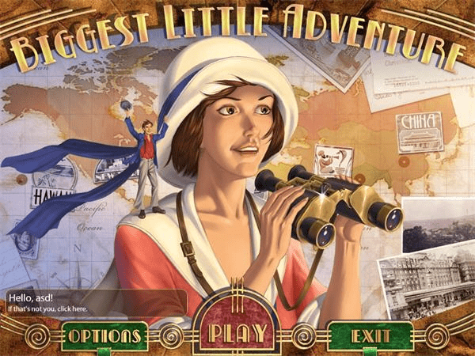
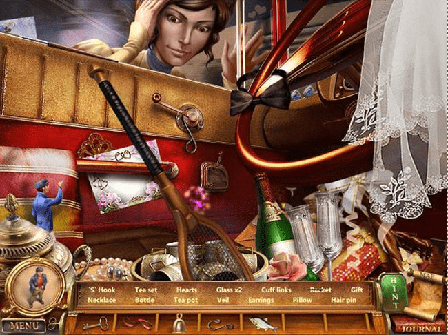

# Biggest Little Adventure 擦边游戏一个

作者：RMB战士

TID：16383

<title>1</title> <link href="../Styles/Style.css" type="text/css" rel="stylesheet">

# 1

*本帖最後由 Mr丶DerbI 於 2014-3-3 21:11 編輯*

中文名：小身材大冒险

怎么说呢？这个游戏与GTS仅仅是擦边，擦边而已。
游戏剧情大约就是由于Ruby不小心被缩小到两个苹果那么高，所以两人不得不去寻找恢复的办法。一大一小两人配合解谜过关，蛮有趣的益智类游戏。
虽然GTS元素融入的不算很明显，不过我玩了之后发现这游戏貌似对学英语，练眼力蛮有帮助的。嘛，上几张图吧：

<title>2</title> <link href="../Styles/Style.css" type="text/css" rel="stylesheet">

# 2

 <ignore_js_op>[600_382380001482797.jpg](forum.php?mod=attachment&aid=NDEzNTN8YzY3ODJmZDd8MTY3NDA2ODEzOXwxODIzMHwxNjM4Mw%3D%3D&nothumb=yes) *(65.8 KB, 下載次數: 2)*

[下載附件](forum.php?mod=attachment&aid=NDEzNTN8YzY3ODJmZDd8MTY3NDA2ODEzOXwxODIzMHwxNjM4Mw%3D%3D&nothumb=yes)

2014-3-3 21:08 上傳  

</ignore_js_op> <ignore_js_op>[201151493358985980.jpg](forum.php?mod=attachment&aid=NDEzNTR8N2JmYmMwNTl8MTY3NDA2ODEzOXwxODIzMHwxNjM4Mw%3D%3D&nothumb=yes) *(94.08 KB, 下載次數: 2)*

[下載附件](forum.php?mod=attachment&aid=NDEzNTR8N2JmYmMwNTl8MTY3NDA2ODEzOXwxODIzMHwxNjM4Mw%3D%3D&nothumb=yes)

2014-3-3 21:09 上傳  

</ignore_js_op> <title>3</title> <link href="../Styles/Style.css" type="text/css" rel="stylesheet">

# 3

亚达~人家肿么变小啦~
(´・ω・｀)不过单从图来看，游戏还是不错的。 <title>4</title> <link href="../Styles/Style.css" type="text/css" rel="stylesheet">

# 4

有这个，完全的解谜游戏。 <title>5</title> <link href="../Styles/Style.css" type="text/css" rel="stylesheet">

# 5

很早以前玩過。。。。那會兒網絡上還有資源，後來因為升級電腦，原始安裝文件就刪除了。。
不過 也無所謂了。。。 <title>6</title> <link href="../Styles/Style.css" type="text/css" rel="stylesheet">

# 6

就解谜来说是个不错的游戏...
但就GTS来说........... <title>7</title> <link href="../Styles/Style.css" type="text/css" rel="stylesheet">

# 7

这个 非常老的游戏了 解谜很好的... <title>8</title> <link href="../Styles/Style.css" type="text/css" rel="stylesheet">

# 8

解密的啊  个人不是很喜欢   <title>9</title> <link href="../Styles/Style.css" type="text/css" rel="stylesheet">

# 9

这是怎么回事 <title>10</title> <link href="../Styles/Style.css" type="text/css" rel="stylesheet">

# 10

快快游戏上看过。。。但是一直没下 <title>11</title> <link href="../Styles/Style.css" type="text/css" rel="stylesheet">

# 11

这游戏...不会是找东西什么的吧 <title>12</title> <link href="../Styles/Style.css" type="text/css" rel="stylesheet">

# 12

ｒｕｂｙ啊...　 <title>13</title> <link href="../Styles/Style.css" type="text/css" rel="stylesheet">

# 13

解謎擦邊阿
大開眼界..= = <title>14</title> <link href="../Styles/Style.css" type="text/css" rel="stylesheet">

# 14

这不就是个普普通通的解谜游戏吗？ <title>15</title> <link href="../Styles/Style.css" type="text/css" rel="stylesheet">

# 15

看了介绍这游戏和GTS关联不大，不过是个老少咸宜的游戏很不错，感谢楼主分享。