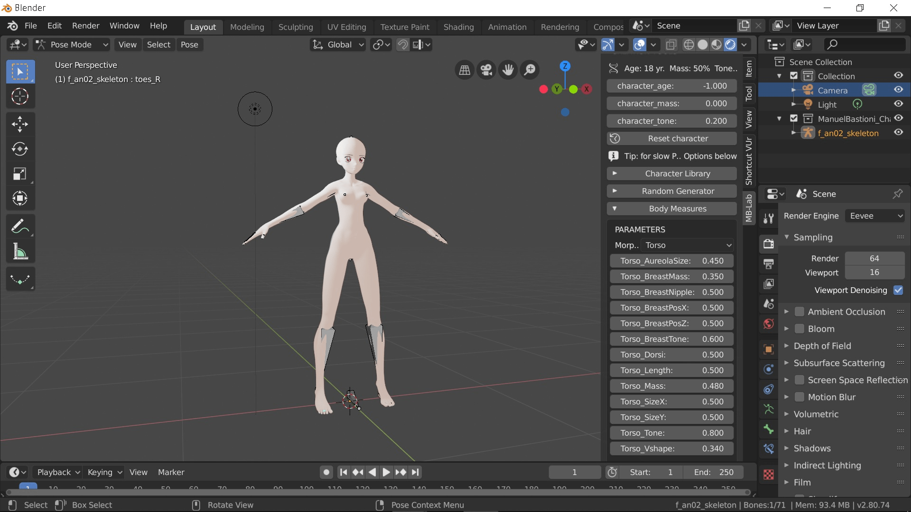
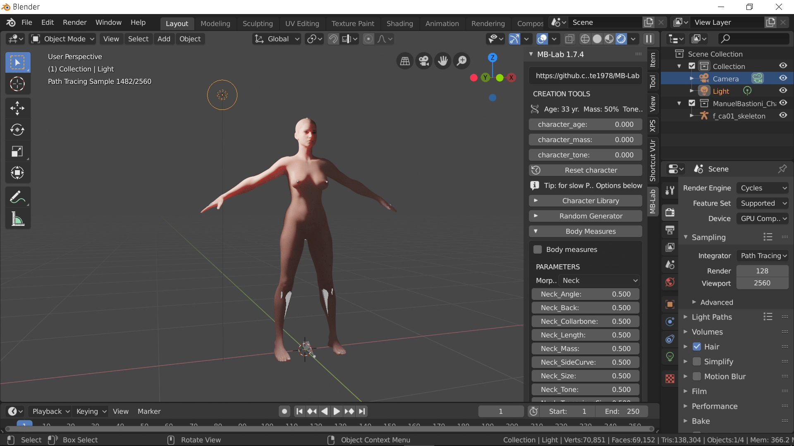

# Blender 2.8，製造人物和城市的兩個Plug-in

作者：3213213210

TID：27027

<title>1</title> <link href="../Styles/Style.css" type="text/css" rel="stylesheet">

# 1

*本帖最後由 3213213210 於 2019-8-6 15:09 編輯*

目前預計Blender 2.8會在7/11正式推出，我先在這邊po個感覺會很實用的Plug-in(外掛、插件)
製作人物，ManuelbastioniLAB：[https://github.com/animate1978/MB-Lab](https://github.com/animate1978/MB-Lab)
免費開源，可以製作各式各樣的人類，有很多參數能調，而且已經Rig好了
動畫風格女性：
<ignore_js_op>

**ani.jpg** *(345.09 KB, 下載次數: 0)*

[下載附件](forum.php?mod=attachment&aid=Nzg5NzR8ZWNhZDQ4Yzl8MTY3NDA2OTY0MnwxODIzMHwyNzAyNw%3D%3D&nothumb=yes)

2019-6-26 19:44 上傳

高加索(就是白人)女性：
<ignore_js_op>

**rea.jpg** *(346.86 KB, 下載次數: 0)*

[下載附件](forum.php?mod=attachment&aid=Nzg5NzV8MTcyMWZjNzN8MTY3NDA2OTY0MnwxODIzMHwyNzAyNw%3D%3D&nothumb=yes)

2019-6-26 19:44 上傳

先講一下，用Eevee render來跑寫實人物看起來會很像果凍......
預設會被打碼，要去Meterial(右邊選單裡倒數第二個紅色圓球)裡把MBlab_generic改掉，找有skin的那項就對了
(編輯：我作了簡單的教學，照作就好 [https://youtu.be/emmNjalS2wI](https://youtu.be/emmNjalS2wI) )
有奶頭，但男女都沒有性器官，自己去捏一個接上去吧

製作城市，SceneCity：[https://www.cgchan.com/](https://www.cgchan.com/)
要價97鎂，因為沒買所以也沒心得
不過城市，你懂得，會是超有用的背景素材
(或者很有錢的話用CityEngine)
<title>2</title> <link href="../Styles/Style.css" type="text/css" rel="stylesheet">

# 2

估计是很强大的软件，但是老了学不动了，只能满足于MMD了 <title>3</title> <link href="../Styles/Style.css" type="text/css" rel="stylesheet">

# 3

6666666666666666文体两开花 <title>4</title> <link href="../Styles/Style.css" type="text/css" rel="stylesheet">

# 4

希望能有比较简单的上手教程 <title>5</title> <link href="../Styles/Style.css" type="text/css" rel="stylesheet">

# 5

> [feizipopo 發表於 2019-7-1 00:11](https://giantessnight.cf/gnforum2012/forum.php?mod=redirect&goto=findpost&pid=408805&ptid=27027)
> 希望能有比较简单的上手教程

[https://youtu.be/emmNjalS2wI](https://youtu.be/emmNjalS2wI)
我不是剛傳了一個影片說明怎麼製作人物跟砍碼嗎 你要什麼的教學
<title>6</title> <link href="../Styles/Style.css" type="text/css" rel="stylesheet">

# 6

*本帖最後由 feizipopo 於 2019-7-1 17:46 編輯*

> [3213213210 發表於 2019-7-1 10:11](https://giantessnight.cf/gnforum2012/forum.php?mod=redirect&goto=findpost&pid=408839&ptid=27027)
> [https://youtu.be/emmNjalS2wI](https://youtu.be/emmNjalS2wI)
> 我不是剛傳了一個影片說明怎麼製作人物跟砍碼嗎 你要什麼的教學
> ...

但我还是不知道blender这个软件怎么用。首先是插件安装就遇到了问题，选择插件（zip）**从文件安装**之后没有任何反应，插件并没有添加进去。插件版本MB-Lab 1.7.4b，Blender版本2.80Beta7月1日发布
————————————————————————————————————————————————
好吧，是识别问题。插件下载页面提到了改名，居然不是改zip包的名字，而是改包里文件夹的名字= =
<title>7</title> <link href="../Styles/Style.css" type="text/css" rel="stylesheet">

# 7

能直接弄出人物是挺方便的 <title>8</title> <link href="../Styles/Style.css" type="text/css" rel="stylesheet">

# 8

> [abc0000000 發表於 2019-7-1 23:36](https://giantessnight.cf/gnforum2012/forum.php?mod=redirect&goto=findpost&pid=408913&ptid=27027)
> 能直接弄出人物是挺方便的

頭髮還是要自己弄就是 不知道能不能期待以後出更多更新</ignore_js_op></ignore_js_op>