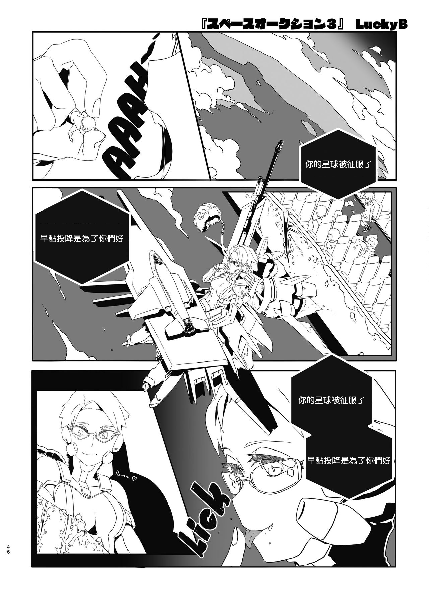

# C99 又延期了……唉，我就担心一些作者因为这件事退圈

作者：咕咕的攸栗

TID：30498

<title>1</title> <link href="../Styles/Style.css" type="text/css" rel="stylesheet">

# 1

好久没有新的gts同人志了……整整一年多了啊 <title>2</title> <link href="../Styles/Style.css" type="text/css" rel="stylesheet">

# 2

同人不赚钱，现在都是fantia，patreon上面拉赞助了 <title>3</title> <link href="../Styles/Style.css" type="text/css" rel="stylesheet">

# 3

> [dfggggx 發表於 2021-3-9 10:19](https://giantessnight.cf/gnforum2012/forum.php?mod=redirect&goto=findpost&pid=462414&ptid=30498)
> 同人不赚钱，现在都是fantia，patreon上面拉赞助了

确实……虽然有点自私但是我还是比较希望一个完整的同人而不是几张图……
<title>4</title> <link href="../Styles/Style.css" type="text/css" rel="stylesheet">

# 4

目前业界良心的まるしゃも老师请一定要去赞助他，每月100日元，十几张图，大概3个月就相当于一篇同人漫画了 <title>5</title> <link href="../Styles/Style.css" type="text/css" rel="stylesheet">

# 5

> [dfggggx 發表於 2021-3-9 11:15](https://giantessnight.cf/gnforum2012/forum.php?mod=redirect&goto=findpost&pid=462419&ptid=30498)
> 目前业界良心的まるしゃも老师请一定要去赞助他，每月100日元，十几张图，大概3个月就相当于一篇同人漫画了 ...

确实良心
唉……何时才能看到其他gts同人啊，看到一些社团没动静好担心啊

希望都是压稿然后c99一出全部卖出来吧

<title>6</title> <link href="../Styles/Style.css" type="text/css" rel="stylesheet">

# 6

本来c97还看到uru画了同人(fondue)然后就没了，甚至还有预告的，希望c99时他别忘了吧 <title>7</title> <link href="../Styles/Style.css" type="text/css" rel="stylesheet">

# 7

本子那边感觉就是薛定谔的疫情也不知道是个啥情况，只能希望到时候C99不会再出什么岔子吧（趴）
话说好几年没看见dre的本子了呢，不知道这次C99会不会有他 <title>8</title> <link href="../Styles/Style.css" type="text/css" rel="stylesheet">

# 8

*本帖最後由 leo1223 於 2021-3-9 11:49 編輯*

> [kale 發表於 2021-3-9 11:27](https://giantessnight.cf/gnforum2012/forum.php?mod=redirect&goto=findpost&pid=462422&ptid=30498)
> 本子那边感觉就是薛定谔的疫情也不知道是个啥情况，只能希望到时候C99不会再出什么岔子吧（趴）
> ...

之前他可能是做那个游戏吧？

希望可以有新作

最想有的是uru的那本蓝发gts的续集（连预告都有了结果发生这种事）

还有也希望蜂蜜有新的啊！！！(不过好像蜂蜜本来就不是发在comiket的?

<title>9</title> <link href="../Styles/Style.css" type="text/css" rel="stylesheet">

# 9

沒ˊ這麼久吧「宇宙人・巨女/縮小合同誌vol.1.2.3 三冊セット」這本剛一年，這本後又發售了四本
<ignore_js_op>

**140.png** *(1.01 MB, 下載次數: 0)*

[下載附件](forum.php?mod=attachment&aid=ODc4MjZ8NzhhMzExN2R8MTY3NDA2NjA3N3wxODIzMHwzMDQ5OA%3D%3D&nothumb=yes)

2021-3-9 11:55 上傳

<title>10</title> <link href="../Styles/Style.css" type="text/css" rel="stylesheet">

# 10

> [yangbaby 發表於 2021-3-9 11:55](https://giantessnight.cf/gnforum2012/forum.php?mod=redirect&goto=findpost&pid=462427&ptid=30498)
> 沒ˊ這麼久吧「宇宙人・巨女/縮小合同誌vol.1.2.3 三冊セット」這本剛一年，這本後又發售了四本
> 
> ...

其实就是有点担心一些小社团因为这样解散
gts本本来就很少了

去年直接没有寺田的本，本来uru有预告有续集也没出，蜂蜜也没本……

其实有趣的是推上好像挺多gts的……就是图和有故事的同人不一样……
<title>11</title> <link href="../Styles/Style.css" type="text/css" rel="stylesheet">

# 11

是呀，亏我还在期待寺田落子的C99的全彩大作，这下看是没戏了 <title>12</title> <link href="../Styles/Style.css" type="text/css" rel="stylesheet">

# 12

> [咕咕的攸栗 發表於 2021-3-9 12:46](https://giantessnight.cf/gnforum2012/forum.php?mod=redirect&goto=findpost&pid=462429&ptid=30498)
> 是呀，亏我还在期待寺田落子的C99的全彩大作，这下看是没戏了

唉……

只能慢慢等了，好久没看到寺田的新作了

虽然单图是很多啦

但是果然还是有故事的作品比较好用
<title>13</title> <link href="../Styles/Style.css" type="text/css" rel="stylesheet">

# 13

日本的同人作者除了c99这种展会以外一般怎么获取收入啊？ <title>14</title> <link href="../Styles/Style.css" type="text/css" rel="stylesheet">

# 14

> [吐槽帝阿虚 發表於 2021-3-9 18:55](https://giantessnight.cf/gnforum2012/forum.php?mod=redirect&goto=findpost&pid=462456&ptid=30498)
> 日本的同人作者除了c99这种展会以外一般怎么获取收入啊？

DLSITE, Patreon, Fantia 啦等等

约稿什么的都行

其实一些人说c99这些其实赚的不多，更多是作为一个沟通的沟道吧

<title>15</title> <link href="../Styles/Style.css" type="text/css" rel="stylesheet">

# 15

> [leo1223 發表於 2021-3-9 11:00](https://giantessnight.cf/gnforum2012/forum.php?mod=redirect&goto=findpost&pid=462415&ptid=30498)
> 确实……虽然有点自私但是我还是比较希望一个完整的同人而不是几张图……
> ...

对啊 赞助的每个月确实能看到几张很优秀的图

但是没有故事和连贯的剧情，总觉得很难受
<title>16</title> <link href="../Styles/Style.css" type="text/css" rel="stylesheet">

# 16

> [Vanmilos 發表於 2021-3-10 23:10](https://giantessnight.cf/gnforum2012/forum.php?mod=redirect&goto=findpost&pid=462571&ptid=30498)
> 对啊 赞助的每个月确实能看到几张很优秀的图
> 
> 但是没有故事和连贯的剧情，总觉得很难受

好想要蜂蜜继续·出那个“两倍”的世界观啊啊！！

画风又好，故事又带感

去年到时有两张这个世界观的单图，所以可能还可以期待一下？

<title>17</title> <link href="../Styles/Style.css" type="text/css" rel="stylesheet">

# 17

> [leo1223 發表於 2021-3-11 16:44](https://giantessnight.cf/gnforum2012/forum.php?mod=redirect&goto=findpost&pid=462606&ptid=30498)
> 好想要蜂蜜继续·出那个“两倍”的世界观啊啊！！
> 
> 画风又好，故事又带感

真的 蜂蜜和DRE的图看的是真的爽，
好想看他们的新本子啊
<title>18</title> <link href="../Styles/Style.css" type="text/css" rel="stylesheet">

# 18

> [leo1223 發表於 2021-3-9 11:21](https://giantessnight.cf/gnforum2012/forum.php?mod=redirect&goto=findpost&pid=462420&ptid=30498)
> 确实良心
> 唉……何时才能看到其他gts同人啊，看到一些社团没动静好担心啊

收入不稳定，不能当主业，能当主业收入我能天天画了</ignore_js_op>