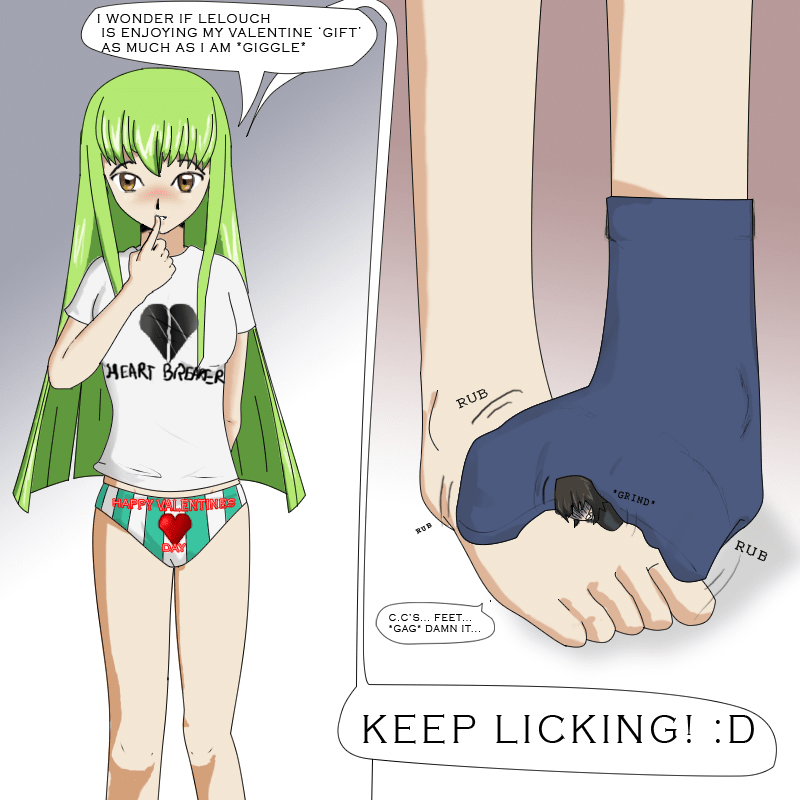

# Code Geass 鲁路修Sound Episode 5...要是动画化多好...

作者：colouur

TID：8120

<title>1</title> <link href="../Styles/Style.css" type="text/css" rel="stylesheet">

# 1

某个网站上看到的翻译。。。。。。

「Cタケ られた C.C. 」 受C蘑菇摧残的C.C.
（以上省略N字）

C.C.：那个，我到底怎么了？

卡莲：咦，样子似乎又变了，好像变回原样了吧。

C.C.：但是，我嘴里都烫伤了，火辣辣的。

千叶：那是当然的，因为我把刚刚做好的奶汁烤蘑菇，直接从烤炉转移到了你的嘴里。

藤堂：看起来，只是骄傲蘑菇的效果消失了，这个似乎也不是C蘑菇。

鲁鲁修：那么就把这个蘑菇命名为取消蘑菇吧。哈哈，真不愧是我能想出这么贴切的名字。

洛洛：不愧是Zero。

千叶：什么呀！

迪特哈尔特：那么，接下来就轮到我的料理了。别看过现在这样，我作为广告人初次接手的就是美食节目，因此对于料理还是挺挑剔的。咳，我做的是五色蘑菇配上酸甜酱料的布里塔尼亚风味料理。耀眼的天蓝色，柠檬黄，刺激粉，翡翠绿，胭脂红，五光十色的色彩，制作出前所未有的绝妙风味，是异次元料理的绝品。

卡莲：哇，……看上去对身体很不好。

藤堂：那是毒药吧。

千叶：应该是毒药吧。

C.C.：主人……这个也必须吃掉吗……

鲁鲁修：那个……

迪特哈尔特：Zero，你该不会不想让C.C.吃我做的料理吗？你一定没有这么想吧！

鲁鲁修：呃……！这是当然的！既然还不知道哪一个是C蘑菇，就必须试吃所有的蘑菇！没错！来，C.C.来吃吧。

C.C.：呜……到底为什么每一种都要做成料理才能吃呀，完全没有任何意义嘛。

鲁鲁修；啊，味道怎么样？

C.C.：和外观不同，似乎还挺好吃的。意外地，还挺好吃。啊！！哇！！

鲁鲁修：怎么了？C.C.！

C.C.：啊啊啊，主人，我的手在变成奇怪的形状

迪特哈尔特：哇啊！

鲁鲁修：尖端锋利的圆锥体，这个形状，而且，还一边发出嗡嗡的声音一边高速旋转，这是！！

卡莲：钻头。

千叶：是钻头吧。

藤堂：太神奇了。

鲁鲁修：这到底是怎么回事！迪特哈尔特！

迪特哈尔特：哎呀，这看起来也只能是将双手变成钻头的蘑菇了，您认为将它命名为“钻头蘑菇”怎么样？

藤堂：钻头吗，这也是男人的浪漫呀，对吧，千叶？

千叶：当然，藤堂先生。

卡莲：什么啊？夫妇相声？

鲁鲁修：你错了，卡莲！话说该吐槽的地方不是那里啊！

C.C.：主人，应该是夫妻相声，请快点把我变回去！！

鲁鲁修：喂，C.C.别挥着那样的手靠过来！钻头会扎到我的！

C.C.：怎么能这样！主人……迪特哈尔特！说到底就是因为你给我吃了奇怪的蘑菇才会发生这种事情！

迪特哈尔特：C.C.为什么要针对我！

C.C.：呀！这样的话！

迪特哈尔特：啊！扎到，扎到我了！

卡莲：啊，好像很疼。这景象实在是很难影像化。

鲁鲁修：卡莲，现在是冷静地佩服的时候吗！

卡莲：那么，吃了我的料理说不定能变回去呢。

鲁鲁修：好，就这么做！

卡莲：哼哼，我做的就是这个杂烩蘑菇。这个稍微有些浑浊的紫色看起来似乎有毒，不过味道应该是没有问题的。虽然我还没有尝过。

C.C.：呃，不过，我这双手没办法吃。

卡莲：真拿你没办法啊，喂你吃吧。来，把嘴巴张大说“啊”。

C.C.：啊∼∼

鲁鲁修：怎么样？有没有要变回去的感觉，C.C.？

C.C.：呃……总觉得眼睛怪怪的……

藤堂：看起来性格似乎没什么变化。

鲁鲁修：眼睛？进沙子了吗？哪一只？让我看看。

C.C.：好的，主人。

鲁鲁修：哇——！！怎么了？！刚刚C.C.的眼睛发光了，发光了呀！！

藤堂：就是说从C.C.的双眼中发射出了光束？

千叶：格纳库的墙壁上，开了一个洞……

卡莲：哎呀哎呀，千叶，终于出现预想之中的剧情了。

千叶：可是就算如此，这也太……

藤堂：总之，就把这蘑菇称为“从眼睛里发出光束的蘑菇”吧

千叶：光束也是男人的浪漫吧，藤堂先生！

鲁鲁修：原来如此，如果告诉拉克夏塔的话，她一定非常高兴。

卡莲：这攻击力真是了不起，这样的话就可以当做武器使用了。

鲁鲁修：不是这样的，你们来看，刚刚光线擦过我的面具留下的焦痕，话说回来卡莲，你为什么能这么冷静！

卡莲：那是因为，不是有“取消蘑菇”吗，吃了那个的话，不就能恢复原状了吗。你忘了吗，Zero？

鲁鲁修：啊……我当然记得！

卡莲：果然忘啦。

鲁鲁修：放心吧，C.C.现在就让你变回去。喂，千叶，把用取消蘑菇做的奶汁烤蘑菇拿过来。

千叶：对不起，Zero。取消蘑菇，其实刚刚全部都吃完了。

鲁鲁修：你说什么！

C.C.：主人，那我到底该怎么办呀啊啊啊啊！

藤堂：一击就击穿了墙壁，这可是相当于战舰的破坏力呀。

鲁鲁修：没办法了，这样的话，就必须一个一个把所有蘑菇都吃一遍，并祈祷她能恢复原状了。

洛洛：不愧是Zero。随机应变，机智过人，这个对策太漂亮了。

卡莲：他这不就是碰运气吗？

鲁鲁修：大家来帮忙吧，把这些蘑菇，都塞进C.C.的嘴里吧。

众人：了解！

C.C.：别这样，不……唔……唔……哇啊啊啊啊！我是不是变大了？  

鲁鲁修：C.C.居然巨大化了。  

千叶：居然比斩月还大，这个发展太出乎意料了。  

藤堂：这就是中华联邦4000年的魅力吗？  

洛洛：总之，这个就是“巨大化蘑菇”了吧。  

C.C.：别管它叫什么名字了！  

鲁鲁修：啊，C.C.她，把格纳库的天花板顶破了！  

迪特哈尔特：哈哈，不对不对，这是CG呀，是CG，或者是很久以前使用的特效。哈哈哈哈。  

卡莲：唉呀，迪特哈尔特开始逃避现实了。  

鲁鲁修：对不起，C.C.我已经用尽了所有办法，可是现代科学还没法帮助你。  

C.C.：怎么会这样啊……原来……这样啊……

鲁鲁修：C.C.

C.C.：这个也是那个也是，全部……说到底都是我不好。

鲁鲁修：不，那是布里塔尼亚的皇帝……

C.C.：够了，全部都是我不好，夏天会那么热，海水会那么咸，全都是我的错。

藤堂：怎么觉得变得有些神经错乱了啊。

卡莲：嗯，虽然变得这么大，却这么自卑啊。

C.C.：身体变成这样，已经不能再留在主人身边了，请不要来找我了。

千叶：那个，就算不找你你也太显眼了。

C.C.：再见，大家，再见，主人！

鲁鲁修：真是的，别跑呀！C.C.

迪特哈尔特：啊，要塌了……

卡莲：停下来！C.C.
——————————————————————
朱雀：陛下，有事禀告。

皇帝：哦？我在想是谁呢，原来是枢木，有什么事？

朱雀：潜入中华联邦的间谍紧急报告说，黑色骑士团的根据地蓬莱岛上，有一个巨大的未知生物正在发飙。

皇帝：巨大生物？

朱雀：报告上说似乎是一名少女，我想恐怕是哪里搞错了吧。

皇帝：年轻少女吗？哈哈哈哈，可恶的Zero，你真的上钩了！

朱雀：那个，陛下？

皇帝：可恶的Zero，不，鲁鲁修，你完全上了我的当呢，噗……哈哈哈哈！！

朱雀：啊，……哈？
————————————————————————
C.C.：请不要找我！！  

。。。啊，巨大化的C女王。。。。 <title>2</title> <link href="../Styles/Style.css" type="text/css" rel="stylesheet">

# 2

看不懂啊……
解释一下好吗 <title>3</title> <link href="../Styles/Style.css" type="text/css" rel="stylesheet">

# 3

广播剧没可能动画化的吧

我看到了什么，各种男人的浪漫！ <title>4</title> <link href="../Styles/Style.css" type="text/css" rel="stylesheet">

# 4

那就取名为男人的浪漫   菇吧~~~~另外楼主,您的剧情何等糟糕啊!!!!!cc.是女王,女王啊!!!!不是女仆啊!!!!主人?你以为你在对谁说话?

[ *本帖最後由 lg83449447 於 2010-6-8 11:14 編輯* ] <title>5</title> <link href="../Styles/Style.css" type="text/css" rel="stylesheet">

# 5

...！这不是我写的
就是转来的Sound EP5广播剧原文的翻译
因为是C.C.失忆以后的事！
所以是女仆啊！
(看来前面省略太多的确不是什么好主意。。。。。。。）
p.s.广播剧这种东西的确有够恶搞。。。。

[ *本帖最後由 Cod1945 於 2010-6-8 11:31 編輯* ] <title>6</title> <link href="../Styles/Style.css" type="text/css" rel="stylesheet">

# 6

为什么看着更像同人恶搞的广播剧= = <title>7</title> <link href="../Styles/Style.css" type="text/css" rel="stylesheet">

# 7

那段糟糕的剧情当然要选择性无视啊！！！！！ <title>8</title> <link href="../Styles/Style.css" type="text/css" rel="stylesheet">

# 8

不过我觉得女仆C也蛮可爱的说~C的另一面呢.
当然还是更喜欢C女王！ <title>9</title> <link href="../Styles/Style.css" type="text/css" rel="stylesheet">

# 9

那簡直一定是惡搞版的……一定是這樣的……
雖說C女王變大也不錯吧…… <title>10</title> <link href="../Styles/Style.css" type="text/css" rel="stylesheet">

# 10

[http://browse.deviantart.com/?qh ... loggedin=1#/d2k8ye5](http://browse.deviantart.com/?qh=&section=&q=giantess+cc&loggedin=1#/d2k8ye5) by *teniko
看台词也是c女王女仆化得场景 <title>11</title> <link href="../Styles/Style.css" type="text/css" rel="stylesheet">

# 11

 <ignore_js_op>[C_C_Valentine_by_teniko.jpg](forum.php?mod=attachment&aid=MjA5MDR8ZGFlMWU2M2Z8MTY3NDA2ODg3MnwxODIzMHw4MTIw&nothumb=yes) *(285.1 KB, 下載次數: 0)*

[下載附件](forum.php?mod=attachment&aid=MjA5MDR8ZGFlMWU2M2Z8MTY3NDA2ODg3MnwxODIzMHw4MTIw&nothumb=yes)

2010-6-10 13:08 上傳  

</ignore_js_op> <title>12</title> <link href="../Styles/Style.css" type="text/css" rel="stylesheet">

# 12

楼上的图 不错哦