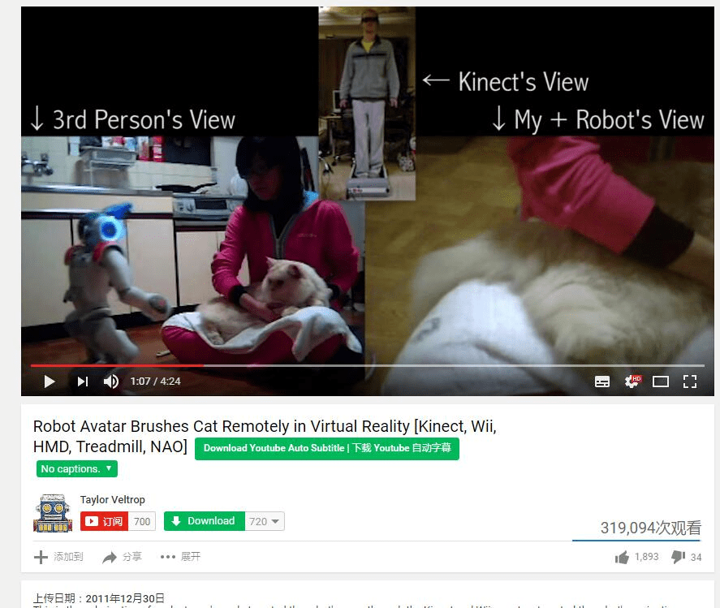
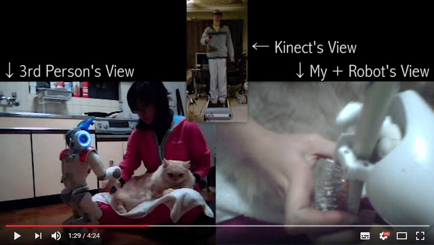
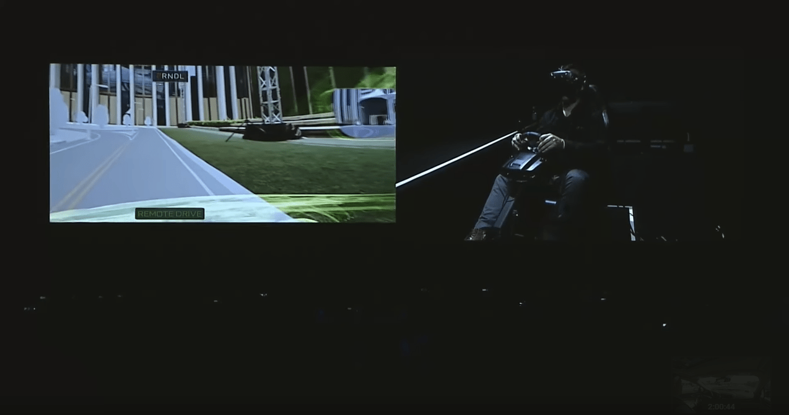
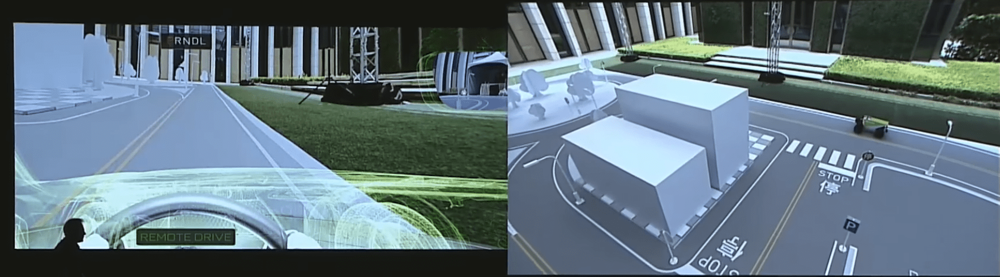
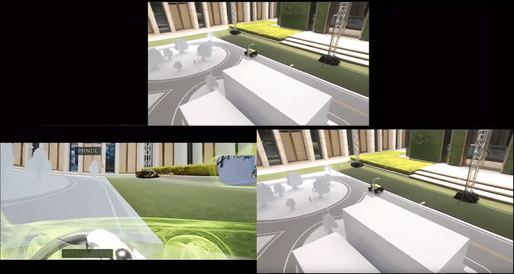
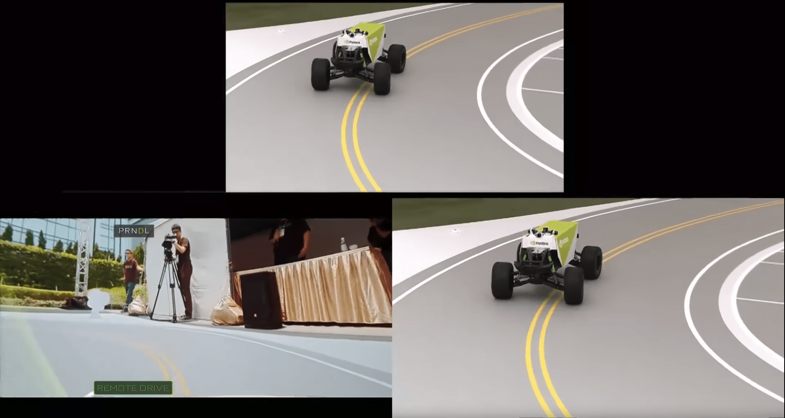

# Cyberpunk脑洞一则

作者：xnr

TID：22905

<title>1</title> <link href="../Styles/Style.css" type="text/css" rel="stylesheet">

# 1

昨天看完了攻壳机动队，然后脑洞就收不住了。
赛博朋克，其实我们现在的世界就越来越接近这种设定了，随着科技的发展一切只是时间问题。

我们都知道，物理上的放大与缩小是不可能实现的，关于这些有大把的论文可以翻，生物上不可能，但是科技可能啊...
最典型的，VR设备，只要和现在的IOT（物联网）和AI与机器人技术整合一下，不就可以实现我们自己的机器人Avatar了吗？

VR设备作为画面数据输入（Vive、Oculus），借助一些第三方设备比如VR跑步机Virtuix Omni来同步脚步运动，再配合诺亦腾的惯性动作捕捉设备PERCEPTION NEURON和Leap Motion手部捕捉，这样就会实现一个全方位的数据收集就实现了...这样我们就有了一个人物理空间运动的大部分数据了。接下来只要做一个足够小的人形机器人，装一个VR摄像机或者能够以低延迟同步头部运动的摄像机云台，将人的运动输入转换成机器人的运动输入，并在5G网络下实现信号与画面的传输，AI可以辅助机器人的运动与平衡，这样不就实现了现实世界的GTS了么？

不要认为这很遥远，现在的重点是，我上面提到的所有技术现在都已经发展的比较成熟了，只是缺少把这些东西整合在一起的人而已。

VR眼镜：明年HTC会推出2代产品，分辨率翻倍，体验更好；
动捕设备：现在已经很成熟了，并且已经在很多电影和游戏中使用了；
AI+机器人：还记得Google那个很厉害的平衡机器人么？
5G网络：这个很快就会普及，可以大幅度减小图像传输和信号的延迟。

其实早在2011年就有人实现了这东西的雏形了，youtube链接：[这里](https://www.youtube.com/watch?v=pxoL4bnLp0g)
照顾不能翻墙的同学：
<ignore_js_op>

**QQ截图20170409022408.jpg** *(69.11 KB, 下載次數: 0)*

[下載附件](forum.php?mod=attachment&aid=Njc1MzV8NTkyNzU0NjJ8MTY3NDA2NzA3NXwxODIzMHwyMjkwNQ%3D%3D&nothumb=yes)

2017-4-9 02:24 上傳

这个人使用了跑步机+HMD+Kinect作为动作输入设备，由于当时技术不发达，操作上有巨大的延迟；
即便如此，他甚至实现了和里面妹子的互动（接东西）：
<ignore_js_op>

**QQ截图20170409023031.jpg** *(42.32 KB, 下載次數: 1)*

[下載附件](forum.php?mod=attachment&aid=Njc1MzZ8Y2YzMGRhZmR8MTY3NDA2NzA3NXwxODIzMHwyMjkwNQ%3D%3D&nothumb=yes)

2017-4-9 02:32 上傳

感受到了么？这就是未来啊！

至于脑后插管那种，在生物技术没有突破的情况下是很难实现的，然而借助目前的这些技术，这套方案近在眼前...
这就是赛博朋克的雏形啊...
<title>2</title> <link href="../Styles/Style.css" type="text/css" rel="stylesheet">

# 2

好厉害的样子，可是不是自己的身体的话，感觉有种看别人的感觉，再说触觉方面又能和真的一样吗？ <title>3</title> <link href="../Styles/Style.css" type="text/css" rel="stylesheet">

# 3

所以说这种产业是科学技术发展的助推力……最近很迷AMSR，可惜有墙 <title>4</title> <link href="../Styles/Style.css" type="text/css" rel="stylesheet">

# 4

现在科技发展这么快
估计10年左右就能普及
所以
还不快努力赚钱？ <title>5</title> <link href="../Styles/Style.css" type="text/css" rel="stylesheet">

# 5

大神果然是走在科技的前沿……
VR+移动摄像机感觉还挺遥远的，能在VR游戏世界中体验就不错了 <title>6</title> <link href="../Styles/Style.css" type="text/css" rel="stylesheet">

# 6

我估计，比较成熟的GTS体验感觉，也就是未来3~5年内的事情

我相信美国甚至会有专门的GTS体验馆，聘请模特来扮演GTS，玩家付费扮演小人

但是不会大张旗鼓的在街头办，应该会是私密的地方 <title>7</title> <link href="../Styles/Style.css" type="text/css" rel="stylesheet">

# 7

其实不用摄像机，就像玩游戏一样，做过人体的模型，带个vr像地图一样移动不是一样的么 <title>8</title> <link href="../Styles/Style.css" type="text/css" rel="stylesheet">

# 8

*本帖最後由 wxy112300 於 2017-4-9 23:11 編輯*

> [q67837474 發表於 2017-4-9 17:15](https://giantessnight.cf/gnforum2012/forum.php?mod=redirect&goto=findpost&pid=328898&ptid=22905)
> 其实不用摄像机，就像玩游戏一样，做过人体的模型，带个vr像地图一样移动不是一样的么 ...

这个的不同之处是，双方都可以体验到互动，这种体验是双向的，玩家既扮演了小人，又能满足GTS本身。
对于喜爱GTS的妹子来说也是个福音...感觉就像，Ghost in the Shell。

当你知道你面前的蚂蚁是由一个人类控制的时候，你还会像正常视角那样看蚂蚁么？
<title>9</title> <link href="../Styles/Style.css" type="text/css" rel="stylesheet">

# 9

*本帖最後由 wxy112300 於 2017-4-10 01:01 編輯*

> [xnr 發表於 2017-4-9 15:31](https://giantessnight.cf/gnforum2012/forum.php?mod=redirect&goto=findpost&pid=328883&ptid=22905)
> 我估计，比较成熟的GTS体验感觉，也就是未来3~5年内的事情
> 
> 我相信美国甚至会有专门的GTS体验馆，聘请模特 ...

技术实现上很有可能，不过有专门体验馆的可能性还是不大，毕竟圈子的群体数量实在是太少

其实只要VR直播的技术成熟了，体验GTS感觉也不是问题
<title>10</title> <link href="../Styles/Style.css" type="text/css" rel="stylesheet">

# 10

> [SOLS 發表於 2017-4-9 11:12](https://giantessnight.cf/gnforum2012/forum.php?mod=redirect&goto=findpost&pid=328872&ptid=22905)
> 大神果然是走在科技的前沿……
> VR+移动摄像机感觉还挺遥远的，能在VR游戏世界中体验就不错了 ...

并不遥远...我自己就买了个小型的VR摄像机（LG Cam 360），虽然不能实时的在VR里看直播画面，但是录出来之后的视角还是很震撼的
<title>11</title> <link href="../Styles/Style.css" type="text/css" rel="stylesheet">

# 11

> [jiachufan1 發表於 2017-4-9 10:43](https://giantessnight.cf/gnforum2012/forum.php?mod=redirect&goto=findpost&pid=328870&ptid=22905)
> 现在科技发展这么快
> 估计10年左右就能普及
> 所以

努力赚钱是正解了...10年我感觉其实都用不到的，2020年8K分辨率的屏幕就能实现量产，那时候的VR沉浸感和现在的设备强的不是一个等级的
<title>12</title> <link href="../Styles/Style.css" type="text/css" rel="stylesheet">

# 12

> [LLLDMXY1234 發表於 2017-4-9 07:59](https://giantessnight.cf/gnforum2012/forum.php?mod=redirect&goto=findpost&pid=328854&ptid=22905)
> 好厉害的样子，可是不是自己的身体的话，感觉有种看别人的感觉，再说触觉方面又能和真的一样吗？ ...

这个也不一定...玩过VR游戏的话你就会知道，在VR里看自己身体的感觉是很奇妙的，可能开始比较奇怪但是很快就能够适应。
至于触觉，现在微软已经提供了一些很有趣的解决方案：
[http://www.leiphone.com/news/201610/WlmHqAZ8wKG9owyM.html](http://www.leiphone.com/news/201610/WlmHqAZ8wKG9owyM.html)

<title>13</title> <link href="../Styles/Style.css" type="text/css" rel="stylesheet">

# 13

。。。。我们要做的只是等待技术成熟，和赚到足够的钱就好了 <title>14</title> <link href="../Styles/Style.css" type="text/css" rel="stylesheet">

# 14

> [wxy112300 發表於 2017-4-9 23:01](https://giantessnight.cf/gnforum2012/forum.php?mod=redirect&goto=findpost&pid=328954&ptid=22905)
> 并不遥远...我自己就买了个小型的VR摄像机（LG Cam 360），虽然不能实时的在VR里看直播画面，但是录出来 ...

求录像啊！！！

另外能不能偷偷的把摄像机放在遥控车上，带到女装店或者女鞋店里逛逛呢？
<title>15</title> <link href="../Styles/Style.css" type="text/css" rel="stylesheet">

# 15

> [wxy112300 發表於 2017-4-9 22:58](https://giantessnight.cf/gnforum2012/forum.php?mod=redirect&goto=findpost&pid=328952&ptid=22905)
> 这个的不同之处是，双方都可以体验到互动，这种体验是双向的，玩家既扮演了小人，又能满足GTS本身。
> 对于 ...

有互动的话简直太强了，游戏根本不能比啊，而且真实性也无可替代
<title>16</title> <link href="../Styles/Style.css" type="text/css" rel="stylesheet">

# 16

求搬运。。。。。。。。。。。。。。。。。。。 <title>17</title> <link href="../Styles/Style.css" type="text/css" rel="stylesheet">

# 17

其实以目前的技术就差做到全身力反馈，只要解决了这个，都不需要机器人之类的做媒介，直接做VR游戏就能解决。 <title>18</title> <link href="../Styles/Style.css" type="text/css" rel="stylesheet">

# 18

还是那句话，努力挣钱啊 <title>19</title> <link href="../Styles/Style.css" type="text/css" rel="stylesheet">

# 19

> [xnr 發表於 2017-4-10 12:31](https://giantessnight.cf/gnforum2012/forum.php?mod=redirect&goto=findpost&pid=329012&ptid=22905)
> 求录像啊！！！
> 
> 另外能不能偷偷的把摄像机放在遥控车上，带到女装店或者女鞋店里逛逛呢？

这个就不方便分享了...毕竟涉及到隐私（然而也并没有啥内容...）

另外如果真的带到公共场所偷拍的话，那就有些流氓了吧（逃
<title>20</title> <link href="../Styles/Style.css" type="text/css" rel="stylesheet">

# 20

那个装在遥控车上的，你恐怕会被警察叔叔带走吧 <title>21</title> <link href="../Styles/Style.css" type="text/css" rel="stylesheet">

# 21

> [EIec 發表於 2017-4-10 21:21](https://giantessnight.cf/gnforum2012/forum.php?mod=redirect&goto=findpost&pid=329058&ptid=22905)
> 其实以目前的技术就差做到全身力反馈，只要解决了这个，都不需要机器人之类的做媒介，直接做VR游戏就能解决 ...

对于扮演GTS的一方，需要机器人这样的微型化身来做媒介
<title>22</title> <link href="../Styles/Style.css" type="text/css" rel="stylesheet">

# 22

脑后插管这种事情，打死我也不要又痛又容易发炎 <title>23</title> <link href="../Styles/Style.css" type="text/css" rel="stylesheet">

# 23

来来来，为没法翻墙的送上福利
不要谢我，挂了记得叫我链接：[http://pan.baidu.com/s/1o8QDsts](http://pan.baidu.com/s/1o8QDsts) 密码：10l4 <title>24</title> <link href="../Styles/Style.css" type="text/css" rel="stylesheet">

# 24

单纯地把人缩小和变大我觉得不可能，也只能通过vr来实现了 <title>25</title> <link href="../Styles/Style.css" type="text/css" rel="stylesheet">

# 25

触觉有什么办法模拟么 <title>26</title> <link href="../Styles/Style.css" type="text/css" rel="stylesheet">

# 26

果然技术发展的有够快的，一年过去了，nvidia已经实现了一个雏形！

见几周前的台北GTC，链接：
[https://youtu.be/cgG3h87IeIo?t=2h4m41s](https://youtu.be/cgG3h87IeIo?t=2h4m41s)
从2小时4分41秒开始看
<ignore_js_op>

**01.png** *(435.74 KB, 下載次數: 0)*

[下載附件](forum.php?mod=attachment&aid=NzI5MDV8ZTM5M2U3Yzl8MTY3NDA2NzA4MXwxODIzMHwyMjkwNQ%3D%3D&nothumb=yes)

2018-6-17 00:21 上傳

<ignore_js_op>

**02.png** *(1.49 MB, 下載次數: 0)*

[下載附件](forum.php?mod=attachment&aid=NzI5MDZ8ZDhjMDcyMjh8MTY3NDA2NzA4MXwxODIzMHwyMjkwNQ%3D%3D&nothumb=yes)

2018-6-17 00:21 上傳

<ignore_js_op>

**03.png** *(2.16 MB, 下載次數: 0)*

[下載附件](forum.php?mod=attachment&aid=NzI5MDd8YmY0MmU2NmF8MTY3NDA2NzA4MXwxODIzMHwyMjkwNQ%3D%3D&nothumb=yes)

2018-6-17 00:22 上傳

简单来说就是戴上VR头显之后玩家会“变小”到一个玩具车里面，然后用VR控制这个玩具车进行试驾
<ignore_js_op>

**04.png** *(1.42 MB, 下載次數: 0)*

[下載附件](forum.php?mod=attachment&aid=NzI5MDh8ZTA1NTdmYWV8MTY3NDA2NzA4MXwxODIzMHwyMjkwNQ%3D%3D&nothumb=yes)

2018-6-17 00:22 上傳

场地是一个玩具大小的大型沙盘模型，通过VR头显可以完全同步以缩小的视角看外面的画面。
这个脑洞真的是越来越接近现实了</ignore_js_op></ignore_js_op></ignore_js_op></ignore_js_op></ignore_js_op></ignore_js_op>