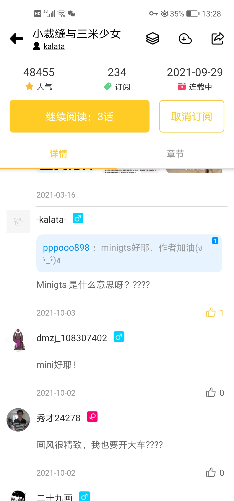
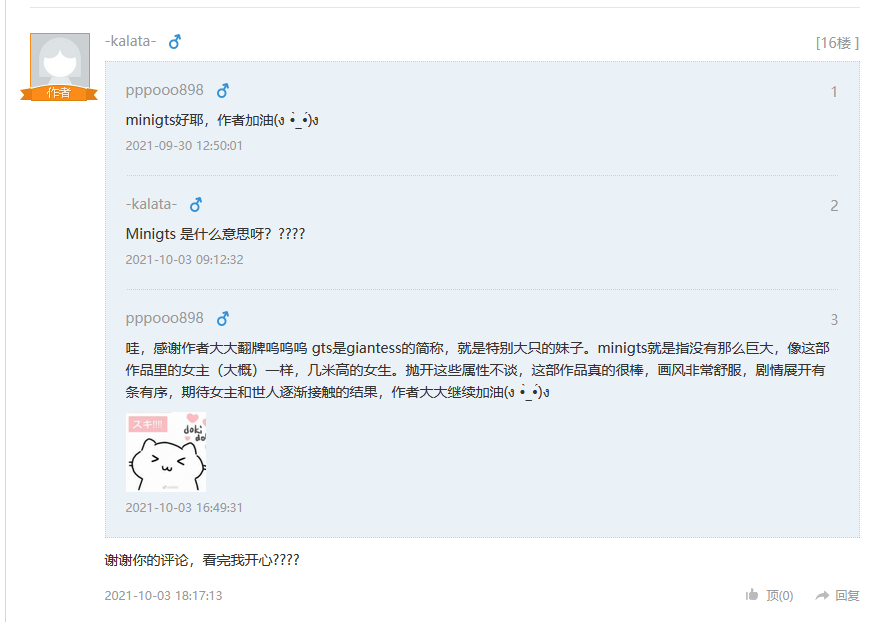

# DMZJ又有国内minigts作品《小裁缝与三米少女》

作者：van♂

TID：31767

<title>1</title> <link href="../Styles/Style.css" type="text/css" rel="stylesheet">

# 1

不知道作者在不在GN www
[https://www.dmzj.com/info/xiaocaifengyusanmishaonv.html](https://www.dmzj.com/info/xiaocaifengyusanmishaonv.html)

<title>2</title> <link href="../Styles/Style.css" type="text/css" rel="stylesheet">

# 2

看着挺不错的，不知道会不会半路弃坑 <title>3</title> <link href="../Styles/Style.css" type="text/css" rel="stylesheet">

# 3

希望是一个温馨一点的故事；不过国内作者画高女的话非常喜欢模特吗…… <title>4</title> <link href="../Styles/Style.css" type="text/css" rel="stylesheet">

# 4

看了看觉得还行，就看后续了别又落入俗套 <title>5</title> <link href="../Styles/Style.css" type="text/css" rel="stylesheet">

# 5

画风可以啊，和那种廉价彩色国漫完全不是一类（差点习惯性地从右到左读了），剧情也不错，潜在矛盾很现实也很明确，看得出来作者有想传达的东西
体格差反差萌纯爱系，真是圈内人福音了，希望不踩雷区不腰斩（不像隔壁女巨人谈恋爱一样讲娱乐圈潜规则那一套闹心的东西），就是有生之年我也等得起 <title>6</title> <link href="../Styles/Style.css" type="text/css" rel="stylesheet">

# 6

高女作品我记得是尸零哎可惜没有后续就 <title>7</title> <link href="../Styles/Style.css" type="text/css" rel="stylesheet">

# 7

救命，作者回复问我什么是minigts。原本还以为作者是个圈内人，求助怎么办(⊙o⊙)！
莫非这是个传教的大好机会？ <ignore_js_op>

**Screenshot_20211003_132824_com.dmzjsq.manhua.jpg** *(305.16 KB, 下載次數: 0)*

[下載附件](forum.php?mod=attachment&aid=OTE1NDZ8N2QxZTlmNDN8MTY3NDA2OTM1NHwxODIzMHwzMTc2Nw%3D%3D&nothumb=yes)

2021-10-3 13:29 上傳

<title>8</title> <link href="../Styles/Style.css" type="text/css" rel="stylesheet">

# 8

> [田棒棒 發表於 2021-10-3 16:02](https://giantessnight.cf/gnforum2012/forum.php?mod=redirect&goto=findpost&pid=481149&ptid=31767)
> 就好好教他好好科普吧，至于如果人家不喜欢就不勉强他。
> 
> 就像你喜欢吃辣自己喜欢可以，对别人主要还是推 ...

不要传教，好不容易有一个不是出于xp画相关内容的，别打扰人家了就
<title>9</title> <link href="../Styles/Style.css" type="text/css" rel="stylesheet">

# 9

*本帖最後由 van♂ 於 2021-10-4 12:09 編輯*

> [诸君我喜欢 發表於 2021-10-4 08:16](https://giantessnight.cf/gnforum2012/forum.php?mod=redirect&goto=findpost&pid=481181&ptid=31767)
> 我觉得适当推广xp没什么关系的，让作者可以了解一下我们圈子也不错

我只是怕xp产生后会为了xp而产粮...那就会和为了发福利而发福利的各种廉价国漫一个样了...
圈地自萌就好，推广就算了，圈子被了解并非好事，再说我其实也好奇圈外人会怎样以一个大众的视角去写这段故事

<title>10</title> <link href="../Styles/Style.css" type="text/css" rel="stylesheet">

# 10

后续：作者好像还挺开心的，希望不会干扰他作为圈外人的创作ww <ignore_js_op>

**微信图片_20211005014645.png** *(43.68 KB, 下載次數: 0)*

[下載附件](forum.php?mod=attachment&aid=OTE1NzB8MTlkNmE5Mzd8MTY3NDA2OTM2M3wxODIzMHwzMTc2Nw%3D%3D&nothumb=yes)

2021-10-5 01:47 上傳

<title>11</title> <link href="../Styles/Style.css" type="text/css" rel="stylesheet">

# 11

新情报：基本月更，一共10话（目前这3话都是20-60页不等），就是说大概明年四月完结 <title>12</title> <link href="../Styles/Style.css" type="text/css" rel="stylesheet">

# 12

一点都不色，太可惜了，给点福利不行？ <title>13</title> <link href="../Styles/Style.css" type="text/css" rel="stylesheet">

# 13

女主属性好像是笨蛋。。10年不出世的世界最高笨蛋。。。。 <title>14</title> <link href="../Styles/Style.css" type="text/css" rel="stylesheet">

# 14

*本帖最後由 van♂ 於 2021-11-5 19:21 編輯*

新情报，11.7左右更新，好耶
[https://www.dmzj.com/info/xiaocaifengyusanmishaonv.html](https://www.dmzj.com/info/xiaocaifengyusanmishaonv.html)
更新了，低情商：剧情中规中矩；高情商：剧情稳中向好
<title>15</title> <link href="../Styles/Style.css" type="text/css" rel="stylesheet">

# 15

这个作者已经更新了，不是圈内人，话说不止三米了吧，怕是有5米</ignore_js_op></ignore_js_op>