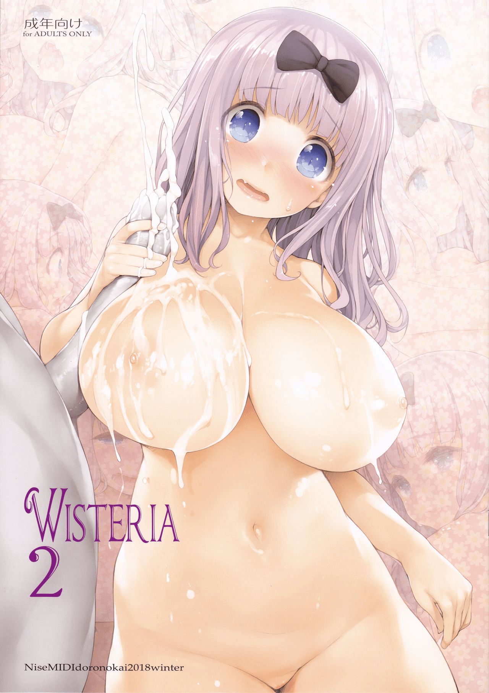
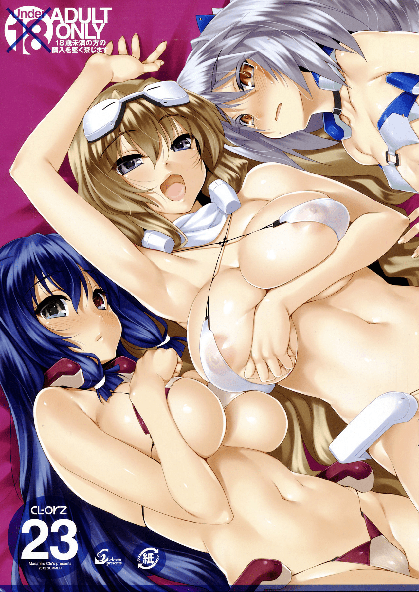

# DRE和蜂蜜是一个人吗？

作者：rilongshen

TID：26659

<title>1</title> <link href="../Styles/Style.css" type="text/css" rel="stylesheet">

# 1

之前一直认为是两个人。但最近翻了下他推特，发现他画的克拉丽丝和最近天真烂漫本里的蜂蜜的碧蓝幻想本里的画风几乎一样。

我知道honey lounge并不是画师名而是个group name，而之前蜂蜜的本子画师署名一般是hachimitsu。
<title>2</title> <link href="../Styles/Style.css" type="text/css" rel="stylesheet">

# 2

不是，是两个人，画风还是有区别的，但是估计二人有交流 <title>3</title> <link href="../Styles/Style.css" type="text/css" rel="stylesheet">

# 3

*本帖最後由 葬儀社 於 2019-4-2 21:50 編輯*

DRE從某本(時段)開始畫風就越來越像蜂蜜.基本上畫風仿效一定有的.不過兩人都合作出了合輯.所以就當兩人私下有彼此互相交流吧.而且仿效畫風/上色技巧在同人圈裡也不是啥新奇的事情.畢竟仿效是學習作畫最快的路徑方法之一.且能抓到本尊多少功力也是看個人練習與造化.至於仿效內容與分鏡.那基本就屬於抄襲的範圍了.有點腦子的應該懂得判斷兩者的差異

要舉例子的話.最有名的就是石惠老師.畢竟成名早.且上色風格很出色.也有人因為仿效他而變成同人大手(呉マサヒロ)

<ignore_js_op>

**IMG_0001.jpg** *(298.91 KB, 下載次數: 0)*

[下載附件](forum.php?mod=attachment&aid=Nzc2MTJ8ZGJiZWFmYTd8MTY3NDA2Njg1MHwxODIzMHwyNjY1OQ%3D%3D&nothumb=yes)

2019-4-2 21:43 上傳

<ignore_js_op>

**001.jpg** *(449.76 KB, 下載次數: 0)*

[下載附件](forum.php?mod=attachment&aid=Nzc2MTN8ZjYyOWMwNTd8MTY3NDA2Njg1MHwxODIzMHwyNjY1OQ%3D%3D&nothumb=yes)

2019-4-2 21:43 上傳

<title>4</title> <link href="../Styles/Style.css" type="text/css" rel="stylesheet">

# 4

我一直以为他们是一个人，画风极像 <title>5</title> <link href="../Styles/Style.css" type="text/css" rel="stylesheet">

# 5

不是一个人
很明显DRE是蜂蜜的迷弟
大概就是一个DRE两眼冒爱心对着蜂蜜的图舔屏学画风这样的印象 <title>6</title> <link href="../Styles/Style.css" type="text/css" rel="stylesheet">

# 6

n站上来看的话不是一个人 <title>7</title> <link href="../Styles/Style.css" type="text/css" rel="stylesheet">

# 7

虽然画风很相似，但还是有区别的，估计是DRE学习蜂蜜 <title>8</title> <link href="../Styles/Style.css" type="text/css" rel="stylesheet">

# 8

看早期DRE的画风就知道了，现在越来越像是学习的缘故~</ignore_js_op></ignore_js_op>