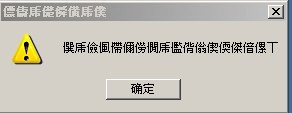

# DigiGirl 修改模型比例的方法(附工具下载7天)

作者：kasumi360

TID：1779

<title>1</title> <link href="../Styles/Style.css" type="text/css" rel="stylesheet">

# 1

用 SB3Utility v0.7.21 以上的版本就可以修改了; 同时修改模型的矩阵 [1,1] [2,2] 和[3,3] 的数值就可以了
有 D3D 基础的就知道怎么改了, 不懂的就改一个试一个 2" />
该软件从 hongfire 上可以找的到， 或者从以下链接下载 ( 11月09日以后到期):

提取码：

6999f3ec

不好意思，　链接粘错了，　已改正, 提取码不变 :
[http://xianexs.mail.qq.com/cgi-bin/downloadfilepart/svrid235/SB3Utility_v0.7.21.rar?svrid=235&fid=2d45f9ed93a3d2d97fa8da791338f930293082c253b85566&&txf_fid=e1a4cb79c0fb655cfaa1e16a532e163acf5a6590&&txf_sid=](http://xianexs.mail.qq.com/cgi-bin/downloadfilepart/svrid235/SB3Utility_v0.7.21.rar?svrid=235&fid=2d45f9ed93a3d2d97fa8da791338f930293082c253b85566&&txf_fid=e1a4cb79c0fb655cfaa1e16a532e163acf5a6590&&txf_sid)
--- <title>2</title> <link href="../Styles/Style.css" type="text/css" rel="stylesheet">

# 2

 <ignore_js_op>[未命名.PNG](forum.php?mod=attachment&aid=NTc3NnxlM2IzNTJjMXwxNjc0MDY5NzE2fDE4MjMwfDE3Nzk%3D&nothumb=yes) *(866.78 KB, 下載次數: 5)*

[下載附件](forum.php?mod=attachment&aid=NTc3NnxlM2IzNTJjMXwxNjc0MDY5NzE2fDE4MjMwfDE3Nzk%3D&nothumb=yes)

2008-11-3 20:04 上傳  

</ignore_js_op> <ignore_js_op>[M.PNG](forum.php?mod=attachment&aid=NTc3N3w5NGY3N2NmNHwxNjc0MDY5NzE2fDE4MjMwfDE3Nzk%3D&nothumb=yes) *(2.09 KB, 下載次數: 6)*

[下載附件](forum.php?mod=attachment&aid=NTc3N3w5NGY3N2NmNHwxNjc0MDY5NzE2fDE4MjMwfDE3Nzk%3D&nothumb=yes)

2008-11-3 20:04 上傳  

</ignore_js_op> <title>3</title> <link href="../Styles/Style.css" type="text/css" rel="stylesheet">

# 3

感謝提供指導，有興趣的人不妨嘗試看看∼∼ <title>4</title> <link href="../Styles/Style.css" type="text/css" rel="stylesheet">

# 4

先来第一个作品。。。见笑见笑 <title>5</title> <link href="../Styles/Style.css" type="text/css" rel="stylesheet">

# 5

 <ignore_js_op>[a1.jpg](forum.php?mod=attachment&aid=NTc3OHw4MzY2MjE4Y3wxNjc0MDY5NzE2fDE4MjMwfDE3Nzk%3D&nothumb=yes) *(65.66 KB, 下載次數: 3)*

[下載附件](forum.php?mod=attachment&aid=NTc3OHw4MzY2MjE4Y3wxNjc0MDY5NzE2fDE4MjMwfDE3Nzk%3D&nothumb=yes)

2008-11-3 20:34 上傳  

</ignore_js_op> <title>6</title> <link href="../Styles/Style.css" type="text/css" rel="stylesheet">

# 6

这是我下载到比较好的 DigiTown 的版本　266MB, 　E文版 , 模型(MM, 也有GG)很多 　(用 AppLocal 打开程序，里面的 Save 内容才可打开!)
[http://www.megaupload.com/cn/?d=NUCG17FE](http://www.megaupload.com/cn/?d=NUCG17FE)

但大客气了 : ) 　也是通过你才知道有 SB3Utility 这个东东 ^_~

[ *本帖最後由 nfsaoc 於 2008-11-3 21:05 編輯* ] <title>7</title> <link href="../Styles/Style.css" type="text/css" rel="stylesheet">

# 7

要回復才能看啊   <title>8</title> <link href="../Styles/Style.css" type="text/css" rel="stylesheet">

# 8

不过我们大陆的回复购买也够麻烦的 <title>9</title> <link href="../Styles/Style.css" type="text/css" rel="stylesheet">

# 9

SB3Utility_v0.7.21无法打开,555 <title>10</title> <link href="../Styles/Style.css" type="text/css" rel="stylesheet">

# 10

回覆看看
有空時研究研究 <title>11</title> <link href="../Styles/Style.css" type="text/css" rel="stylesheet">

# 11

我有興趣!來看看

-----------------------以上是看回覆之前---------------

恩~我進去那網站,他竟然說要qq的email等等耶!
我申請後,再去那網站他竟然還要我在登入,但登入後沒效阿!

[ *本帖最後由 pliod 於 2008-11-4 02:20 編輯* ] <title>12</title> <link href="../Styles/Style.css" type="text/css" rel="stylesheet">

# 12

花了一晚上,总算搞定了,呵呵,身高改完真不错 <title>13</title> <link href="../Styles/Style.css" type="text/css" rel="stylesheet">

# 13

  話說這真是一個好東西 <title>14</title> <link href="../Styles/Style.css" type="text/css" rel="stylesheet">

# 14

 ........3D顶!!!!!!!!!! <title>15</title> <link href="../Styles/Style.css" type="text/css" rel="stylesheet">

# 15

好想试试哦，不知能否下到 <title>16</title> <link href="../Styles/Style.css" type="text/css" rel="stylesheet">

# 16

很不错的东西,可以几个人一起做漫画了 <title>17</title> <link href="../Styles/Style.css" type="text/css" rel="stylesheet">

# 17

好的软件真不少-—— <title>18</title> <link href="../Styles/Style.css" type="text/css" rel="stylesheet">

# 18

好物 收了 之前看日站的說明老是不成，要么禁止大陸IP 要么文件校驗碼過不去 <title>19</title> <link href="../Styles/Style.css" type="text/css" rel="stylesheet">

# 19

  <title>20</title> <link href="../Styles/Style.css" type="text/css" rel="stylesheet">

# 20

回覆看看
研究研究
  <title>21</title> <link href="../Styles/Style.css" type="text/css" rel="stylesheet">

# 21

有空研究研究，今天先看看是什么帖子 <title>22</title> <link href="../Styles/Style.css" type="text/css" rel="stylesheet">

# 22

已收入精華區。

另，都已經收費了，應該沒必要再設置回覆可見，故解除之。 <title>23</title> <link href="../Styles/Style.css" type="text/css" rel="stylesheet">

# 23

? 收費只是玩玩而已， 全篇是設成 Free 的啊  @_@?! <title>24</title> <link href="../Styles/Style.css" type="text/css" rel="stylesheet">

# 24

终于可以自己动手了，可惜以前不会弄都删掉了 <title>25</title> <link href="../Styles/Style.css" type="text/css" rel="stylesheet">

# 25

呃，抱歉抱歉。因為我不久前才注意到你又設收費又設回覆可見，所以搞不懂你偏好哪一個@@

我的立場是寧願你選收費也別選回覆可見，免得多出一堆灌水文無意義的增加論壇流量。

維持這樣也不錯，你想全部設為free再告訴我囉！ <title>26</title> <link href="../Styles/Style.css" type="text/css" rel="stylesheet">

# 26

晕了 点了购买半天没反映。。。 <title>27</title> <link href="../Styles/Style.css" type="text/css" rel="stylesheet">

# 27

載完後解開來執行Digital Girl Rin (English).exe

他說遊戲尚未安裝...(&acute;⑸｀) <title>28</title> <link href="../Styles/Style.css" type="text/css" rel="stylesheet">

# 28

 <ignore_js_op>[error.JPG](forum.php?mod=attachment&aid=NTgwOXw1NmZjNzJmMnwxNjc0MDY5NzUxfDE4MjMwfDE3Nzk%3D&nothumb=yes) *(7.07 KB, 下載次數: 0)*

[下載附件](forum.php?mod=attachment&aid=NTgwOXw1NmZjNzJmMnwxNjc0MDY5NzUxfDE4MjMwfDE3Nzk%3D&nothumb=yes)

2008-11-6 18:56 上傳  

</ignore_js_op> <title>29</title> <link href="../Styles/Style.css" type="text/css" rel="stylesheet">

# 29

郁闷了  怎么\就点不了购买呢？？
哪位大哥再发一个出来。 谢谢！！ <title>30</title> <link href="../Styles/Style.css" type="text/css" rel="stylesheet">

# 30

为什么\用代理购买不了了呢?
我大陆的... <title>31</title> <link href="../Styles/Style.css" type="text/css" rel="stylesheet">

# 31

看看  <title>32</title> <link href="../Styles/Style.css" type="text/css" rel="stylesheet">

# 32

我郁闷了....我按照楼主给的地址下的E文版的这个游戏 可是怎么游戏运行不了呢？
<ignore_js_op>

**22.jpg** *(8.23 KB, 下載次數: 0)*

[下載附件](forum.php?mod=attachment&aid=MjAwMzd8Nzk2NTg2ZTF8MTY3NDA2OTc1M3wxODIzMHwxNzc5&nothumb=yes)

2010-4-25 15:00 上傳

能帮忙解决下吗？ <title>33</title> <link href="../Styles/Style.css" type="text/css" rel="stylesheet">

# 33

貌似不错，有机会试试。。。 <title>34</title> <link href="../Styles/Style.css" type="text/css" rel="stylesheet">

# 34

是修改人物模版的软件么？ <title>35</title> <link href="../Styles/Style.css" type="text/css" rel="stylesheet">

# 35

到期了 <title>36</title> <link href="../Styles/Style.css" type="text/css" rel="stylesheet">

# 36

话说要我提供游戏补丁啥的吗</ignore_js_op>