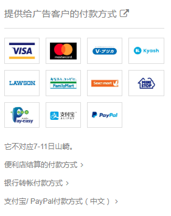

# Fantia中国用户有福音了

作者：大朱投

TID：29342

<title>1</title> <link href="../Styles/Style.css" type="text/css" rel="stylesheet">

# 1

我最近才发现，针对中国用户Fantia特别开通了支付宝和PayPal渠道
<title>2</title> <link href="../Styles/Style.css" type="text/css" rel="stylesheet">

# 2

 <ignore_js_op>[QQ截图20200823223327.png](forum.php?mod=attachment&aid=ODQ3OTV8Mzc0YjU5ZmV8MTY3NDA2NjMyOXwxODIzMHwyOTM0Mg%3D%3D&nothumb=yes) *(28.8 KB, 下載次數: 1)*

[下載附件](forum.php?mod=attachment&aid=ODQ3OTV8Mzc0YjU5ZmV8MTY3NDA2NjMyOXwxODIzMHwyOTM0Mg%3D%3D&nothumb=yes)

2020-8-23 22:33 上傳  

</ignore_js_op> <title>3</title> <link href="../Styles/Style.css" type="text/css" rel="stylesheet">

# 3

啊？我好像没注意到，在哪操作？ <title>4</title> <link href="../Styles/Style.css" type="text/css" rel="stylesheet">

# 4

开了有段时间了，不过还是魔法集市代理。
嘛，有就不错了。 <title>5</title> <link href="../Styles/Style.css" type="text/css" rel="stylesheet">

# 5

> [gtshaha 發表於 2020-8-23 23:33](https://giantessnight.cf/gnforum2012/forum.php?mod=redirect&goto=findpost&pid=445991&ptid=29342)
> 啊？我好像没注意到，在哪操作？

进入Fantia往下翻就可以找到

<title>6</title> <link href="../Styles/Style.css" type="text/css" rel="stylesheet">

# 6

我付款的时候还是没有paypal和支付宝的选项，你这个截图上也写得是提供给广告客户的付款方式，也许我们不算广告客户吧。。 <title>7</title> <link href="../Styles/Style.css" type="text/css" rel="stylesheet">

# 7

其实申请个Visa信用卡也不难，而且用起来更方便 <title>8</title> <link href="../Styles/Style.css" type="text/css" rel="stylesheet">

# 8

还以为默认支付方式里能用PayPal了呢。原来只是充点数能用。。。 <title>9</title> <link href="../Styles/Style.css" type="text/css" rel="stylesheet">

# 9

patreon好久能有这个

<title>10</title> <link href="../Styles/Style.css" type="text/css" rel="stylesheet">

# 10

虽然有信用卡，但是还是不如支付宝这些方便，这着实是个好消息 <title>11</title> <link href="../Styles/Style.css" type="text/css" rel="stylesheet">

# 11

现在很多支持paypal的网站都可以付款了，不用海外卡和双币卡，只需要绑定一张国内银联卡就可以。 <title>12</title> <link href="../Styles/Style.css" type="text/css" rel="stylesheet">

# 12

不错，再怎么说支付宝也比paypal好用点 <title>13</title> <link href="../Styles/Style.css" type="text/css" rel="stylesheet">

# 13

刚刚去看了，真的可以，已经赞助上了 <title>14</title> <link href="../Styles/Style.css" type="text/css" rel="stylesheet">

# 14

好消息啊 一步一步来吧

国人所谓的“盗版”和”白嫖”有时候还是因为付费太麻烦了或者墙
这样一点一点改进的话 对我们这个小圈子也挺好的， 画师和创作者都能得到反馈了 <title>15</title> <link href="../Styles/Style.css" type="text/css" rel="stylesheet">

# 15

好棒，如果patreon也能支持就好了 <title>16</title> <link href="../Styles/Style.css" type="text/css" rel="stylesheet">

# 16

这个可以魔法集市上面买 但是patreon的还是不行 害 <title>17</title> <link href="../Styles/Style.css" type="text/css" rel="stylesheet">

# 17

这是好事，毕竟学生申visa还是有点麻烦的