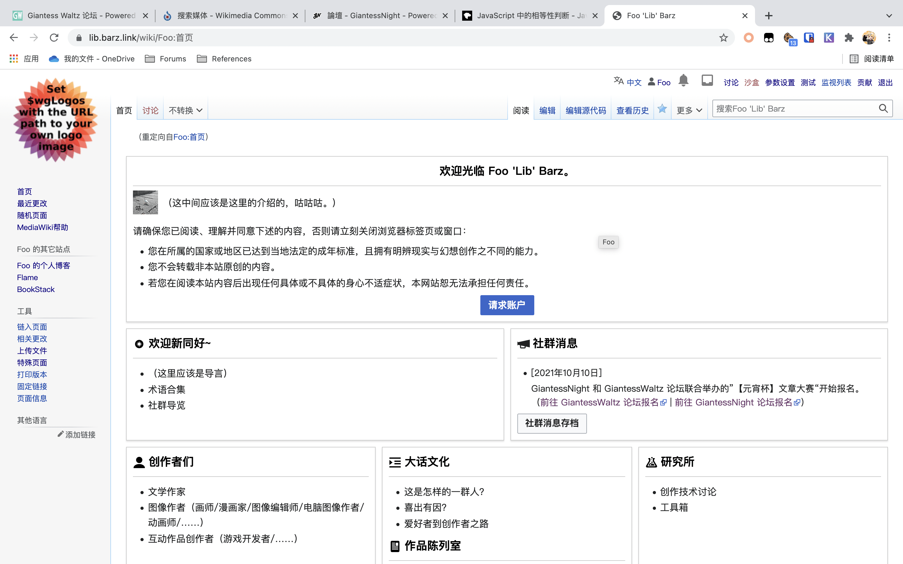

# Foo ＂lib＂ Barz （暂定）草案路线图？

作者：Foobarz

TID：31780

<title>1</title> <link href="../Styles/Style.css" type="text/css" rel="stylesheet">

# 1

FOO 2021/10/3**前言（或许是自我介绍）**
自我介绍一向是我最头疼的东西……你看这家伙起名字有多么随意就知道了。如果你也向我一样写过一些在电脑上运行的代码的话，你应该也已经见过 “foo”和“bar”不少次了。它们好像经常在各种文档中客串出演一下变量的样子。至于我推后面（https://twitter.com/barz076） 的那个数字的话，目前你就把它当作我注册时发现此用户名已被使用随便填的数字好了。绝赞摸鱼或者咕咕作者 +=1 ，在看了某系列图（好啦就是这个啦）之后开始走上了自产自销的不归路（不是）。第一部想到哪写到哪还匆匆强行完结的游戏在被Bilibili几个 UP 主推荐（其实就是录了下游戏实况）以后还是没什么变化，该没人理的我还是没人理的样子……  不知道主角换了个位置应该算续作还是前作的下一部在慢悠悠的出了个序章以后，我的兴趣就转移到别的地方去了，例如看了某个汉化觉得不舒服就自己动手然后还是被劫胡……或者接下来要说的事情。（好啦好啦，那个很有可能会继续做的啦……）在意想不到或者司空见惯的地方有着奇妙的坚持，例如不怎么受用还让自己满是破费买的 OneDrive for Business（OneDrive for Business 国际版用的 *.sharepoint.com 目前在大陆还没有受到普通版 OneDrive （onedrive.live.com）的“亲切招待”，下载速度嘛，总比人尽皆知没充会员的百度网盘快。）然后发现自己的东西又被人放到百度微云各种歪瓜劣枣的地方的时候……（强颜欢笑.jpg）**所以这个计划是怎么蹦出来的？**
在第x次看到有人问哪里有某某的时候，我首先想到的是做一个索引网站，就像刚连上互联网那几年流行的黄页或者网站导航一样。然后我就找了和我有点联系的朋友询问一下建议。在问到 GiantessWaltz 站长 phone2345 （在GW公式交流群里大家包括我都叫电话叫惯了，下面就继续叫电话了~）的时候，他/她用自己的惨痛经历（或许夸张了点）提醒我，想要长久的发展下去的话就一定要有些自己的特色。例如……（下略，各位应该比我更清楚这几个中文社群的特点）然后这么一想的话，既然都用上 MediaWiki 了，那么做一个中文巨大娘wiki似乎也就很那么……理所当然了？于是在有了这个想法以后，我就以我贫瘠的脑细胞挤出了几个问题列成了前面那张问卷。在此感谢完成那张问卷的三十余位朋友（截止到我开始写这个的时候），帮我把问题转载到GiantessNight 论坛的电话和特别关照我的 GN 站长 Dante。（这样我就更没有勇气鸽下去了吧，也许。）以及问卷在这里了，目前依然欢迎提出各种建议： https://forms.office.com/r/W2UFV33NvH接下来要展示问卷的部分结论，基于 Microsoft Forms 复制问卷不会复制结果以及里面有一些个人信息的关系，我就不放出问卷的摘要了。**起名字什么的最难了！**
所以我就把这个史诗级难题分摊给各位了（不是），在去掉诸如还行一类玩梗的回答之后（还行），大概还有这些结果。

| GtsLib | GiantessEncyclopedia |
| giantess library | moe巨大娘 |
| 巨大娘探险指南 | Foo‘s Bar（Foo的酒吧） |
| Winner | GiantessLIB |
| 天降马克 | 盒中猫 |
| 盖亚图书馆（随便想的） | GiantessMorning百科（ |
| GDI （开个玩笑，如果有灵感的话，下次吧） | fooの巨大娘词典 |
| GiantessLoverSite | 巨大娘宣传部 (Giantess Propaganda Department) |
| GiantessIndex | giantess wiki china |
| GTSmaker | Foo的天狐神社...？ |
| 巨大萌娘星 | Emp-Lab |
| 超弩级巨少女 |  |

你问我有什么看法嘛……l  我一开始觉得某部游戏的名字改一下就很不错，虽然遗憾的是那位作者因为各种可堪设想的原因不再活跃了来着。l  大多数参考意见都有 giantess 或者巨大娘来着，看来大家主动帮我限制主题了嘛。（笑）l  libgts …… 这很像隔壁类 UNIX 系统的库的名字嘛……（好啦好啦，我知道 Library 除了图书馆也有库的意思啦。当然如果你没写过源代码理解不了这其中的梗的话也没有关系。）l  也许是因为害羞啦，虽然我有可能是在中文范围里收集这些内容的第一位啦，我也有点不是很想在网站标题上留下自己的名字的样子。l  以及我发现我应该再加个问题问问起这个名字的理由的，虽然现在已经晚了……如果一定要从里面选一个的话，在看了GN的社群网站募集表最上面的「神社」（https://jinja-modoki.com/）以后，我可能会觉得天狐神社好一点。（嗯？）当然我还是再等等看有没有能让我眼前一亮的想法好了。
<title>2</title> <link href="../Styles/Style.css" type="text/css" rel="stylesheet">

# 2

**接下来，我们该收集些什么？**
所以首先就愉快的把整体范围限缩在巨大娘的范围了。l  “介绍巨大娘爱好”大概是在试图破除某些迷思：*出圈的情况一直在发生，但圈内一直缺少个中文的巨娘wiki，让圈外到圈内形成了一道墙，对接触圈子的新人而言，没有指引很容易产生误解，甚至踩了雷而不自知；对长驻圈内的同好而言，遇到要解释GTS时，很难有个理想的答覆，甚至被认为是性癖或不良嗜好而尴尬。*但是接下来我就发现我文采实在匮乏或者经验不足，根本不知道该如何介绍……BiliBili UP主虚研会的某期视频（https://www.bilibili.com/video/BV17K4y1N7hu）也许能作为一个参考的开始。l  “介绍相关的各种要素” 是什么呢？我也不知道（笑），目前的想法大概就是巨娘分类学了（这是啥玩意儿？），也就是介绍各种分类方式（例如最直观的大小，或是起源、性格之类的），以及和相关创作经常交叉的其他元素，像是最常见的大搞破坏什么的。毕竟如果仰望过去的话……l  “收集创作者、作品和爱好者社群”可能会遇上的其它问题？这个想法大概就是 GN“世界情报交流区”和电话一开始给我看的 Giantess Wiki（https://giantess.miraheze.org/）组合起来的东西。<title>3</title> <link href="../Styles/Style.css" type="text/css" rel="stylesheet">

# 3

*本帖最後由 Foobarz 於 2021-10-3 22:30 編輯*

以及我是有想法在尽可能获得授权的前提下提供公开访问的作品的镜像的，以期避免原始链接失效的情况。从上到下三个选项的完整描述在下面：l  在取得授权的情况下可以，同时可以在收取存储成本的情况下主动提供。l  在取得授权的情况下可以，但只有在原始出处失效的情况下才提供。l  为了避免不必要的风险和争议，没有必要要那么做。从最初的意见来看，大家对于这种做法不至于强烈反对，那么……还是先暂时搁置一下谨慎研究一下可行的解决方案吧。（咕咕）l  “收集各种原创研究”指的是？例如 GN 和GW 都有的以某个数据为参考输入参数的巨大娘计算器，以及可供创作者参考的教学等等。当然你喜欢的话放其它的也行啊，例如角色扮演的设定什么的。l  还有别的想法嘛？*“我看出来了，你们各个身怀绝技。”*下面列出了一些收到的回复中有些有趣的想法。

| 给想创作巨娘文化作品的人一些设定技术指引，例如物理效应或尺寸换算；开发巨娘主题RPGmaker游戏的技术指引，例如人物放大缩小插件 |
| 可以打造成一个引导新人入坑的平台(？) 创作作品以接受度(轻重口)分类，开贴解答新人常见问题，比如着重介绍其他圈内创作者分布平台和购买方法，以及科普圈内通用术语常识之类的 |
| 帮助新入圈的人少走弯路，不要再被二道贩子骗更多的钱了，如果可以直接赞助给创造者。 |
| 供使用者幻想使用的小工具？我看但大的计算器是个很棒的例子 |
| 作品分类感觉会很有用，就是类似于TV Tropes网站那样，给作品分类 |
| 或许可以按照xp分区？毕竟像我这种足控哈哈哈 经常兴致勃勃的打开帖子发现是vore 还是有点失落的 |

我还能说什么呢？（还行）**如果便捷和私密目前不能共存？**
或者也可以说是这里应该面向哪些人。在问卷里我是这么描述的：背景： MediaWiki 本身并没有为私密性过多设计（毕竟最大的用户是维基百科嘛），可视化编辑器的关键组件 RESTBase （ [https://www.mediawiki.org/wiki/RESTBase](https://www.mediawiki.org/wiki/RESTBase) ）目前无法在要求登录才能查阅的环境下工作。要展开来讲也差不多啦，MediaWiki 也很清楚的说明它不是为私密内容而设计的 Wiki 软件了，例如没有精确到条目或者分类的权限控制，大部分扩展会以匿名的方式访问只读 API ，所以一旦设置成需要登录才能访问会导致工作不正常之类的。显然大家的想法基本上和我差不多，就是作为可能会引导新人的地方，目前先不要放太极限的内容上去。有几位的回复也提到的极限的内容就留在个别的论坛去讨论好了。也有提出过分开成表站和里站的想法，虽然 MediaWiki 能用一个数据库承载不同的配置来着，这个有需要的时候再研究了。**总结：编者募集中（喂）**
虽然想法很多，但是越到后面我就越发现我知识和文采的匮乏。（可能是技能树点错方向了吧，笑）以及我这么久了连首页都还没鸽出来，怕不是要被打死了（x）如果哪位愿意来一起贡献的话，欢迎来 https://lib.barz.link/wiki/Special:%E7%94%B3%E8%AF%B7%E8%B4%A6%E6%88%B7 请求账户。好从 Word 贴来的格式全丢了（x）
所以原件在这里： [https://barz076-my.sharepoint.com/:w:/g/personal/foo_barz076_onmicrosoft_com/Ef60oW-7AIZLpU_iCmF-yd8BDTmIRMimnLqNm88y2M51yw?e=cwh5Xy](https://barz076-my.sharepoint.com/:w:/g/personal/foo_barz076_onmicrosoft_com/Ef60oW-7AIZLpU_iCmF-yd8BDTmIRMimnLqNm88y2M51yw?e=cwh5Xy)
<title>4</title> <link href="../Styles/Style.css" type="text/css" rel="stylesheet">

# 4

呃，GTS不是性癖吗？我觉得就是性癖啊 <title>5</title> <link href="../Styles/Style.css" type="text/css" rel="stylesheet">

# 5

> 宇宙巨娘大和号 發表於 2021-10-4 19:15
> 呃，GTS不是性癖吗？我觉得就是性癖啊

你想引发战争吗.jpg
圈内也有单纯将其视为萌属性一派的存在～ <title>6</title> <link href="../Styles/Style.css" type="text/css" rel="stylesheet">

# 6

> [知らない 發表於 2021-10-4 20:07](https://giantessnight.cf/gnforum2012/forum.php?mod=redirect&goto=findpost&pid=481214&ptid=31780)
> 你想引发战争吗.jpg
> 圈内也有单纯将其视为萌属性一派的存在～

哈哈哈好吧，虽然我个人是觉得只有色没有萌啦
<title>7</title> <link href="../Styles/Style.css" type="text/css" rel="stylesheet">

# 7

对我来说的话，现在属于兴趣范畴，而且说是兴趣也只是感兴趣，没有特别喜欢的那种 <title>8</title> <link href="../Styles/Style.css" type="text/css" rel="stylesheet">

# 8

<ignore_js_op>

**截屏2021-10-13 15.38.04.png** *(1.95 MB, 下載次數: 0)*

[下載附件](forum.php?mod=attachment&aid=OTE3NDB8ZTRhOTU0YTV8MTY3NDA2NTgzM3wxODIzMHwzMTc4MA%3D%3D&nothumb=yes)

2021-10-13 15:38 上傳

捞一下（？），模仿 MediaWiki.org 画了个首页。（咕咕咕）
另外为了这个目的另外建了一个 QQ 群，群号 962553076 ，如果有人有意向的话（希望会有啦）可以加进来聊，如果更中意其它 IM 的话，再说了……

<title>9</title> <link href="../Styles/Style.css" type="text/css" rel="stylesheet">

# 9

网页链接：[https://lib.barz.link/wiki/Foo:%E9%A6%96%E9%A1%B5](https://lib.barz.link/wiki/Foo:%E9%A6%96%E9%A1%B5)
我做了那份问卷，我也去看了一下那个网页，我感觉这个排版需要重新调整，找一个有一定经验/或者职业的用户交互界面设计师去重新排版和设计，这个排版对新来者和不上文字论坛的用户者非常的不友好，只有用惯了那些文字论坛，WIKI，和能有一点学习能力，接受程度高，兴趣高的圈内人才能接受，新来者可能会非常不适应，尤其是将来的潜在用户，出生时期都是在90-10年左右，他们大多是都是从小使用贴吧，百度百科，支付宝，微信等这些用户交互界面经过多次的改进，多次演变和在市场筛选下存留下来的软件，他们的对于交互界面的口味已经形成了，像是Writing.com和维基百科他们很有可能一大部分人刚刚进来，看到一大堆文字，直接被吓到退了出去，不是所有人都能接受这样的排版的。
我有可能要求太高了，，希望你看到我的反馈之后不要生气。

然后就是人长期在海外，QQ号码无法验证，也注册不了，这就是最大的麻烦，没法加群交流。

<title>10</title> <link href="../Styles/Style.css" type="text/css" rel="stylesheet">

# 10

还有你收藏的文章的品味和写的文章也很不错 <title>11</title> <link href="../Styles/Style.css" type="text/css" rel="stylesheet">

# 11

> [racer0725 發表於 2021-10-15 21:46](https://giantessnight.cf/gnforum2012/forum.php?mod=redirect&goto=findpost&pid=482397&ptid=31780)
> 网页链接：https://lib.barz.link/wiki/Foo:%E9%A6%96%E9%A1%B5
> 我做了那份问卷，我也去看了一下那个网页， ...

这大概就是不知身在此山中吧。
以及用 Discord 或者 Microsoft Teams 找我也行。
<title>12</title> <link href="../Styles/Style.css" type="text/css" rel="stylesheet">

# 12

> [Foobarz 發表於 2021-10-15 22:18](https://giantessnight.cf/gnforum2012/forum.php?mod=redirect&goto=findpost&pid=482401&ptid=31780)
> 这大概就是不知身在此山中吧。
> 以及用 Discord 或者 Microsoft Teams 找我也行。
> ...

很正常，我也是在设计产品，做反馈的调查问卷，然后被测试参加者和领导按在地上摩擦的时候才想到用户交互界面的问题的，我的DISCORD是AMXCDC#8855，可以加我一下吗？我不太熟悉DISCORD。</ignore_js_op>