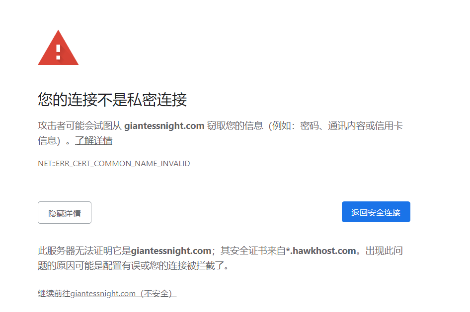
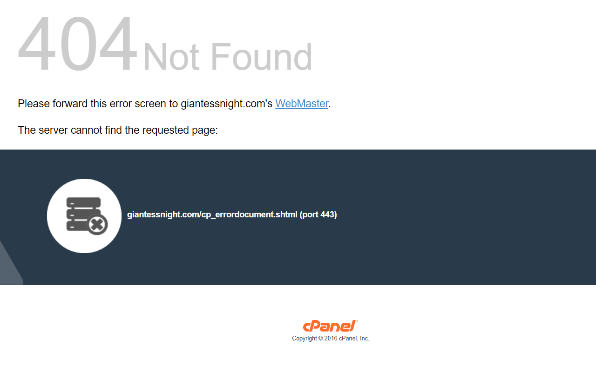

# GN换新IP了 198.252.98.97 有改hosts的更新后就能上了

作者：Vanmilos

TID：29638

<title>1</title> <link href="../Styles/Style.css" type="text/css" rel="stylesheet">

# 1

*本帖最後由 phone2345 於 2020-10-9 20:12 編輯*

昨天(10/8)早上GN换了新IP，DNS服务器应该已经更新完毕，但是有用改hosts方式避免DNS污染的用户没跟着换的话，就会出现cPannel的404错误页面。

<ignore_js_op>

**QQ图片20201009131637.png** *(50.72 KB, 下載次數: 0)*

[下載附件](forum.php?mod=attachment&aid=ODU1NjZ8NWNkMzJmNDF8MTY3NDA2NjI1NXwxODIzMHwyOTYzOA%3D%3D&nothumb=yes)

2020-10-9 13:18 上傳

<ignore_js_op>

**QQ图片20201009131624.png** *(62.13 KB, 下載次數: 0)*

[下載附件](forum.php?mod=attachment&aid=ODU1Njd8M2QyZmJjNzR8MTY3NDA2NjI1NXwxODIzMHwyOTYzOA%3D%3D&nothumb=yes)

2020-10-9 13:18 上傳

因此请记得更新hosts设定。 (旧IP是 198.252.98.91)

198.252.98.97 giantessnight.com
<title>2</title> <link href="../Styles/Style.css" type="text/css" rel="stylesheet">

# 2

謝謝大佬提性
不過我沒那麽多手跑去碰DNS哈哈 <title>3</title> <link href="../Styles/Style.css" type="text/css" rel="stylesheet">

# 3

其实可以搞一个新域名解析到这个IP的...叫但大再加个域名就行 <title>4</title> <link href="../Styles/Style.css" type="text/css" rel="stylesheet">

# 4

.
不看你這帖子我都不知道被換了IP <title>5</title> <link href="../Styles/Style.css" type="text/css" rel="stylesheet">

# 5

之前还以为服务器出问题了...原来是换了新ip <title>6</title> <link href="../Styles/Style.css" type="text/css" rel="stylesheet">

# 6

大佬辛苦了

更新了以后首页的图片也都有了

我的青春回来了！ <title>7</title> <link href="../Styles/Style.css" type="text/css" rel="stylesheet">

# 7

明天弄，就是明天，就是明天，冲鸭！！！ <title>8</title> <link href="../Styles/Style.css" type="text/css" rel="stylesheet">

# 8

前几天确实出现这个情况了，不过梯子换了个节点还是登上来了 <title>9</title> <link href="../Styles/Style.css" type="text/css" rel="stylesheet">

# 9

感谢大佬分享，不过现在使用VPN了。 <title>10</title> <link href="../Styles/Style.css" type="text/css" rel="stylesheet">

# 10

顺便也买个新域名吧？比如 gn2020.com 什么的。。。 <title>11</title> <link href="../Styles/Style.css" type="text/css" rel="stylesheet">

# 11

我发现居然可以百度到GN的IP...发现最后一个从91变成97就自己改过来了233 <title>12</title> <link href="../Styles/Style.css" type="text/css" rel="stylesheet">

# 12

感谢大佬分享，这也太有用了吧，正好vpn到期了</ignore_js_op></ignore_js_op>