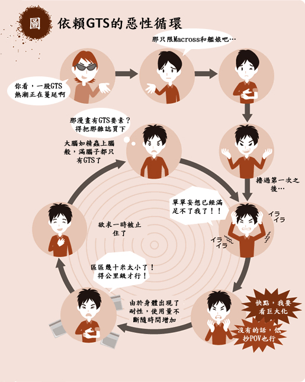

# GTS中毒之惡性循環

作者：Jake

TID：15893

<title>1</title> <link href="../Styles/Style.css" type="text/css" rel="stylesheet">

# 1

原改圖來自[http://twitpic.com/dr32kr](http://twitpic.com/dr32kr) ,這是中翻版

所以,真想不到居然有人委託我翻這個(

<ignore_js_op>

**BdBR2KLCEAEKseO_t.jpg** *(227.44 KB, 下載次數: 29)*

[下載附件](forum.php?mod=attachment&aid=MzkwNTZ8MWM3MDAzYzZ8MTY3NDA2ODg4NXwxODIzMHwxNTg5Mw%3D%3D&nothumb=yes)

2014-1-5 01:26 上傳

<title>2</title> <link href="../Styles/Style.css" type="text/css" rel="stylesheet">

# 2

被委托翻译这个...不会是圈外人的委托吧...
话说GTS的圈子正在一点点扩大呢，能感受出来，不知道是好事还是坏事... <title>3</title> <link href="../Styles/Style.css" type="text/css" rel="stylesheet">

# 3

记得《进击的巨人》倒是着实掀起了一阵啊风潮啊 <title>4</title> <link href="../Styles/Style.css" type="text/css" rel="stylesheet">

# 4

为何会有这种图啊....
不过好像还真是像这么回事 <title>5</title> <link href="../Styles/Style.css" type="text/css" rel="stylesheet">

# 5

不太明白啊。。。。 <title>6</title> <link href="../Styles/Style.css" type="text/css" rel="stylesheet">

# 6

既然有惡性,那麼相反的良性是怎樣子？ <title>7</title> <link href="../Styles/Style.css" type="text/css" rel="stylesheet">

# 7

感觉还真这么回事！
K君 你怎么看 <title>8</title> <link href="../Styles/Style.css" type="text/css" rel="stylesheet">

# 8

除了接觸GTS的原因不同外
個人認同自己已深陷在這循環好久了
<title>9</title> <link href="../Styles/Style.css" type="text/css" rel="stylesheet">

# 9

我看這是六道輪迴了。(中間就是輪迴眼的圈圈圈圈......)
在男同好當中抓到7個同好太容易了，但這在女性同好當中是否一樣?
我深陷在這循環好久了+1，試過看但大文連續櫓了五次然後虛脫的經驗，於是要加約束裝置。
<title>10</title> <link href="../Styles/Style.css" type="text/css" rel="stylesheet">

# 10

真的有時候看太多會傷身阿
隔天早上起來有些地方感覺不是很好 <title>11</title> <link href="../Styles/Style.css" type="text/css" rel="stylesheet">

# 11

傷身子喔
腦中不停的妄想XD <title>12</title> <link href="../Styles/Style.css" type="text/css" rel="stylesheet">

# 12

圈圈中的男孩子看上去略像艾伦 有木有？ <title>13</title> <link href="../Styles/Style.css" type="text/css" rel="stylesheet">

# 13

现在真是满脑子都是GTS了。。 <title>14</title> <link href="../Styles/Style.css" type="text/css" rel="stylesheet">

# 14

个人还是不太喜欢太巨大化的   超过几公里就没感觉了   有互动最好十几米就行 <title>15</title> <link href="../Styles/Style.css" type="text/css" rel="stylesheet">

# 15

我只想说：根本停不下来 <title>16</title> <link href="../Styles/Style.css" type="text/css" rel="stylesheet">

# 16

貌似有点道理...我竟无言以对... <title>17</title> <link href="../Styles/Style.css" type="text/css" rel="stylesheet">

# 17

好像说的很有道理唉！！！ <title>18</title> <link href="../Styles/Style.css" type="text/css" rel="stylesheet">

# 18

真是一语就道破真理啊！！ <title>19</title> <link href="../Styles/Style.css" type="text/css" rel="stylesheet">

# 19

就是因为图上所说的，所以口味变得越来越重了 <title>20</title> <link href="../Styles/Style.css" type="text/css" rel="stylesheet">

# 20

中枪倒地。。。这真是太对了。。 <title>21</title> <link href="../Styles/Style.css" type="text/css" rel="stylesheet">

# 21

還好我不是圖中的人...
沒中毒YA(= =) <title>22</title> <link href="../Styles/Style.css" type="text/css" rel="stylesheet">

# 22

覺得還好自己沒有惡性循環,算是增加了一種興趣
GTS喜愛的屬性也很固定,不是mega至giga的就提不起那感覺
只是較喜歡人物是原創的
而不要是大眾人物(如高人氣漫畫/電玩女主角當GTS之類的) <title>23</title> <link href="../Styles/Style.css" type="text/css" rel="stylesheet">

# 23

gts圈能擴大絕對是好事的，這樣相關作品才會多 <title>24</title> <link href="../Styles/Style.css" type="text/css" rel="stylesheet">

# 24

不知道从几岁开始进入这个领域 只知道能进这个圈 真好 <title>25</title> <link href="../Styles/Style.css" type="text/css" rel="stylesheet">

# 25

为何自从我看到了10万倍之后就越走越远了 <title>26</title> <link href="../Styles/Style.css" type="text/css" rel="stylesheet">

# 26

其實還有一種狀況病入膏肓
......自己創作(╯￣▽￣)╯
自己的巨人自己做!!
這樣就沒有口味問題啦! <title>27</title> <link href="../Styles/Style.css" type="text/css" rel="stylesheet">

# 27

现在发现的同类越来越多了，虽然是网上 <title>28</title> <link href="../Styles/Style.css" type="text/css" rel="stylesheet">

# 28

GTS只是一个业余爱好，过度的投入对思想不太好 <title>29</title> <link href="../Styles/Style.css" type="text/css" rel="stylesheet">

# 29

一开始百倍就满足了 现在感觉起线MEGA
这爱好的确伤身 但忍不住... <title>30</title> <link href="../Styles/Style.css" type="text/css" rel="stylesheet">

# 30

> [starcraftorz 發表於 2015-11-19 01:44](https://giantessnight.cf/gnforum2012/forum.php?mod=redirect&goto=findpost&pid=275052&ptid=15893)
> 其實還有一種狀況病入膏肓
> ......自己創作(╯￣▽￣)╯
> 自己的巨人自己做!!

最可怕的是写着写着对自己的角色有感觉了，我竟然被自己的文章爽到了</ignore_js_op>