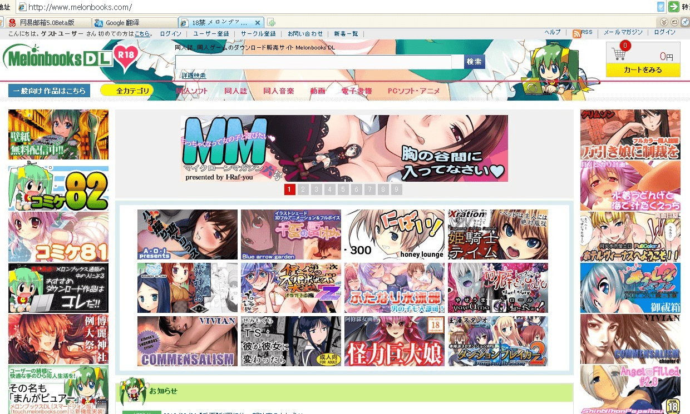

# GTS文化有史以来最辉煌的时刻

作者：泡面

TID：13417

<title>1</title> <link href="../Styles/Style.css" type="text/css" rel="stylesheet">

# 1

*本文章最後由 xnr 於 2012-10-3 00:53 編輯*

[http://www.melonbooks.com/](http://www.melonbooks.com/)

这是日本最知名的成人漫画购物网站，首页四部GTS漫画，包括V姐的那部。

这是GTS文化有史以来最辉煌的时刻，相信今后有望突破这一纪录。

补充，这个漫画网站有分一般区和成人区，成人区有四部GTS漫画在首页：
[http://www.melonbooks.com/index.php?main_page=index](http://www.melonbooks.com/index.php?main_page=index)

总区(包含非成人的)也有两部GTS漫画。

----------------------------------------------------------------------

刷新之后，可能主页内容会有所变动，但是都会有巨大娘的，特截图如下：

<ignore_js_op>

**辉煌.jpg** *(375.32 KB, 下載次數: 12)*

[下載附件](forum.php?mod=attachment&aid=MzEyODR8ZTFmNTQwMGV8MTY3NDA2ODU1NnwxODIzMHwxMzQxNw%3D%3D&nothumb=yes)

2012-10-3 00:18 上傳

<title>2</title> <link href="../Styles/Style.css" type="text/css" rel="stylesheet">

# 2

顶起！虽然作为新人，也要对GTS文化的发扬光大表示激动，意味着今后有更多的资源可以搜集了。 <title>3</title> <link href="../Styles/Style.css" type="text/css" rel="stylesheet">

# 3

> wtr2010 發表於 2012-10-3 00:11 
> 顶起！虽然作为新人，也要对GTS文化的发扬光大表示激动，意味着今后有更多的资源可以搜集了。 ...

好好读书，今后有份好工作就能转化成购买力了，那是对GTS文化最实质性的支持！ <title>4</title> <link href="../Styles/Style.css" type="text/css" rel="stylesheet">

# 4

.
………你是在等人吐嘈嗎？
對方首頁顯示的是每日新書，以及「你最近瀏覽過的商品」
還有一個就是靠你平常檢索些啥判斷出來的「推薦給你的商品」

所以你的首頁當然會是一堆GTS漫畫。
因為我的也是啊！
倒不如說你為什麼才四個？我的「你最近瀏覽過的商品」根本全部都是GTS類的漫畫！
{:6_287:} <title>5</title> <link href="../Styles/Style.css" type="text/css" rel="stylesheet">

# 5

> Dante 發表於 2012-10-3 00:19 
> .
> ………你是在等人吐嘈嗎？
> 對方首頁顯示的是每日新書，以及「你最近瀏覽過的商品」

不是，也包括最近热门的书
你可以去I raf you 的博客看看，他也截图了
我当然知道会有记录，后来刷新后，仍然有巨大娘漫画
我已经截图了，并非最近浏览的，但丁明鉴。

<title>6</title> <link href="../Styles/Style.css" type="text/css" rel="stylesheet">

# 6

應該是真的，第一次進這網站首頁就看到很多GTS的漫畫，感動～～ <title>7</title> <link href="../Styles/Style.css" type="text/css" rel="stylesheet">

# 7

补充，这个漫画网站有分一般区和成人区，成人区有四部GTS漫画在首页：
[http://www.melonbooks.com/index.php?main_page=index](http://www.melonbooks.com/index.php?main_page=index)

总区(包含非成人的)也有两部GTS漫画。

<title>8</title> <link href="../Styles/Style.css" type="text/css" rel="stylesheet">

# 8

但总的吐槽亮了，不过导航栏里面的确有GTS的作品。我实在是想不起来自己什么时候登陆过这个网站，但点进去以后在推荐和最近浏览的栏目里面有好多GTS向作品。
“V婶的一小步，是圈子的一大步。” <title>9</title> <link href="../Styles/Style.css" type="text/css" rel="stylesheet">

# 9

> 流浪人 發表於 2012-10-3 07:33 
> 但总的吐槽亮了，不过导航栏里面的确有GTS的作品。我实在是想不起来自己什么时候登陆过这个网站，但点进去 ...

V姐终于变V婶了吗，，，

{:6_294:}好吧。我只是随便吐吐 <title>10</title> <link href="../Styles/Style.css" type="text/css" rel="stylesheet">

# 10

很久之前此网站是我来收本子名然后找资源看封面的地方，好怀念的地方啊（虽然现在已经有了各种hentai网），GTS圈也终于上首页了…… <title>11</title> <link href="../Styles/Style.css" type="text/css" rel="stylesheet">

# 11

我也第一次上 确实很多GTS本 <title>12</title> <link href="../Styles/Style.css" type="text/css" rel="stylesheet">

# 12

好贵啊 听说日中兑换是1人民币=12日元啊  那些漫画一本都是好几十快的…… <title>13</title> <link href="../Styles/Style.css" type="text/css" rel="stylesheet">

# 13

LZ, yes!!
Recently, almost every Size-Fetish (GTS) mangas get best seller prize in Melonbooks DL.
Also Melonbooks DL's official said that "【巨大娘】ジャンルがメロンブックスＤＬで爆進中！この勢いに乗り遅れるな！" (GTS genre gets fever at Melonbooks DL! Don't miss it!).
[https://twitter.com/Melonbooks_DL/status/250781165500391425](https://twitter.com/Melonbooks_DL/status/250781165500391425)

It's so great!! <title>14</title> <link href="../Styles/Style.css" type="text/css" rel="stylesheet">

# 14

V婶。。。。这称呼一改辈分都变了。。。。阿流够下本啊 <title>15</title> <link href="../Styles/Style.css" type="text/css" rel="stylesheet">

# 15

笔误神变婶么？过几天没准变奶。 <title>16</title> <link href="../Styles/Style.css" type="text/css" rel="stylesheet">

# 16

.
原來是真的啊，眼殘沒注意到。
不過昨天首頁真的是看不到呀，要點進去同人誌的分頁才看得到。</ignore_js_op>