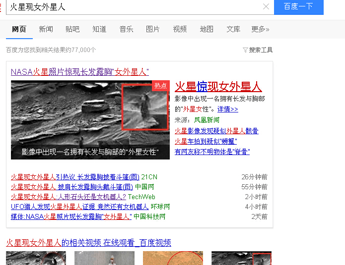
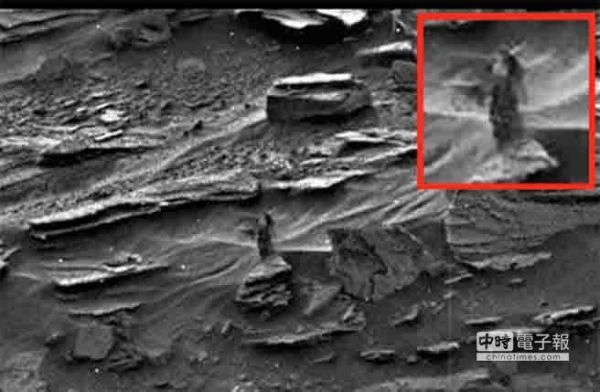

# GTS难道现实真的有存在可能？大家看这新闻

作者：局促不安

TID：19604

<title>1</title> <link href="../Styles/Style.css" type="text/css" rel="stylesheet">

# 1

<ignore_js_op>

**1.jpg** *(331.68 KB, 下載次數: 0)*

[下載附件](forum.php?mod=attachment&aid=NTM3MzV8YzJiM2EwYmF8MTY3NDA2ODAwN3wxODIzMHwxOTYwNA%3D%3D&nothumb=yes)

2015-8-8 15:17 上傳

<ignore_js_op>

**2.jpg** *(43.28 KB, 下載次數: 0)*

[下載附件](forum.php?mod=attachment&aid=NTM3MzR8MjAwMWQwNGF8MTY3NDA2ODAwN3wxODIzMHwxOTYwNA%3D%3D&nothumb=yes)

2015-8-8 15:17 上傳

<title>2</title> <link href="../Styles/Style.css" type="text/css" rel="stylesheet">

# 2

这图片如果是真的，里面女人的大小差不多有几层楼那么高了吧~~~

突然想到以前看过一个帖子，现实地球和月亮相比，然后地球和太阳对比， 太阳和天狼星对比等等等等。。。
这个帖子：[http://tieba.baidu.com/p/1334887677](http://tieba.baidu.com/p/1334887677)
然后我发现，宇宙中也许有比地球大一万倍的星球，那么假如这种星球上有智能生命，那体型应该是非常巨大的吧。。。如果和地球人对比，他们外形和我们差不多，那我们的体积也许就是人家身上一个细胞那么大~~想想有多恐怖~~~

大家觉得呢？可以一起讨论下啊~~~我觉得我想的虽然离谱，但并不是毫无这种可能的。在加上有虫洞理论，宇宙应该存在非直线平面穿梭，有可能曲线空间穿梭的事情，那么科学理论上，人类是可以这些外星生命相遇的~~~ <title>3</title> <link href="../Styles/Style.css" type="text/css" rel="stylesheet">

# 3

大家知道youtube的mark lee吗，他是个聋哑人，但做过一个叫“the new world”和“ The Red Planet”的动画视频，里面的剧情和我表达的这种幻想很接近。他的是通过某种仪式让女巨人在不同星球上转移，但设定是每个星球上都有无数的小男人，于是这些成为她们的主要食物和踩踏对象 

唉，我是从家畜人鸦俘的小说和漫画开始进入GTS这个圈子的，虽然是科幻小说，但也是科学伪论下形成的幻想。。大家平时幻想都是以科学为地基展开的吗？还是就单纯以那么存在了，设定就那样儿开始的呢？？ <title>4</title> <link href="../Styles/Style.css" type="text/css" rel="stylesheet">

# 4

话说仅凭外观就确定是女外星人是不是有点不科学 <title>5</title> <link href="../Styles/Style.css" type="text/css" rel="stylesheet">

# 5

应该只是块石头，之前也有人脸不是吗，只是我们的大脑熟悉才把它们想成人而已。 <title>6</title> <link href="../Styles/Style.css" type="text/css" rel="stylesheet">

# 6

gts几乎是科学上不会存在的
如果是以人类的姿态存在的话，这么大的躯体，双腿根本承受不了这么大的重量，这已经没牵涉其他健康问题之类的。
<title>7</title> <link href="../Styles/Style.css" type="text/css" rel="stylesheet">

# 7

  之前有说过宇宙中有很多有可能有智慧生命的星球啊。。就是特别特别远。。而且大小和形态都和地球差不多。。形成生命最基本得有大量的水啊... <title>8</title> <link href="../Styles/Style.css" type="text/css" rel="stylesheet">

# 8

其实……
所谓生物，首先就是人类自己的定义，如果有一种东西不吃不喝，靠着晒太阳活着，它是不是生物？如果有一种东西，不需要水和空气，必须在真空中，它是不是生物？如果有一种东西，不会动，但是又能发声，它是不是生物？我们从未见过地球上以外的生物，也许对于某些其他星球上的东西来说，地球上的石头才符合他们生物的定义。
其次，就算是人类定义的生物真的存在，他们能和人类长得一样吗？如果是巨大老鼠，巨大蟑螂之类的生物呢？ <title>9</title> <link href="../Styles/Style.css" type="text/css" rel="stylesheet">

# 9

不是不可能，但機會太渺茫啊
長出個跟人類外型一樣……不對，符合自己審美觀的生物而且大小差很多當然可以，宇宙很大嘛，但是能跟我們產生聯繫甚至接觸?
繼續寫小說吧 <title>10</title> <link href="../Styles/Style.css" type="text/css" rel="stylesheet">

# 10

理论上肯定有巨大生物的,因为你无法确定外星球的环境因素.
但是至于长成人类这样嘛.....希望渺茫
不过魔物娘也满有爱(长成类人也希望渺茫 <title>11</title> <link href="../Styles/Style.css" type="text/css" rel="stylesheet">

# 11

我也曾經有另類幻想,女巨人生存於宇宙邊際,也就是宇宙邊際是她們的地,而中間的空間才是她們的天, <title>12</title> <link href="../Styles/Style.css" type="text/css" rel="stylesheet">

# 12

GTS就是要想像才好玩阿
真的有就不好玩了 <title>13</title> <link href="../Styles/Style.css" type="text/css" rel="stylesheet">

# 13

....... 我們都知道.... 人類這個類態是因為地球環境進化出來的物種
在外星就不一定可以維持這種姿態....
其實人類的結構和機能在巨大化到某一程度就難以維持
所以(擹手) <title>14</title> <link href="../Styles/Style.css" type="text/css" rel="stylesheet">

# 14

“但类似我们这样的生命确实是特殊的。”弗林纳人说，“举个例子，我们的体形都差不多。在所有智慧生命中，包括那些已经遗弃了自己世界的，成熟的个体的体重都平均在5O公斤和500公斤之间。我们最长维，或多或少平均都是两米左右——确切地说，有智慧的生命不太可能小于1.5米。”
　　我再次试着抬起眉毛。“那我们为什么会是这样呢？”
　　“在哪儿都是这样，不仅仅在地球上，因为最小的可持续燃烧的火堆的直径大约为五十厘米，为了控制火，你得比它大一点。没有火，当然也就没有冶金术，因而也没有复杂的科学技术。”——一个停顿，然后是一个蹦跶——“你不明白吗？我们都进化成适合用火的体形——并且这体形刚好是宇宙的对数中心。宇宙最大端的物质比我们大四十个数量级，而在最小端的物质比我们小四十个数量级。”霍勒斯看着我，上下跳动着。“如果你四下看看的话，我们确实处在创造的中心。”
罗伯特索耶——<计算中的上帝> <title>15</title> <link href="../Styles/Style.css" type="text/css" rel="stylesheet">

# 15

朋友，外星人的长相，哪怕是雌性你也消受不起啊 <title>16</title> <link href="../Styles/Style.css" type="text/css" rel="stylesheet">

# 16

*本帖最後由 gfgfgf 於 2015-8-8 23:59 編輯*

就是借题发挥而已，楼上很多人表达的都是以地球的标准来看待的结果，但宇宙那么大，大到是远远超过地球人所接触的科学范围的，也更甚至超过我们对生命的认知，所以我们对这些范畴的探索也只能先通过想象，而后确定和否定而已。  因为，可以说目前地球人能够解释的科学只是在宇宙中的站立的一个很小很小的点而已。
就假设，假设浩瀚宇宙中恰巧有那么一颗星球，和地球结构一模一样，和地球上生命演化也一模一样等不管过程如何，它上面生存的智能生命和地球人差不多，只不过他们的星球更大，质量更高，重力更强，然后他也更强大强壮.......  就算是很荒唐，但提出这样的假设，对于神奇的宇宙来说，我们也不可能完全否定吧，因为这方面我们的科学都甚至没踏进去一步。这或许就是想象的魅力吧。

<title>17</title> <link href="../Styles/Style.css" type="text/css" rel="stylesheet">

# 17

*本帖最後由 gfgfgf 於 2015-8-9 00:09 編輯*

然后这种“人”，有正好符合我们GTS群体的审美~~~只是这要的幻想而已。而科学理论审美的只是用来加深这种幻想的代入感！！！！
就比如曾经我还想过有另一个地球，在另一个太阳系，上面有和自己一模一样的另一个人，这样的事情！！所谓平行空间，也许它只是时间上的错差，空间上的错差，但也可能是曲面宇宙空间，和我们这个地球的另一个对称点，之类啥的~~~~~
那我的GTS幻想就是，通过某个神秘虫洞，地球男人穿到另一个星球，而这星球比地球大很多倍，地球男人到上面可以步履轻盈，像跳蚤那样灵活。然后上面也有女巨人，是地球人的许多倍，对他们而言，地球人是外星人。于是被她们抓住，然后她们想办法像繁殖家畜那样繁殖他们，然后女巨人宰割小人的世界的题材就完成了。

或者另一种，穿越到一个比较小的星球，上面完美的环境，完美的生态系统，不过上面的人比地球人小很多很多，而且都是男性智商也不高，还处在初级发展阶段，一个地球普通智商的女人穿越去后，几乎相当于神了。
<title>18</title> <link href="../Styles/Style.css" type="text/css" rel="stylesheet">

# 18

楼主想象力相当丰富啊，，不过我想我们是没机会看到你期望的那天了。。。。。 <title>19</title> <link href="../Styles/Style.css" type="text/css" rel="stylesheet">

# 19

就算这是外星生物，我觉得也不会是那种会造UFO类型 <title>20</title> <link href="../Styles/Style.css" type="text/css" rel="stylesheet">

# 20

*本帖最後由 that123 於 2015-8-9 06:21 編輯*

一半一半……好吧……我看到你的回文了……
這是一個信念問題 我大概明白了…
<title>21</title> <link href="../Styles/Style.css" type="text/css" rel="stylesheet">

# 21

我有很多種幻想,但因寫作能力不好,都沒發表,所以我好幾個故事都爛尾收場,
諸多幻想比如未來世界有縮小動物的科技,罪犯都會被縮小,避免浪費時間空間,而因食物不足窮人都自願縮小變富人奴役..... <title>22</title> <link href="../Styles/Style.css" type="text/css" rel="stylesheet">

# 22

女外星人那个新闻吧..虽然梦想很美好，但是现实还是很残酷的。再说，就算真有这样的生命体，你确定能符合地球人的审美吗？我觉得梦想两个字，还是停留在梦想才会比较好 <title>23</title> <link href="../Styles/Style.css" type="text/css" rel="stylesheet">

# 23

我也都幻想過美女被縮小丟進寶石,而且是不斷縮小,而寶石是一個蟲洞,美女進入了另一個宇宙,在這宇宙的星球對她來說只有細砂大,......而地球上,夜空上竟出現了這個美女...... <title>24</title> <link href="../Styles/Style.css" type="text/css" rel="stylesheet">

# 24

> [静儿_ 發表於 2015-8-8 17:07](https://giantessnight.cf/gnforum2012/forum.php?mod=redirect&goto=findpost&pid=264890&ptid=19604)
> 其实……
> 所谓生物，首先就是人类自己的定义，如果有一种东西不吃不喝，靠着晒太阳活着，它是不是生物？如 ...

喂，不要打碎我们的幻想啊————————

<title>25</title> <link href="../Styles/Style.css" type="text/css" rel="stylesheet">

# 25

gts在目前看来应该不会在现实中出现了 <title>26</title> <link href="../Styles/Style.css" type="text/css" rel="stylesheet">

# 26

gts在目前看来应该不会在现实中出现了 <title>27</title> <link href="../Styles/Style.css" type="text/css" rel="stylesheet">

# 27

楼主脑洞略大！不过有生之年系列了 <title>28</title> <link href="../Styles/Style.css" type="text/css" rel="stylesheet">

# 28

然并卵，以人类科技目前的发展加速度，论坛诸位是等不到开拓太空的一天了。记得留下家祭无忘告乃翁的遗嘱吧。 <title>29</title> <link href="../Styles/Style.css" type="text/css" rel="stylesheet">

# 29

。。。本身人类里美少女比例就很少了，你还指望自然生成的巨大外星人看着像美少女吗。。。 <title>30</title> <link href="../Styles/Style.css" type="text/css" rel="stylesheet">

# 30

只是很像吧，不过希望有这样的外星人 <title>31</title> <link href="../Styles/Style.css" type="text/css" rel="stylesheet">

# 31

这外星人长得跟地球人差不多啊 <title>32</title> <link href="../Styles/Style.css" type="text/css" rel="stylesheet">

# 32

 外星人什么的，也许早就gts了不知道多久了呢，不过客观来说科学想完成gts有点牵强。 <title>33</title> <link href="../Styles/Style.css" type="text/css" rel="stylesheet">

# 33

不知道是真是假!!!!!!!!!!!!! <title>34</title> <link href="../Styles/Style.css" type="text/css" rel="stylesheet">

# 34

我只想说。。。比地球厉害的存在到处都是。。。GTS的可能肯定是有。。只是我们这一排人估计是看不到了 <title>35</title> <link href="../Styles/Style.css" type="text/css" rel="stylesheet">

# 35

啰嗦一句有的没的吧（我是学文的，理科一概不懂，这是从杂志上看的）......之前有科学家提出过压缩法（把人体压缩），结果那样的话人的密度比金子还高，被推翻。还有就是拿取法，拿走人身上的一些细胞之类的，结果.........会把缩小人变成白痴。还有微缩法，不过我忘记是怎么一回事了，这种方法理论上可行，但是.......人类科技还没发展到那个地步......... <title>36</title> <link href="../Styles/Style.css" type="text/css" rel="stylesheet">

# 36

> gfgfgf 發表於 2015-8-8 15:25
> 这图片如果是真的，里面女人的大小差不多有几层楼那么高了吧~~~
> 
> 突然想到以前看过一个帖子，现实地球和月 ...

如果一个星球比地球大一万倍，又和地球成分差不多的话，根据体积与半径的立方关系，引力和半径的平方反比关系，那个星球的引力会比地球大的多，考虑到受力问题，如果有生物的话反而会比地球生物体型小。所以比地球小的星球更有可能产生体型更大的生物。。。至于人类这种温血动物的体型还受到自身散热的限制。如果体型太大，体内产生的热量更多，更难散出去，体温过高就gg了。所以温血动物的体型是有极限的。综上，GTS在现实中完全没办法实现的。 <title>37</title> <link href="../Styles/Style.css" type="text/css" rel="stylesheet">

# 37

并没有可能，星球质量越大，动物越矮，长得太长就会被重力杂碎 <title>38</title> <link href="../Styles/Style.css" type="text/css" rel="stylesheet">

# 38

这怕是   哎~   虽然很现实   估计  想多了 <title>39</title> <link href="../Styles/Style.css" type="text/css" rel="stylesheet">

# 39

哈哈，路过看看，挺有趣的！ <title>40</title> <link href="../Styles/Style.css" type="text/css" rel="stylesheet">

# 40

坦白說...以科學的角度而論
如果把人身高放大10倍
那麼他的力量會變成100倍(因為肌肉截面積變成10倍X10倍)
但是他的體重會變成1000倍(長X寬X高)
這樣會產生甚麼後果呢？
想像一下自己身上背了10個人就知道了
這個負荷可以讓他把自己壓死
(以上論述可以去參考一下「空想科學大戰」的內容)

所以在地球上這種放大基本上是行不通的
但是在茫茫星辰大海有沒有可能呢？
答案是可能的
如果某顆星球的體積是地球的1/10的話，因為重力也只有1/10
剛好可以把多增加的體重抵銷
因此可以讓巨人存在
但是在他們來到地球的一瞬間就....GG
反而是我們過去還可以生存
所以阿~~為了滿足我們的夢想
讓我們一起航向星辰大海吧
<title>41</title> <link href="../Styles/Style.css" type="text/css" rel="stylesheet">

# 41

曾经看过一个系列电影,好像叫黑衣人,
片尾有一段情节就是车站的储物柜就是另
一个世界,而我们的也只是更高级世界的车站
储物柜罢了,另一说是更高级生命的玩具.
我觉得这是相当有可能的事</ignore_js_op></ignore_js_op>