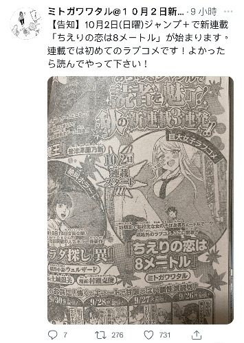
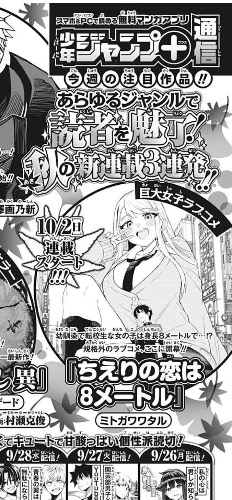

# Jmup新漫畫連載ちえりの恋は8目トル

作者：sjfksi

TID：34173

<title>1</title> <link href="../Styles/Style.css" type="text/css" rel="stylesheet">

# 1

*本帖最後由 magickatio 於 2022-9-26 22:48 編輯*

今天在上推特上看到的

10月2日正式連載
作者的pixiv:
[https://www.pixiv.net/en/users/12935264/artworks](https://www.pixiv.net/en/users/12935264/artworks) <title>2</title> <link href="../Styles/Style.css" type="text/css" rel="stylesheet">

# 2

 <ignore_js_op>[5679D8DB-7965-4FF7-985D-C05B518ED9BD.jpeg](forum.php?mod=attachment&aid=OTk0OTh8N2I0NTNjZjF8MTY3NDA2OTI4NHwxODIzMHwzNDE3Mw%3D%3D&nothumb=yes) *(80.48 KB, 下載次數: 2)*

[下載附件](forum.php?mod=attachment&aid=OTk0OTh8N2I0NTNjZjF8MTY3NDA2OTI4NHwxODIzMHwzNDE3Mw%3D%3D&nothumb=yes)

2022-9-26 22:31 上傳  

</ignore_js_op> <title>3</title> <link href="../Styles/Style.css" type="text/css" rel="stylesheet">

# 3

*本帖最後由 magickatio 於 2022-9-26 22:47 編輯*

內容簡介：青梅竹馬又是轉校生的女孩子的身高有八米？規格外的戀愛喜劇，在這裏開幕！

<title>4</title> <link href="../Styles/Style.css" type="text/css" rel="stylesheet">

# 4

<title>5</title> <link href="../Styles/Style.css" type="text/css" rel="stylesheet">

# 5

 <ignore_js_op>[7E1F58C9-A065-4DE3-BD37-FF567B70970D.jpeg](forum.php?mod=attachment&aid=OTk1MDB8NzY2ZmZkYzh8MTY3NDA2OTI4NHwxODIzMHwzNDE3Mw%3D%3D&nothumb=yes) *(78.13 KB, 下載次數: 0)*

[下載附件](forum.php?mod=attachment&aid=OTk1MDB8NzY2ZmZkYzh8MTY3NDA2OTI4NHwxODIzMHwzNDE3Mw%3D%3D&nothumb=yes)

2022-9-26 22:44 上傳  

</ignore_js_op> <title>6</title> <link href="../Styles/Style.css" type="text/css" rel="stylesheet">

# 6

jump连载？好耶！这个题材看上去就很吸引人啊，不知道作者是不是圈内人 <title>7</title> <link href="../Styles/Style.css" type="text/css" rel="stylesheet">

# 7

我在推特上也看到了，还是彩色的宣传画面。有点期待呢。 <title>8</title> <link href="../Styles/Style.css" type="text/css" rel="stylesheet">

# 8

居然有这种题材的恋爱喜剧但总觉得很悬 <title>9</title> <link href="../Styles/Style.css" type="text/css" rel="stylesheet">

# 9

現在可以看了 [https://shonenjumpplus.com/episode/316112896890762684](https://shonenjumpplus.com/episode/316112896890762684) <title>10</title> <link href="../Styles/Style.css" type="text/css" rel="stylesheet">

# 10

搞一拳超人汉化的团子汉化组接手了，第一话看上去还挺甜的，终于不是奥特曼打怪兽了，是真正意义上的恋爱喜剧，minigts加温柔系纯爱这谁顶得住阿，当场追了（话说广义minigts好像是1.8-10m？） <title>11</title> <link href="../Styles/Style.css" type="text/css" rel="stylesheet">

# 11

很棒啊剧情！画风也很喜欢！就是不知道题材能持续多久了，期待！ <title>12</title> <link href="../Styles/Style.css" type="text/css" rel="stylesheet">

# 12

[https://www.copymanga.org/comic/zhihulidaqgdbami](https://www.copymanga.org/comic/zhihulidaqgdbami)  有汉化了 <title>13</title> <link href="../Styles/Style.css" type="text/css" rel="stylesheet">

# 13

纯爱的呀，不过这个巨大少女支援局的标志感觉好尴尬啊 <title>14</title> <link href="../Styles/Style.css" type="text/css" rel="stylesheet">

# 14

现在更新到第4话啦，很喜欢这个画风