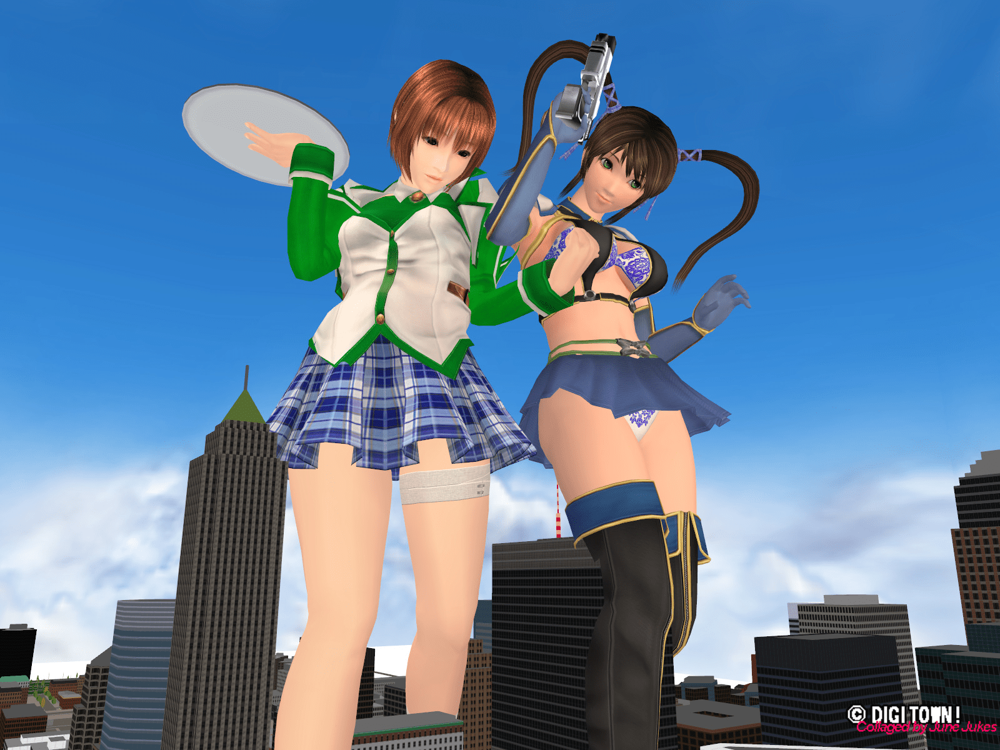

# Jukes的個人GTS站「Megame」在昨晚突破百萬瀏覽人數了！（頂樓新增Megame BBS公告)

作者：gtsferygood

TID：8341

<title>1</title> <link href="../Styles/Style.css" type="text/css" rel="stylesheet">

# 1

雖然慢了些，但有告知總比沒告知好

因為無法直接去留言版祝賀的緣故，
大家就把自己想說的話寫在這裡吧，我會請他來看。

另外這是Jukes先前在Megame BBS發佈的公告：

**Megame BBS開始支援多國語言文字編碼！
不過，Jukes我只能理解日文、英文、華文與韓文而已。

用其他語言發表回文是可以接受的。
但有時我很抱歉，我沒辦法回答他們。

也許我會試著回答您的問題。
因為我不能輸入中文。（但閱讀方面是沒有問題的！）

請不要猶豫，盡情發表您的回文！**

[ *本帖最後由 gtsferygood 於 2010-7-4 17:51 編輯* ] <title>2</title> <link href="../Styles/Style.css" type="text/css" rel="stylesheet">

# 2

首先祝贺Megame突破百万浏览~~ 祝越办越好~
说起来 这是我每天日常的网站啊... <title>3</title> <link href="../Styles/Style.css" type="text/css" rel="stylesheet">

# 3

Megame建站有一些时间了，其中我最佩服Jukes坚持数日内一更的毅力~

祝越办越好！

PS：Megame的图以破坏城市居多，期待有小人互动情节的好图~

[ *本帖最後由 18X 於 2010-7-1 18:52 編輯* ] <title>4</title> <link href="../Styles/Style.css" type="text/css" rel="stylesheet">

# 4

恭喜咯~~~话说居然有这么多人看GTS相关呢！
Congratulation on the  break through 1000000 visit count ！
I can't believe there are so many people like GTS  <title>5</title> <link href="../Styles/Style.css" type="text/css" rel="stylesheet">

# 5

同贺

顺便拜求ls头像系列的出处……

。 <title>6</title> <link href="../Styles/Style.css" type="text/css" rel="stylesheet">

# 6

恭喜获得成就【百万雄师】~~~
祝这位日语英语中文君的网站越办越好
（祝贺贴就不吐槽5L了） <title>7</title> <link href="../Styles/Style.css" type="text/css" rel="stylesheet">

# 7

LS頭像是virtualgiantess2的圖... <title>8</title> <link href="../Styles/Style.css" type="text/css" rel="stylesheet">

# 8

我發現六樓的話越來越亮點了- - <title>9</title> <link href="../Styles/Style.css" type="text/css" rel="stylesheet">

# 9

撒花祝贺~

MEGAME上的许多作品我都很喜欢的呢。
像是リュティア ……桑原 鈴……等等。

祝MEGAME越办越好哈~ <title>10</title> <link href="../Styles/Style.css" type="text/css" rel="stylesheet">

# 10

祝贺越办越好！~~上去逛逛是每天必做的功课的说~ <title>11</title> <link href="../Styles/Style.css" type="text/css" rel="stylesheet">

# 11

大家好.
Thank you very much for your celebrating Megame's Mega (1,000,000) Access!

>楼主
I'm so sorry, these weeks I cannot make 薔薇皇女's scenes.
But, tonight or this weekend, probably I can restart it!

>9L E兄!
These pics for you! <title>12</title> <link href="../Styles/Style.css" type="text/css" rel="stylesheet">

# 12

 <ignore_js_op>[20100701-213331.jpg](forum.php?mod=attachment&aid=MjEyNjV8Zjc2NjlhNTl8MTY3NDA2ODg1NHwxODIzMHw4MzQx&nothumb=yes) *(605.81 KB, 下載次數: 1)*

[下載附件](forum.php?mod=attachment&aid=MjEyNjV8Zjc2NjlhNTl8MTY3NDA2ODg1NHwxODIzMHw4MzQx&nothumb=yes)

2010-7-1 20:38 上傳  

</ignore_js_op> <ignore_js_op>[20100701-213157.jpg](forum.php?mod=attachment&aid=MjEyNjZ8NjJmYzIyMDZ8MTY3NDA2ODg1NHwxODIzMHw4MzQx&nothumb=yes) *(605.18 KB, 下載次數: 1)*

[下載附件](forum.php?mod=attachment&aid=MjEyNjZ8NjJmYzIyMDZ8MTY3NDA2ODg1NHwxODIzMHw4MzQx&nothumb=yes)

2010-7-1 20:38 上傳  

</ignore_js_op> <ignore_js_op>[20100701-213451.jpg](forum.php?mod=attachment&aid=MjEyNjd8ZGZkZjcwODB8MTY3NDA2ODg1NHwxODIzMHw4MzQx&nothumb=yes) *(499.36 KB, 下載次數: 1)*

[下載附件](forum.php?mod=attachment&aid=MjEyNjd8ZGZkZjcwODB8MTY3NDA2ODg1NHwxODIzMHw4MzQx&nothumb=yes)

2010-7-1 20:38 上傳  

</ignore_js_op> <title>13</title> <link href="../Styles/Style.css" type="text/css" rel="stylesheet">

# 13

One more scene with Ryutia (リュティア)! <title>14</title> <link href="../Styles/Style.css" type="text/css" rel="stylesheet">

# 14

 <ignore_js_op>[20100701-214413.jpg](forum.php?mod=attachment&aid=MjEyNjh8YTkxMTk5ZGV8MTY3NDA2ODg1NHwxODIzMHw4MzQx&nothumb=yes) *(553.46 KB, 下載次數: 1)*

[下載附件](forum.php?mod=attachment&aid=MjEyNjh8YTkxMTk5ZGV8MTY3NDA2ODg1NHwxODIzMHw4MzQx&nothumb=yes)

2010-7-1 20:47 上傳  

</ignore_js_op> <ignore_js_op>[20100701-214553.jpg](forum.php?mod=attachment&aid=MjEyNjl8NTYyNjc5ZGR8MTY3NDA2ODg1NHwxODIzMHw4MzQx&nothumb=yes) *(567.52 KB, 下載次數: 1)*

[下載附件](forum.php?mod=attachment&aid=MjEyNjl8NTYyNjc5ZGR8MTY3NDA2ODg1NHwxODIzMHw4MzQx&nothumb=yes)

2010-7-1 20:47 上傳  

</ignore_js_op> <title>15</title> <link href="../Styles/Style.css" type="text/css" rel="stylesheet">

# 15

祝贺mega达成 今后也会一直做juke的观众吧。 <title>16</title> <link href="../Styles/Style.css" type="text/css" rel="stylesheet">

# 16

That's OK,我會好好等著
這次的Model移植的很完美
希望不會跟前面落差感太大 <title>17</title> <link href="../Styles/Style.css" type="text/css" rel="stylesheet">

# 17

JUKES兄的热情令人 （受宠若惊啊……辛苦你了）

那么我就满怀感激地收下了

[ *本帖最後由 eventually 於 2010-7-1 22:53 編輯* ] <title>18</title> <link href="../Styles/Style.css" type="text/css" rel="stylesheet">

# 18

城市部分很合胃口啊
每天都更新的話 點閱人數暴增是應必然的
而且質量又好又有在精進!

可喜可賀!! <title>19</title> <link href="../Styles/Style.css" type="text/css" rel="stylesheet">

# 19

今天 Megame BBS 開始了中文支持.
[http://megame.jp/](http://megame.jp/)
[http://megame.jp/cgi-bin/aska/aska.cgi](http://megame.jp/cgi-bin/aska/aska.cgi)

Please access to Megame!  <title>20</title> <link href="../Styles/Style.css" type="text/css" rel="stylesheet">

# 20

The link to BBS in index page is wrong <title>21</title> <link href="../Styles/Style.css" type="text/css" rel="stylesheet">

# 21

Jukes大的作品若有加上與小人的互動，那就更完美了 <title>22</title> <link href="../Styles/Style.css" type="text/css" rel="stylesheet">

# 22

Aaaaaahhhh!

修正了! 多謝!! <title>23</title> <link href="../Styles/Style.css" type="text/css" rel="stylesheet">

# 23

> 原帖由 *hubert* 於 2010-7-4 12:39 發表 
> Jukes大的作品若有加上與小人的互動，那就更完美了

Yes, I know.
Now I'm trying to add 小人 to my works!

以下, 最近的作品. <title>24</title> <link href="../Styles/Style.css" type="text/css" rel="stylesheet">

# 24

 <ignore_js_op>[20100428-013914.jpg](forum.php?mod=attachment&aid=MjEyOTJ8NmE0NmM1ZjF8MTY3NDA2ODg3MnwxODIzMHw4MzQx&nothumb=yes) *(484.47 KB, 下載次數: 2)*

[下載附件](forum.php?mod=attachment&aid=MjEyOTJ8NmE0NmM1ZjF8MTY3NDA2ODg3MnwxODIzMHw4MzQx&nothumb=yes)

2010-7-4 12:38 上傳  

</ignore_js_op> <ignore_js_op>[20100508-235136.jpg](forum.php?mod=attachment&aid=MjEyOTN8ZmIyYmUwNzB8MTY3NDA2ODg3MnwxODIzMHw4MzQx&nothumb=yes) *(358.89 KB, 下載次數: 1)*

[下載附件](forum.php?mod=attachment&aid=MjEyOTN8ZmIyYmUwNzB8MTY3NDA2ODg3MnwxODIzMHw4MzQx&nothumb=yes)

2010-7-4 12:38 上傳  

</ignore_js_op> <ignore_js_op>[20100509-234033.jpg](forum.php?mod=attachment&aid=MjEyOTR8YjU5ZWIxODZ8MTY3NDA2ODg3MnwxODIzMHw4MzQx&nothumb=yes) *(546.41 KB, 下載次數: 1)*

[下載附件](forum.php?mod=attachment&aid=MjEyOTR8YjU5ZWIxODZ8MTY3NDA2ODg3MnwxODIzMHw4MzQx&nothumb=yes)

2010-7-4 12:38 上傳  

</ignore_js_op> <ignore_js_op>[20100523-144458.jpg](forum.php?mod=attachment&aid=MjEyOTV8Y2IyYmNlYmN8MTY3NDA2ODg3MnwxODIzMHw4MzQx&nothumb=yes) *(390.3 KB, 下載次數: 1)*

[下載附件](forum.php?mod=attachment&aid=MjEyOTV8Y2IyYmNlYmN8MTY3NDA2ODg3MnwxODIzMHw4MzQx&nothumb=yes)

2010-7-4 12:38 上傳  

</ignore_js_op> <ignore_js_op>[20100606-022332.jpg](forum.php?mod=attachment&aid=MjEyOTZ8NThjOWI3M2R8MTY3NDA2ODg3MnwxODIzMHw4MzQx&nothumb=yes) *(583.78 KB, 下載次數: 1)*

[下載附件](forum.php?mod=attachment&aid=MjEyOTZ8NThjOWI3M2R8MTY3NDA2ODg3MnwxODIzMHw4MzQx&nothumb=yes)

2010-7-4 12:38 上傳  

</ignore_js_op> <ignore_js_op>[20100606-023018.jpg](forum.php?mod=attachment&aid=MjEyOTd8MmFiMGVmY2J8MTY3NDA2ODg3MnwxODIzMHw4MzQx&nothumb=yes) *(573.23 KB, 下載次數: 1)*

[下載附件](forum.php?mod=attachment&aid=MjEyOTd8MmFiMGVmY2J8MTY3NDA2ODg3MnwxODIzMHw4MzQx&nothumb=yes)

2010-7-4 12:38 上傳  

</ignore_js_op> <ignore_js_op>[20100615-020100.jpg](forum.php?mod=attachment&aid=MjEyOTh8ZmE2NmYyOTZ8MTY3NDA2ODg3MnwxODIzMHw4MzQx&nothumb=yes) *(505.23 KB, 下載次數: 1)*

[下載附件](forum.php?mod=attachment&aid=MjEyOTh8ZmE2NmYyOTZ8MTY3NDA2ODg3MnwxODIzMHw4MzQx&nothumb=yes)

2010-7-4 12:38 上傳  

</ignore_js_op> <ignore_js_op>[20100615-024336.jpg](forum.php?mod=attachment&aid=MjEyOTl8OTEwY2JhMTB8MTY3NDA2ODg3MnwxODIzMHw4MzQx&nothumb=yes) *(523.58 KB, 下載次數: 1)*

[下載附件](forum.php?mod=attachment&aid=MjEyOTl8OTEwY2JhMTB8MTY3NDA2ODg3MnwxODIzMHw4MzQx&nothumb=yes)

2010-7-4 12:38 上傳  

</ignore_js_op> <title>25</title> <link href="../Styles/Style.css" type="text/css" rel="stylesheet">

# 25

謝謝回覆，
第二張圖片(235136)的感覺非常不錯。
再次感謝您的作品發表在論壇。 <title>26</title> <link href="../Styles/Style.css" type="text/css" rel="stylesheet">

# 26

>第二張圖片(235136)的感覺非常不錯。
Thanks a lot!
Similar works are here. ->  [http://megame.jp/mgm/2010/05a/index.html#007](http://megame.jp/mgm/2010/05a/index.html#007) <title>27</title> <link href="../Styles/Style.css" type="text/css" rel="stylesheet">

# 27

謝謝提供，我收藏了。
非常好的一個系列作品，組圖看起來的感覺就是不一樣
此外，2010-05-06的系列也不錯。期待您的大作

[ *本帖最後由 hubert 於 2010-7-4 13:40 編輯* ] <title>28</title> <link href="../Styles/Style.css" type="text/css" rel="stylesheet">

# 28

所以能正大光明的在BBS輸入中文? <title>29</title> <link href="../Styles/Style.css" type="text/css" rel="stylesheet">

# 29

Umm, maybe my Chinese text in 回覆#17 的貼子 is inaccurate. 

Previously, Megame BBS supported only Japanese and English text.
This is very inconvenient for Chinese friends (one of this is, you, G姐!)
So, I improved the BBS program last night.
Then, now you can write Chinese text in Megame BBS.

But, my reply will be written in English because my Chinese language skill is so poor.

Thank you! <title>30</title> <link href="../Styles/Style.css" type="text/css" rel="stylesheet">

# 30

所以J桑的论坛已经正式成为中，英，日文三国语言鼎立的强大国际化论坛
可喜可贺~~~
祝J桑的论坛越来越火~
Ps.咱也在从支持喔~~

[ *本帖最後由 lg83449447 於 2010-7-4 15:35 編輯* ] <title>31</title> <link href="../Styles/Style.css" type="text/css" rel="stylesheet">

# 31

我的疑慮煙消雲散了

而且我也過去當前峰了,再說Jukes已經下達了

「Please do not hesitate to post your comment!」
　　　（請不要猶豫，盡情發表您的評論！）

的指示，請各位不要膽怯，大膽發言吧！

[ *本帖最後由 gtsferygood 於 2010-7-4 17:47 編輯* ] <title>32</title> <link href="../Styles/Style.css" type="text/css" rel="stylesheet">

# 32

恭喜 Jukes兄啊 <title>33</title> <link href="../Styles/Style.css" type="text/css" rel="stylesheet">

# 33

J兄的作品，一直我都很喜欢。
可能主要原因是审美观比较接近吧。
听说J兄最近准备加入一些互动的内容，我感觉有些奇怪。

我奇怪的不是为什么要加入这些内容，我真正奇怪的是，为什么之前J兄的作品中缺少这些元素呢？

喜欢GTS的人，增加互动内容，是一种原始动力吧？
是不是日本的法律不允许？ <title>34</title> <link href="../Styles/Style.css" type="text/css" rel="stylesheet">

# 34

Jukes先前尚未掌握到這方面的技術
就美術而言並不是他的強項，反而還是先天上的弱項
對於程式語言的編寫與更換才是他最得意的項目
（同時也從事科技產業方面的工作）

因此以前只能像扮家家酒那般
以女巨人作為主角、用固定的場景作為背景
小人直接空氣化，以文字的敘述來代替

一直到去年我跟他開始交流後
在題材的選擇與素材的蒐集上才開始有了很大的轉變
當然Jukes自己本身也有去自學一些其他必要的特效設置
而且最近Jukes接受的委託也越來越多，讓他有更多機會去練習
技術會突飛猛進也是必然的

還有目前Jukes使用的Sexy beach&Digital Girl(感謝Jukes指正)
原本也只能更改人物大小的數據、以及肢體動作的調整而已
更為精緻背景、特效與小人互動，還有皮膚材質移植
都是後來才開始慢慢摸索出來的東西

「薔薇」的髮型與絲帶則是他初次使用3D編輯軟體所弄的產物

[ *本帖最後由 gtsferygood 於 2010-7-4 21:06 編輯* ] <title>35</title> <link href="../Styles/Style.css" type="text/css" rel="stylesheet">

# 35

> 原帖由 *gts-c* 於 2010-7-4 18:29 發表 
> J兄的作品，一直我都很喜欢。
> 可能主要原因是审美观比较接近吧。
> 听说J兄最近准备加入一些互动的内容，我感觉有些奇怪。
> 
> 我奇怪的不是为什么要加 ...

萝卜白菜，各有所爱，有的人喜欢GTS与小人的互动，而有的人就喜欢GTS与城市、楼房的互动。

提建议可以，但是没必要把自己的喜好套在他人的喜好上。
——————————————————————————————————————

J大的作品我也很喜欢，人物模型符合我们的审美观。

希望今后能看到更多的：
1\. 拥有完整剧情的图片故事，而不仅是部分片段。
2\. 更多GTS与小人的互动，尤其是希望能在城市中加入大量的小人，不知道技术上能否实现？感觉城市像是模型，死气沉沉。
3\. 更多POV镜头，从小人的第一视角看，更有真实感和震撼感。

[ *本帖最後由 xnr 於 2010-7-4 19:44 編輯* ] <title>36</title> <link href="../Styles/Style.css" type="text/css" rel="stylesheet">

# 36

>>31L G姐
Exactly!
I'm using 2 systems, "SexyBeach3" (Sexyビーチ3) and "Digital Girl" (デジタル彼女).

SB3 has lots of costumes, and generally more beautifil than DG.
But, the poses of the girl is fixed (select from 137 poses), and basically only one girl in one pic.

However, in DG, I can show max 5 girls + boys, and their poses are flexible.
But, there are very few costumes, and very difficult to modifying.., and generally less quality than SB3.

So, these days I'm trying to translate SB3 model data into DG.
It is very very difficult challenge.

>>32L x大
>2\. 更多GTS与小人的互动，尤其是希望能在城市中加入大量的小人，不知道技术上能否实现？
>GTS与城市的互动感觉城市像是模型，死气沉沉。
>3\. 更多POV镜头，从小人的第一视角看，更有真实感和震撼感。
Yes, yes, yes!!
Of course I has been understood these problems!
Yes, I want to solve these problems!
Ah, but, there are technical difficulties.... <title>37</title> <link href="../Styles/Style.css" type="text/css" rel="stylesheet">

# 37

給我更努力點啦 <title>38</title> <link href="../Styles/Style.css" type="text/css" rel="stylesheet">

# 38

嘛嘛，女皇请息怒，技术难题不是一时半会可以攻克的-  -..... <title>39</title> <link href="../Styles/Style.css" type="text/css" rel="stylesheet">

# 39

我還好,但其他猴急的人等不等的了就不知道了 <title>40</title> <link href="../Styles/Style.css" type="text/css" rel="stylesheet">

# 40

BBS可以写中文了……？这真是太高端了……GOOD JOB！

34：JUKES兄已经很努力了哈~从前不是只能在一个小岛上四处张望么，现在已经可以在城市中了
相信JUKES兄可以克服难关的~ <title>41</title> <link href="../Styles/Style.css" type="text/css" rel="stylesheet">

# 41

薔薇的連載又再度開始了
我跟但丁這邊也開始著手翻譯
幾天後就會將翻譯放上