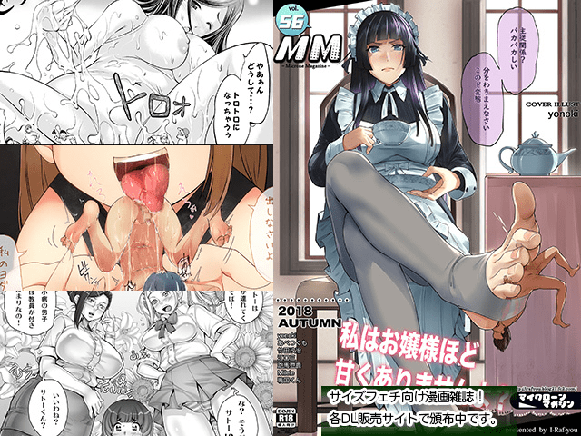

# MM56了都

作者：zxk135

TID：26095

<title>1</title> <link href="../Styles/Style.css" type="text/css" rel="stylesheet">

# 1

[http://irafyou.blog21.fc2.com/blog-entry-1099.html](http://irafyou.blog21.fc2.com/blog-entry-1099.html)
刚在P站看到的
<ignore_js_op>

**71773238_p0.jpg** *(169.66 KB, 下載次數: 1)*

[下載附件](forum.php?mod=attachment&aid=NzU1NDF8MGUxZThhNTJ8MTY3NDA2NjkyMnwxODIzMHwyNjA5NQ%3D%3D&nothumb=yes)

2018-11-22 14:17 上傳

<title>2</title> <link href="../Styles/Style.css" type="text/css" rel="stylesheet">

# 2

感觉这次的封面..比之前的好了那么一点？ <title>3</title> <link href="../Styles/Style.css" type="text/css" rel="stylesheet">

# 3

感觉很不错                        <title>4</title> <link href="../Styles/Style.css" type="text/css" rel="stylesheet">

# 4

我觉得很赞啊，p站是什么站啊？ <title>5</title> <link href="../Styles/Style.css" type="text/css" rel="stylesheet">

# 5

希望封面故事能有漫画，不过八成是不可能了。有点还念一整本都是封面那个故事的MM23（话说作者是谁？），而且画风和故事都很好。 <title>6</title> <link href="../Styles/Style.css" type="text/css" rel="stylesheet">

# 6

> [101466189 發表於 2018-11-22 20:32](https://giantessnight.cf/gnforum2012/forum.php?mod=redirect&goto=findpost&pid=391205&ptid=26095)
> 我觉得很赞啊，p站是什么站啊？

Pixiv是個圖站，日文為主，有不少圈內人在p站開號 <title>7</title> <link href="../Styles/Style.css" type="text/css" rel="stylesheet">

# 7

从这个封面看感觉还不错 <title>8</title> <link href="../Styles/Style.css" type="text/css" rel="stylesheet">

# 8

> [spacewolves 發表於 2018-11-22 20:57](https://giantessnight.cf/gnforum2012/forum.php?mod=redirect&goto=findpost&pid=391208&ptid=26095)
> 希望封面故事能有漫画，不过八成是不可能了。有点还念一整本都是封面那个故事的MM23（话说作者是谁？），而 ...

[https://www.pixiv.net/member.php?id=4702035](https://www.pixiv.net/member.php?id=4702035)
这个是MM23的作者
我也很喜欢那个故事和画风
<title>9</title> <link href="../Styles/Style.css" type="text/css" rel="stylesheet">

# 9

从封面看感觉还可以，等等吧
<title>10</title> <link href="../Styles/Style.css" type="text/css" rel="stylesheet">

# 10

看上去还不错，不知道要等多久才能看到 <title>11</title> <link href="../Styles/Style.css" type="text/css" rel="stylesheet">

# 11

都已经mm59了啊，感觉每本内容都不一样 <title>12</title> <link href="../Styles/Style.css" type="text/css" rel="stylesheet">

# 12

> [zxk135 發表於 2018-12-2 01:46](https://giantessnight.cf/gnforum2012/forum.php?mod=redirect&goto=findpost&pid=391683&ptid=26095)
> 都已经mm59了啊，感觉每本内容都不一样

卧槽有毒，我还专门去看了一下，哪来的59啊，你倒是把57和58的封面图都发一下。。。
<title>13</title> <link href="../Styles/Style.css" type="text/css" rel="stylesheet">

# 13

> [qq1261029704 發表於 2018-12-2 02:58](https://giantessnight.cf/gnforum2012/forum.php?mod=redirect&goto=findpost&pid=391693&ptid=26095)
> 卧槽有毒，我还专门去看了一下，哪来的59啊，你倒是把57和58的封面图都发一下。。。
> ...

估計是錯字
怕不是隨手一水就算了
<title>14</title> <link href="../Styles/Style.css" type="text/css" rel="stylesheet">

# 14

比较想看封面故事啊，不知道这次有没有</ignore_js_op>