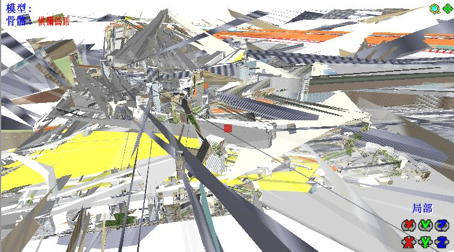

# MMD难题求解！

作者：cat

TID：13008

<title>1</title> <link href="../Styles/Style.css" type="text/css" rel="stylesheet">

# 1

上次制作MMD视频，有几个问题未被解决，我在这里再提一下，希望大家能够给予解答。 感激不尽啊！
1.人物无法巨大化（要么一开始就是大的）（如何巨大化？）。上次有人说用MME特效scaleG,a)我找不到这个特效，b)……我不会用特效啊！ 谁能教教我！
2.制作城市时，缩小城市背景到一定程度会使城市变粗糙，在街道中穿行会造成看到的景物破碎；放大人物后移动视角花费的时间极长，若现在较小的人物上做动作，再导入到较大人物中，较大人物的动作幅度会很小……（有什么快速移动视角的方法吗？或者使地图不破碎？）附上图。
<ignore_js_op>

**posui.jpg** *(29.55 KB, 下載次數: 0)*

[下載附件](forum.php?mod=attachment&aid=MzAxNDV8Y2FmNzg3M2N8MTY3NDA2OTcxMnwxODIzMHwxMzAwOA%3D%3D&nothumb=yes)

2012-8-9 16:04 上傳

3.另外，银匙町地图一进入PE，再保存出来（即使不操作），也会自动变成被巨大少女侵袭后的样子（建筑全部变形，看不出原貌）(如何编辑此地图？)
扔进去之前是这样的：
<ignore_js_op>

**qian.jpg** *(73.87 KB, 下載次數: 0)*

[下載附件](forum.php?mod=attachment&aid=MzAxNDZ8N2EwMDQyZmR8MTY3NDA2OTcxMnwxODIzMHwxMzAwOA%3D%3D&nothumb=yes)

2012-8-9 16:04 上傳

扔进去之后……
咳咳，变成了这样：
<ignore_js_op>

**hou.jpg** *(88.07 KB, 下載次數: 0)*

[下載附件](forum.php?mod=attachment&aid=MzAxNDR8N2FmOWZjNzV8MTY3NDA2OTcxMnwxODIzMHwxMzAwOA%3D%3D&nothumb=yes)

2012-8-9 16:04 上傳

求解啊！
4.城市（或建筑）被踩到、踢到……（各种破坏）后，如何做出被破坏的物理效果？
5.一个叫“物理墙”的模型怎么用？
下载地址：[http://115.com/file/cl9k5zfd](http://115.com/file/cl9k5zfd)
但是……     115的大众分享被关掉了，没有115的好像不能下载了……
而且有115的也得先转存网盘再在自己的网盘里下载啊！
总之，以上问题…… 求高手解答啊！ <title>2</title> <link href="../Styles/Style.css" type="text/css" rel="stylesheet">

# 2

补上一句，问题二已经得到解决…… 忘说了……,感谢eighteen. <title>3</title> <link href="../Styles/Style.css" type="text/css" rel="stylesheet">

# 3

scaleG那個特效也是別人以前給我的，自從硬盤掛掉以後已經一併陪葬了，抱歉啦…… <title>4</title> <link href="../Styles/Style.css" type="text/css" rel="stylesheet">

# 4

厄，没有其他办法了咩？
难道要制作n个不同大小的模型然后……一个一个放？？？
还有其他问题啊，求教 <title>5</title> <link href="../Styles/Style.css" type="text/css" rel="stylesheet">

# 5

关于放大模型方面 是指Scale_v004吗？
这个的话我到是有
要这个的话LZ留个邮箱吧...</ignore_js_op></ignore_js_op></ignore_js_op>