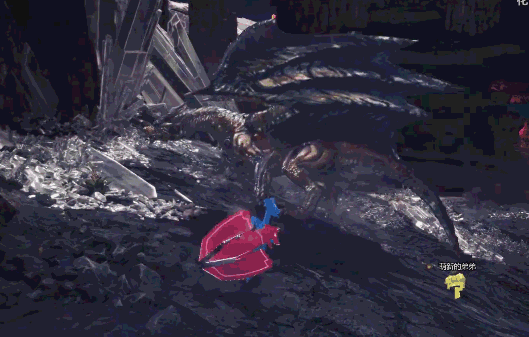

# PM新作劍盾有巨大化要素

作者：3213213210

TID：26947

<title>1</title> <link href="../Styles/Style.css" type="text/css" rel="stylesheet">

# 1

*本帖最後由 3213213210 於 2019-6-5 21:55 編輯*

[https://youtu.be/toZmDDNR7AE](https://youtu.be/toZmDDNR7AE)
「極巨化」

當然是寶可夢巨大化啦 大到讓人覺得這還打個屁啊
不過沒人規定本子要照著遊戲的設定走 恩恩

目前唯一有介紹的 能期待的女角只有博士助手
道館館主目前只介紹一個男的 而歷代來講8個道館至少會有3個女的
四天王至少有1個 上一作還有3個呢
再加上路邊訓練家 只要有其中1個人作出爆炸性發言「我也好想巨大化看看呢」 我們就能期待同人圖大爆發了

請別覺得這個預測太荒謬 GF很常在遊戲裡塞問題滿滿的發言(大叔的金珠之類的)......
總之 大家一起期待11/15吧

編輯：已經有討論串在講巨大沙奈朵了.......怕
<title>2</title> <link href="../Styles/Style.css" type="text/css" rel="stylesheet">

# 2

讓我想起寺田的超巨大沙奈朵，先知...... <title>3</title> <link href="../Styles/Style.css" type="text/css" rel="stylesheet">

# 3

呃。。我居然关注点在团战上面。。宝可梦巨大化我是一点兴趣都没有。。。当然~如果里面有妹子能巨大化就太棒了
要么干脆出个妹子宝可梦算啦（妄想） <title>4</title> <link href="../Styles/Style.css" type="text/css" rel="stylesheet">

# 4

吼鯨王巨大化感覺會很壯觀

不知道小智能不能把他舉起來 <title>5</title> <link href="../Styles/Style.css" type="text/css" rel="stylesheet">

# 5

> [tony12345678 發表於 2019-6-6 00:34](https://giantessnight.cf/gnforum2012/forum.php?mod=redirect&goto=findpost&pid=406816&ptid=26947)
> 吼鯨王巨大化感覺會很壯觀
> 
> 不知道小智能不能把他舉起來

有人討論到說「不管什麼尺寸的怪極巨化後的大小都一樣」 所以那個應該不是問題
還有個傢伙說「那吼鯨王跟向尾喵終於可以正常位了」......恩

<title>6</title> <link href="../Styles/Style.css" type="text/css" rel="stylesheet">

# 6

**我只想要解他全家！！！！！（被打**
<ignore_js_op>

**-7Q5-47xcXzZ9tT3cSep-9d.gif** *(3.45 MB, 下載次數: 0)*

[下載附件](forum.php?mod=attachment&aid=Nzg3MTl8MmM5ZTkzZDF8MTY3NDA2NjgwOXwxODIzMHwyNjk0Nw%3D%3D&nothumb=yes)

2019-6-6 15:16 上傳

ㄔ

<title>7</title> <link href="../Styles/Style.css" type="text/css" rel="stylesheet">

# 7

已經可以用「ダイマックス」找圖了
目前有沙奈朵跟費洛美螂的相撲對決......
拉蒂亞斯......不是官方設定的人型......
依布......
不行 我頭好痛 <title>8</title> <link href="../Styles/Style.css" type="text/css" rel="stylesheet">

# 8

女主巨大化比较吸引人</ignore_js_op>