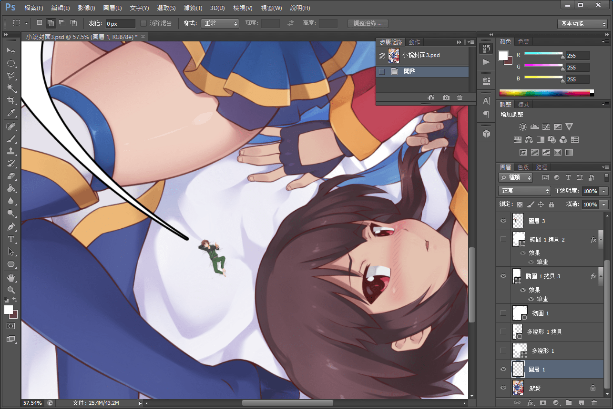
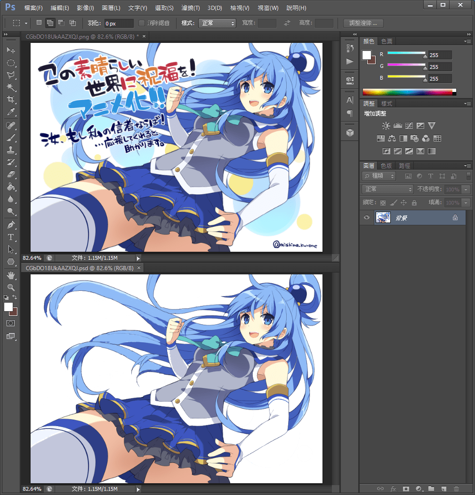
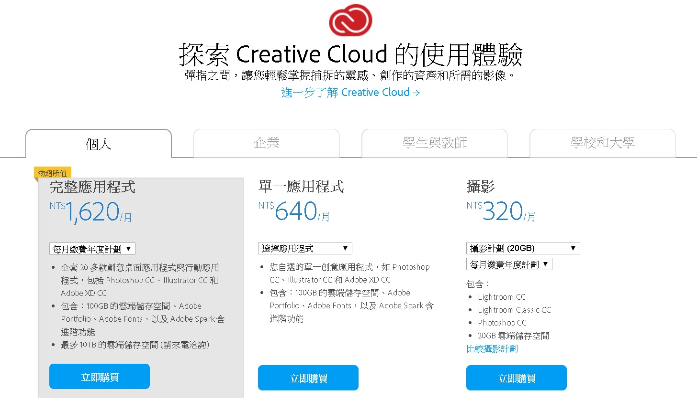
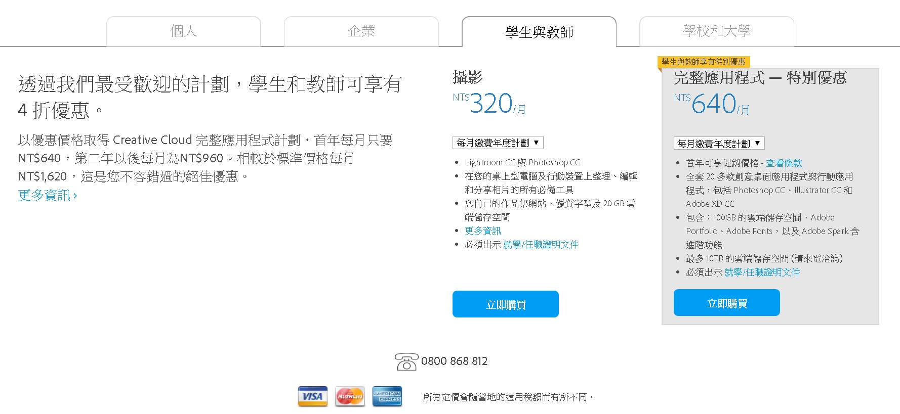

# PS更新版本啦

作者：3213213210

TID：25971

<title>1</title> <link href="../Styles/Style.css" type="text/css" rel="stylesheet">

# 1

*本帖最後由 3213213210 於 2018-10-16 11:14 編輯*

如果有人不知道的話，PS=Photoshop，現在已經更新了2019版本
基本上Adobe系列都有大更新，不過我看這裡應該沒人在用AE跟Premiere......
總之，這次更新了調色盤、圖層混合模式及時預覽等我們用不到的進階功能
還有一個我很確定只要想玩合成都會想接觸的功能
**內容感知填色**
如果有早就在用PS的可能在想，啊不究內容感知填滿，有什麼新的
NOOOOOOOOOOOO
這次的，不是選取以後直接右鍵填滿，你可以選擇軟體的取樣區域
請去編輯→內容感知填色 (簡體叫啥我不知道反正就感知)

......這樣講好像有點難懂
內容感知的意思是，軟體會利用周邊環境來運算你想取代的內容長什麼樣子
白話就是，如果畫面裡有礙眼的物件，你把範圍選起來，電腦就會想辦法靠範圍外的運算把範圍裡的東西通通P掉
可能是一台車，可能是照片拍攝日期，可能是一扇門，可能是一條狗，反正就是你不想要在畫面裡的東西讓電腦來處理
實際用過會發現，有時候電腦沒那麼聰明，被填滿的地方好像是挖異次元來補的
像是，選取範圍外有斑馬線，電腦閱讀規律後可能會決定把斑馬線裁一半放進選取範圍內，這種「截肢幽靈」常出現在感知填滿裡
**這次的更新，就是讓你調整電腦的運算參考範圍**
剛才說了，電腦是靠你選取範圍外的東西判斷範圍內該塞什麼
但是現在，你可以決定電腦用來參考的範圍了
如果有條斑馬線(......還是叫枕木紋之類的)會被放進不該有那個紋路(材質)的地方，
只要把運算範圍裡的斑馬線剔除就好
反過來說，有需要參考的規律在運算範圍外也能加回來
讓我們沈心靜念，默默的感恩Adobe大神的付出

如果看不懂的話，就是以後要製作好尻的照片更簡單了，以上
======================================================

順便報個壞消息，URU的肝出了問題，要花好一陣子調整作息
鼓勵大家沒事多喝水多睡覺，說不定以後大家的雞雞都需要你呢

<title>2</title> <link href="../Styles/Style.css" type="text/css" rel="stylesheet">

# 2

*本帖最後由 phone2345 於 2018-10-16 16:41 編輯*

我推薦一鍵去背的功能：
[https://www.bilibili.com/video/av20842735](https://www.bilibili.com/video/av20842735)
[https://www.youtube.com/watch?v=x-9qYLr15tU](https://www.youtube.com/watch?v=x-9qYLr15tU)

不過新的CC版實在好貴，我只有舊版CS6，湊合著用還行。

<title>3</title> <link href="../Styles/Style.css" type="text/css" rel="stylesheet">

# 3

 <ignore_js_op>[PS作業中.PNG](forum.php?mod=attachment&aid=NzUxOTh8MDJiODA2YWN8MTY3NDA2Njk4NXwxODIzMHwyNTk3MQ%3D%3D&nothumb=yes) *(955.13 KB, 下載次數: 0)*

[下載附件](forum.php?mod=attachment&aid=NzUxOTh8MDJiODA2YWN8MTY3NDA2Njk4NXwxODIzMHwyNTk3MQ%3D%3D&nothumb=yes)

2018-10-16 16:40 上傳  

</ignore_js_op> <title>4</title> <link href="../Styles/Style.css" type="text/css" rel="stylesheet">

# 4

> [phone2345 發表於 2018-10-16 15:54](https://giantessnight.cf/gnforum2012/forum.php?mod=redirect&goto=findpost&pid=389486&ptid=25971)
> 我推薦一鍵去背的功能：
> https://www.bilibili.com/video/av20842735
> https://www.youtube.com/watch?v=x-9 ...

去背只是把不要的地方變成透明，內容感知是塞東西進去，不太一樣
其實只要素材允許這個功能就沒必要啦，逼不得已自己用筆刷塗一塗也是一招
<title>5</title> <link href="../Styles/Style.css" type="text/css" rel="stylesheet">

# 5

*本帖最後由 phone2345 於 2018-10-16 18:44 編輯*

> [3213213210 發表於 2018-10-16 18:30](https://giantessnight.cf/gnforum2012/forum.php?mod=redirect&goto=findpost&pid=389493&ptid=25971)
> 去背只是把不要的地方變成透明，內容感知是塞東西進去，不太一樣
> 其實只要素材允許這個功能就沒必要啦， ...

自己的經驗是機器學習輔助填色還是有極限，現階段只適用在3次元的照片或影片上，但是遇到二次元的圖像，還是得手工處理。

例如這張圖用渣技術去除文字：

對會用手寫板繪圖的大佬來說，這肯定是小菜一疊！
<title>6</title> <link href="../Styles/Style.css" type="text/css" rel="stylesheet">

# 6

 <ignore_js_op>[PS完成.PNG](forum.php?mod=attachment&aid=NzUyMDB8MGUxNGYwNjB8MTY3NDA2Njk4NXwxODIzMHwyNTk3MQ%3D%3D&nothumb=yes) *(584.76 KB, 下載次數: 0)*

[下載附件](forum.php?mod=attachment&aid=NzUyMDB8MGUxNGYwNjB8MTY3NDA2Njk4NXwxODIzMHwyNTk3MQ%3D%3D&nothumb=yes)

2018-10-16 18:41 上傳  

</ignore_js_op> <title>7</title> <link href="../Styles/Style.css" type="text/css" rel="stylesheet">

# 7

我比较感兴趣ps在台湾卖多少钱一年？ <title>8</title> <link href="../Styles/Style.css" type="text/css" rel="stylesheet">

# 8

> [marycat 發表於 2018-10-18 22:57](https://giantessnight.cf/gnforum2012/forum.php?mod=redirect&goto=findpost&pid=389623&ptid=25971)
> 我比较感兴趣ps在台湾卖多少钱一年？

<ignore_js_op>

**Adobe.jpg** *(203.55 KB, 下載次數: 0)*

[下載附件](forum.php?mod=attachment&aid=NzUyMjh8ODU0YzA4NGV8MTY3NDA2Njk4NXwxODIzMHwyNTk3MQ%3D%3D&nothumb=yes)

2018-10-19 08:24 上傳

<ignore_js_op>

**AdobeS.jpg** *(228.33 KB, 下載次數: 0)*

[下載附件](forum.php?mod=attachment&aid=NzUyMjl8NjU0ZjU5NzB8MTY3NDA2Njk4NXwxODIzMHwyNTk3MQ%3D%3D&nothumb=yes)

2018-10-19 08:24 上傳

普通成人一年要花個360美金吧，不過每年都有大更新
<title>9</title> <link href="../Styles/Style.css" type="text/css" rel="stylesheet">

# 9

> [3213213210 發表於 2018-10-19 08:25](https://giantessnight.cf/gnforum2012/forum.php?mod=redirect&goto=findpost&pid=389639&ptid=25971)
> 普通成人一年要花個360美金吧，不過每年都有大更新

看起来摄影师套餐很不错啊，Ps  Lr两个软件一年才3840NT，大陆黑心代理商一个ps卖3499RMB，等于15600NT了
<title>10</title> <link href="../Styles/Style.css" type="text/css" rel="stylesheet">

# 10

> [marycat 發表於 2018-10-20 10:22](https://giantessnight.cf/gnforum2012/forum.php?mod=redirect&goto=findpost&pid=389682&ptid=25971)
> 看起来摄影师套餐很不错啊，Ps  Lr两个软件一年才3840NT，大陆黑心代理商一个ps卖3499RMB，等于15600NT了 ...

太爽了吧 一個PS抵過了Adobe全餐欸 還是這是本家的差別待遇</ignore_js_op></ignore_js_op>