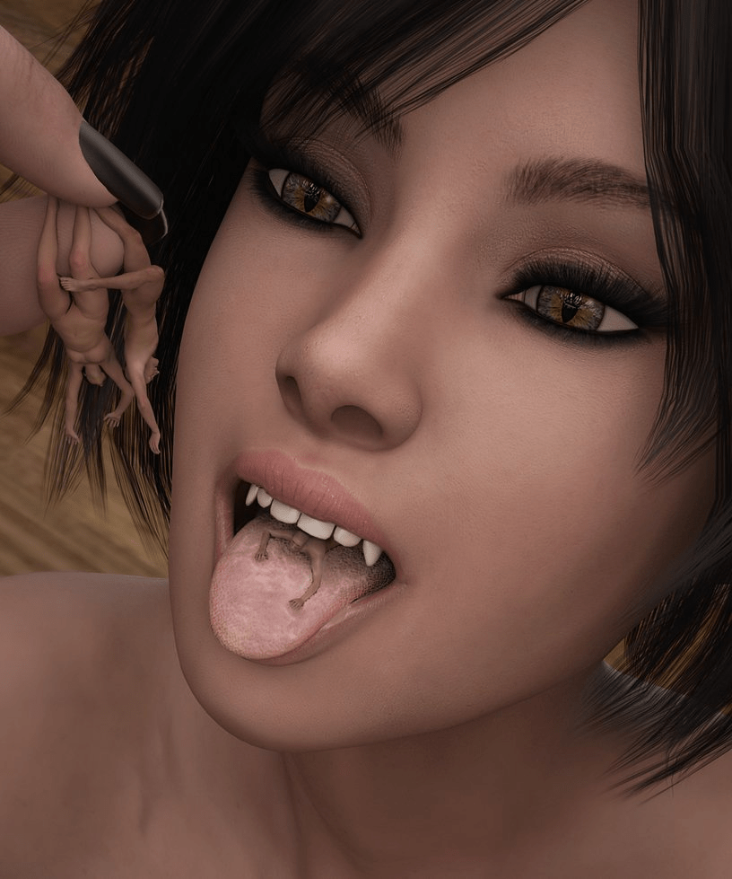
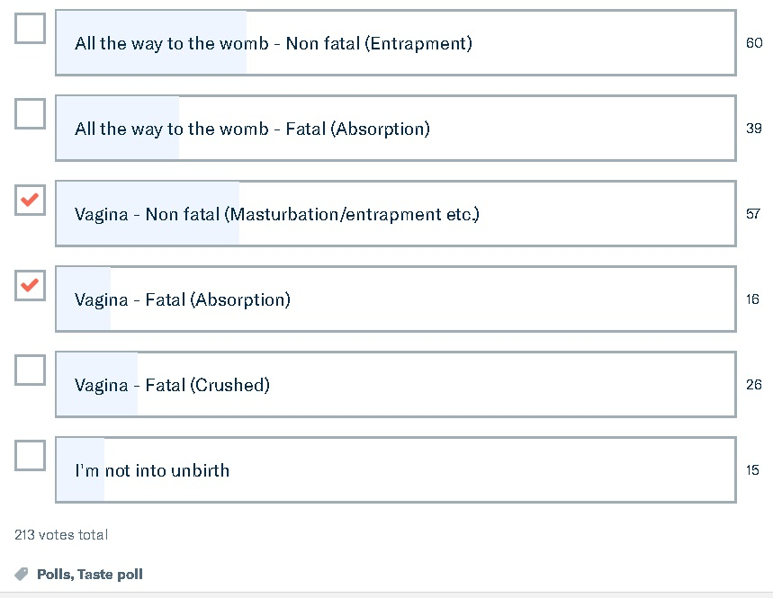
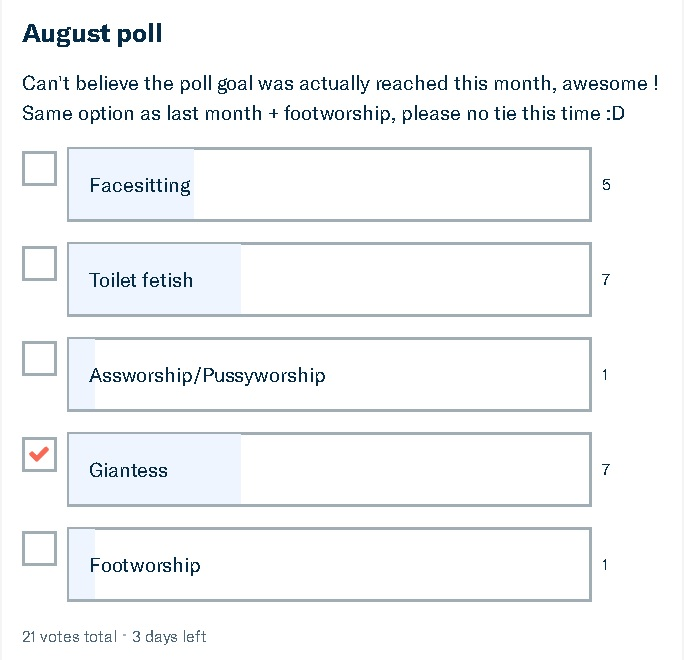
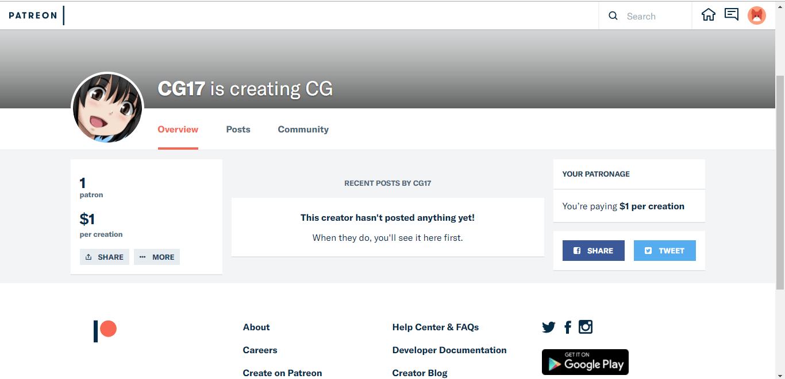

# Patreon上的GTS作者(10／12更新，重新排版)

作者：476894213

TID：23715

<title>1</title> <link href="../Styles/Style.css" type="text/css" rel="stylesheet">

# 1

*本帖最後由 3213213210 於 2017-10-12 17:48 編輯*

給不知道的新手，Patreon是一個資助創作者的網站
對，要錢，不想付錢的可以滾了

總之，如果希望圈子能繼續發展，讓現在很厲害的創作者們能有穩定收入是很重要的

廢話不多說，以下清單開始，留言有補充的我會再加進來
(用手機的記得先切換全版模式)

---------------------------------------------------------------------------------
☆CG17★
[https://www.patreon.com/jyg](https://www.patreon.com/CG17)
特別置頂，想知道怎麼回事的翻一下這串
---------------------------------------------------------------------------------

=========================2D插畫/漫畫===========================

1.寺田落子
[https://www.patreon.com/OchikoTerada](https://www.patreon.com/OchikoTerada)
這個名字應該不用再多做說明了，
不過扶他和男森很多請小心
獎勵：5美元/月—差分畫之類的

2.URU
[https://www.patreon.com/uru0000](https://www.patreon.com/uru0000)
圈內油畫風首屈一指的大師
那個贊助者限定的開發中遊戲，論壇有人分享了
不過絕大部分插圖會有裸體差分版，我保證E紳士上沒有
扶他和獵奇圖不少，建議在聖人模式的時候整理
獎勵：  1美元/月—可以看到一些圖(至少比沒付錢的多)
           3美元/月—以上+可以看到一些草圖
           5美元/月—以上+可以下載開發中遊戲、可以看到很多圖(基本上是全部)，每個月可以下載JPG打包和草稿打包
         10美元/月—以上+每月PSD檔打包(以上兩項的2016年時的連結有不少失效了，要跟作者講一下)
         30美元/月—以上+可以建議雜圖的主題、可以建議開發中遊戲的支線(需作者核可)
         50美元/月—以上+可以建議漫畫的主題

3.Karbo
[https://www.patreon.com/Karbo](https://www.patreon.com/Karbo)
如果連這位大前輩都不認得就別勉強付錢了
(提示：吞食、獸娘、更多吞食)
獎勵：  1美元/月—草稿、進度報告等
           5美元/月—以上+高解析度圖片和行程表
         10美元/月—以上+桌面背景壁紙+PSD檔
         20美元/月—以上+每月挑選4人畫專屬彩色素描(主題要作者核可)、漫畫草稿
         30美元/月—以上+每月挑選1人的指定製作圖片，若作者合意可以變成完整插畫
         50美元/月—也是跟請求有關的，如果你看不懂作者的英文的話你也用不到這個權利了
       100美元/月—你瘋了 (目前有4個人瘋了)

4.LuckyB
[https://www.patreon.com/LuckyB](https://www.patreon.com/LuckyB)
畫風稍微特殊一點，可能要電波對到才會喜歡
不會說日文，不過英文也講得亂七八糟......是韓國人嗎?大部分作品在一段時間後都會上傳公共空間(pixiv)，所以基本上這個資助最好當慈善事業來作
獎勵：......我看不懂
         10美金能私訊委託打折?
         30美金以上的獎勵都是得直接跟作者談的，看不懂也不用考慮領獎了

5.Marty Z[https://www.patreon.com/MartyZ](https://www.patreon.com/MartyZ)
同樣是2D插畫家，水準一般，但嘴部特寫處理得很不錯
獎勵： 1美元/月—素描、投票資格
          5美元/月—可以看一些圖
        10美元/月—可以看很多圖，保證高畫質
這個傢伙的獎勵比較微妙，20美元的指定素描是有限人數的，
目前已經滿了不能再加，但他的PSD檔也設20美元門檻
所以要PSD可能要用10美元獎勵調成20美元，我是不確定有沒有效

6.giorunog[https://www.patreon.com/doujinsak](https://www.patreon.com/doujinsak)
畫的不怎麼好也不怎麼差，對二創的作品有興趣可以考慮
獎勵：  1美元/月—雜圖、新圖預覽
           5美元/月—以上+FF7同人+每月更新兩三面的漫畫
         10美元/月—以上+PSD檔+其他每月兩三面的漫畫

===========================3D動畫=============================

1.Eskoz
[https://www.patreon.com/Eskoz](https://www.patreon.com/Eskoz)
圈內3D動畫最強的作者，沒有之一
雖然最近用的模組風格比較偏，但食用......實用性還是No.1
獎勵相對少很多，但他說「如果可以取得足夠穩定收入就不用再接工作室案子了」
這樣的人才難道大家忍心讓他花時間做其他事嗎
獎勵：  1美元/月—圖片、渲染中半成品等
           5美元/月—以上+製作中影片，直接給你看Maya(動畫軟體)播放的樣子
         10美元/月—以上+未完成片段、影片有最高解析度版本、投票權*、一些影片的差分版
                         *投票權：像是要用哪個部位、有沒有死人、小人要不要有呻吟聲等，讓用戶進行投票

2.TheWiking2000
[https://www.patreon.com/TheWiking2000](https://www.patreon.com/TheWiking2000)
也是3D動畫神人，模組是走寫實風的
久久才生出一部長篇，最終成品都是免費的
所以......請一樣抱持做慈善的心情去投吧
獎勵：  1美元/月—可以看渲染測試
           5美元/月—以上+影片高品質版下載+可以了解進度在哪
         10美元/月—以上+可以看半成品+可以先看劇本
         20美元/月—以上+可以針對劇本走向投票+讓自己的名字出現在協助人員名單(可選)
         50美元/月—以上+挖靠，一定會想出甚麼特別的回饋(限五人，目前有一人選擇)

=========================3D圖片/圖組===========================

1.smogass
[https://www.patreon.com/smogass](https://www.patreon.com/smogass)
這應該是最需要贊助的一位
不認得這傢伙?沒關係，馬上讓你看看：
<ignore_js_op>

**1.jpg** *(4.03 MB, 下載次數: 0)*

[下載附件](forum.php?mod=attachment&aid=NjkxOTN8MmU4YWJlMDJ8MTY3NDA2OTQ1M3wxODIzMHwyMzcxNQ%3D%3D&nothumb=yes)

2017-8-18 14:48 上傳

<ignore_js_op>

**4.png** *(97.92 KB, 下載次數: 0)*

[下載附件](forum.php?mod=attachment&aid=NjkxOTR8YjBmNDY3NTB8MTY3NDA2OTQ1M3wxODIzMHwyMzcxNQ%3D%3D&nothumb=yes)

2017-8-18 14:51 上傳

(擦手)如各位所見，這位的渲染功力更勝已經神隱的小狐狸桑
但是！
他卻把大量時間花費在普通尺寸的SM上!!!!!!!
各位鄉親難道能接受嗎!!!!!!
是時候改變一切了！
......咳咳
這位目前的Patreon追蹤者非常少，所以把錢投在他身上效益特別高
投票時分母越小，分子越大，讓他見識GTS愛好者的決$心吧！
*看不懂英文就全部按寫著Giantess的那項就好*
獎勵：1美元/月—投下神聖的一票
         5美元/月—可以投更多票

2.openhighhat
[https://www.patreon.com/openhighhat](https://www.patreon.com/openhighhat)
是玩歐美系的，作品程度......還不錯
獎勵： 1美元/漫畫—10-15頁的漫畫下載連結
六塊錢的連結已經有一個失效了，可以直接用買的
→[https://gumroad.com/ohh](https://gumroad.com/ohh)
注意這傢伙不是按月計費，自己注意Patreon的收費方式，
月結時繳出去的應該是你填的數字的三四倍，開天窗就好笑囉

===========================真人=============================

1.Giantess Shizuka[https://www.patreon.com/user?u=7284238](https://www.patreon.com/user?u=7284238)
......素人自拍?
照片明暗對比調的超級糟糕，也沒多正，而且毫無構圖可言
不過為了鼓勵大家下海玩這圈子，我還是忍痛投了
獎勵：  5美元/月—看照片、看預覽、投票權

然後還有要補充的作者的話請留言，謝謝大家

<title>2</title> <link href="../Styles/Style.css" type="text/css" rel="stylesheet">

# 2

 <ignore_js_op>[E.jpg](forum.php?mod=attachment&aid=NjkxOTZ8NjU3NGNkNTd8MTY3NDA2OTQ1M3wxODIzMHwyMzcxNQ%3D%3D&nothumb=yes) *(91.13 KB, 下載次數: 0)*

[下載附件](forum.php?mod=attachment&aid=NjkxOTZ8NjU3NGNkNTd8MTY3NDA2OTQ1M3wxODIzMHwyMzcxNQ%3D%3D&nothumb=yes)

2017-8-18 15:05 上傳  

</ignore_js_op> <ignore_js_op>[s.jpg](forum.php?mod=attachment&aid=NjkxOTV8NTk4MjMwYjl8MTY3NDA2OTQ1M3wxODIzMHwyMzcxNQ%3D%3D&nothumb=yes) *(71.74 KB, 下載次數: 0)*

[下載附件](forum.php?mod=attachment&aid=NjkxOTV8NTk4MjMwYjl8MTY3NDA2OTQ1M3wxODIzMHwyMzcxNQ%3D%3D&nothumb=yes)

2017-8-18 15:05 上傳  

</ignore_js_op> <title>3</title> <link href="../Styles/Style.css" type="text/css" rel="stylesheet">

# 3

这类作者其实挺多的，欧美那边的作者3D技术貌似都比较娴熟。
[https://www.patreon.com/jetslasher](https://www.patreon.com/jetslasher)
[https://www.patreon.com/GFSM](https://www.patreon.com/GFSM)
[https://www.patreon.com/mastershrinker](https://www.patreon.com/mastershrinker) <title>4</title> <link href="../Styles/Style.css" type="text/css" rel="stylesheet">

# 4

giantess city里不少作者也在这里开了账号 <title>5</title> <link href="../Styles/Style.css" type="text/css" rel="stylesheet">

# 5

好还是咱们论坛的A大好 <title>6</title> <link href="../Styles/Style.css" type="text/css" rel="stylesheet">

# 6

早就有人建议我用Patreon
无奈我不会用啊啊啊…… <title>7</title> <link href="../Styles/Style.css" type="text/css" rel="stylesheet">

# 7

> [cg17 發表於 2017-8-18 18:02](https://giantessnight.cf/gnforum2012/forum.php?mod=redirect&goto=findpost&pid=345094&ptid=23715)
> 早就有人建议我用Patreon
> 无奈我不会用啊啊啊……

看得懂英文的話很簡單的
看不懂的話......這個網站很大一部分是用英文跟客戶交流的
看你要不要找國內有沒有小眾集資網站，不然就雇個翻譯
<title>8</title> <link href="../Styles/Style.css" type="text/css" rel="stylesheet">

# 8

最近缺钱（负债），等手头宽裕了以后试试，不知道支持那些支付方式 <title>9</title> <link href="../Styles/Style.css" type="text/css" rel="stylesheet">

# 9

> [spacewolves 發表於 2017-8-18 18:31](https://giantessnight.cf/gnforum2012/forum.php?mod=redirect&goto=findpost&pid=345099&ptid=23715)
> 最近缺钱（负债），等手头宽裕了以后试试，不知道支持那些支付方式

最簡單就信用卡，不然Paypal也可以
<title>10</title> <link href="../Styles/Style.css" type="text/css" rel="stylesheet">

# 10

光支持寺田和uru每个月就六十出头了，学生党实在没有那个财力全部点一遍……
用paypal支付很简单，和国内的各大支付软件没两样，绑银联的卡都可以，即使你不是VISA卡。
这两位支持绝对是超值的，相信我！ <title>11</title> <link href="../Styles/Style.css" type="text/css" rel="stylesheet">

# 11

寺田要是有继续在PATREON里更新游戏也好啊。。。。不过最近貌似又开始忙了 <title>12</title> <link href="../Styles/Style.css" type="text/css" rel="stylesheet">

# 12

*本帖最後由 yolachan 於 2017-8-18 23:26 編輯*

Here's a couple of really good giantess vore patreon pages,sorry,since i'm new i can't post the whole links,to see the correct links just delete the space between patreon and .com.

patreon .com/DangoNoms
patreon .com/MrIshimaru <title>13</title> <link href="../Styles/Style.css" type="text/css" rel="stylesheet">

# 13

> [cg17 發表於 2017-8-18 18:02](https://giantessnight.cf/gnforum2012/forum.php?mod=redirect&goto=findpost&pid=345094&ptid=23715)
> 早就有人建议我用Patreon
> 无奈我不会用啊啊啊……

If you want i'll be happy to help you start using patreon and gather fans in the western vore community,with your artistic prowesse you'll be able to make a lot cash very easily.
<title>14</title> <link href="../Styles/Style.css" type="text/css" rel="stylesheet">

# 14

> [cg17 發表於 2017-8-18 18:02](https://giantessnight.cf/gnforum2012/forum.php?mod=redirect&goto=findpost&pid=345094&ptid=23715)
> 早就有人建议我用Patreon
> 无奈我不会用啊啊啊……

看起來樓上很想幫你弄呢
目前我看到圈內最高資助紀錄是Karbo的每月3200美元
CG大的話，就算英文不好互動不良，開一段時間要湊到每個月幾百美元絕非難事
最麻煩的就是頁面設置、回饋設定，不過這是很一次性的工作，未來不堪用了再改也行
*很怕英文介面的話可以試用Enty，右上角能改繁體中文，雖然翻譯很日式
如果有興趣，我可以先整理一些用這種網站的要點：
1.贊助回饋分級
給予不同層級的贊助者不同的回饋
可以參考URU，1美金開放看部分圖，5美金開放看所有圖
10美金開放專案檔(PSD等)下載，20、30美金以上提供客製需求(等人多起來再提高權限或取消這個選項)
2.設立總金額目標
「當贊助總金額達到XX時就可以怎樣」
比方說，
「每月50鎂=每個月至少會產三張全彩圖」
「每月300鎂=每個月都會產出極短篇漫畫，主題由10鎂以上贊助者投票決定」
然後最重要的是
「每月XXXX鎂=把畫圖變成個人的Full-time Job(主要工作)」，
這個價錢就只能你自己估計了
3.持之以恆發圖
這是最最最大的成功前提，你得讓支持者感覺到自己給錢是有意義的
初期不用太拚，多丟點散亂的草圖或線稿就行
因為我不知道大大生活多忙，我認為可以先以「一個禮拜一張中等精緻圖」為目標
如果怕初期吸引力太差，可以放出免費版本的圖(免費版：解析度低一點、上面附Patreon浮水印)
然後這些有浮水印的圖再散播到City和Booru(完整版請上Patreon！)，只要有第一批客人接下來會輕鬆很多

相信論壇大眾都是希望你能專心創作的，要加油啊
頁面設立以後我會第一個去投錢
<title>15</title> <link href="../Styles/Style.css" type="text/css" rel="stylesheet">

# 15

> [3213213210 發表於 2017-8-19 04:58](https://giantessnight.cf/gnforum2012/forum.php?mod=redirect&goto=findpost&pid=345164&ptid=23715)
> 看起來樓上很想幫你弄呢
> 目前我看到圈內最高資助紀錄是Karbo的每月3200美元
> CG大的話，就算英文不好互動 ...

就是这个页面设置不会弄……
现在仅仅是建立了起始页而已
[https://www.patreon.com/CG17](https://www.patreon.com/CG17)
然后下一步就不知道该怎么做了
<title>16</title> <link href="../Styles/Style.css" type="text/css" rel="stylesheet">

# 16

”對，要錢，不想付錢的可以滾了“

这话好赞233 <title>17</title> <link href="../Styles/Style.css" type="text/css" rel="stylesheet">

# 17

> [cg17 發表於 2017-8-19 06:34](https://giantessnight.cf/gnforum2012/forum.php?mod=redirect&goto=findpost&pid=345165&ptid=23715)
> 就是这个页面设置不会弄……
> 现在仅仅是建立了起始页而已
> https://www.patreon.com/CG17

已經有起始頁了!?
這樣剩下的就是填字遊戲了
先決定一下要做怎樣的獎勵和回饋，剩下的要我弄都可以
(總之就是找到**Edit Page details**然後慢慢摸索就好)
*要收錢的話要有Paypal或美國銀行帳戶，記得研究一下Paypal*
*這裡有個2015年的教學，雖然Paypal改過介面讓這教學變得沒那麼直觀，還是很值得參考
→[http://baronpluto.blogspot.tw/2015/10/patreon.html](http://baronpluto.blogspot.tw/2015/10/patreon.html) (請找到「如何開設」)
<title>18</title> <link href="../Styles/Style.css" type="text/css" rel="stylesheet">

# 18

> [3213213210 發表於 2017-8-19 13:07](https://giantessnight.cf/gnforum2012/forum.php?mod=redirect&goto=findpost&pid=345205&ptid=23715)
> 已經有起始頁了!?
> 這樣剩下的就是填字遊戲了
> 先決定一下要做怎樣的獎勵和回饋，剩下的要我弄都可以

等等，等等！
刚才胡搞乱搞显示已经支持成功了？
<ignore_js_op>

**1.PNG** *(98.26 KB, 下載次數: 1)*

[下載附件](forum.php?mod=attachment&aid=NjkxOTl8YjQwMDgxNDB8MTY3NDA2OTUyMXwxODIzMHwyMzcxNQ%3D%3D&nothumb=yes)

2017-8-19 13:37 上傳

账户绑定已经结束了？
还是说这个钱先转到patreon然后再给作者呢？
SO sorry我好像拿了一血……
（我原本打算试试看如果还没有绑定收款账户的时候支持会发生什么……）
<title>19</title> <link href="../Styles/Style.css" type="text/css" rel="stylesheet">

# 19

*本帖最後由 yolachan 於 2017-8-19 19:27 編輯*

If you want to make money fast you have to expose your work to western vore and giantess communities,to do that you can use these sites.

Deviantart(no lolicon,no scat and no explicit sex but giantess is allowed,nudity is allowed,vore is allowed)
deviantart. com

Aryion(nudity is allowed,sex is allowed,vore is allowed,scat is allowed,also lolicon and shotacon are allowed)
aryion. com/

Pixiv(everything is allowed)
pixiv .net/
Giantessbooru (lolicon and shotacon are allowed,guro is allowed and scat is allowed)
giantessbooru .com/

<title>20</title> <link href="../Styles/Style.css" type="text/css" rel="stylesheet">

# 20

哦，哇，这些都是一些很好的发现，当我找到自己的时候，我会做出贡献。 <title>21</title> <link href="../Styles/Style.css" type="text/css" rel="stylesheet">

# 21

说实话这贴真是个福利贴啊，其实这些作者没有资金就没有动力，肯定要支持啊 <title>22</title> <link href="../Styles/Style.css" type="text/css" rel="stylesheet">

# 22

在等一两年实习了关注寺田岂不是美滋滋，现在大学花销也不小啊 <title>23</title> <link href="../Styles/Style.css" type="text/css" rel="stylesheet">

# 23

*本帖最後由 yolachan 於 2017-8-20 20:24 編輯*

> [cg17 發表於 2017-8-19 06:34](https://giantessnight.cf/gnforum2012/forum.php?mod=redirect&goto=findpost&pid=345165&ptid=23715)
> 就是这个页面设置不会弄……
> 现在仅仅是建立了起始页而已

I'll be happy to help you take all the step required to build up your Patreon page,now that you have set up your own patreon page you need to write an introduction that will explain what you're creating,since you're japanese you might have some difficulties with that so here is an introduction i wrote for you.
Hellò and welcomeI am CG17, the author of many size fetish and vore centered comics such asThe Magic Sisters Chin And Yao,Shrunken Survival,The Big Bad Wolf and Demonic Exam.
I've created this Patreon page to fund my future size fetish and vore comics and illustrations,if you liked my comics and illustrations and want to help me create more please give me your support.

<title>24</title> <link href="../Styles/Style.css" type="text/css" rel="stylesheet">

# 24

這位大哥說你是日本人是誤會對吧
這個介紹OK可用的，文法有點亂但簡單明瞭，意思也有到
還是快點想個贊助者回饋機制吧，我貼的那些人都能當參考 <title>25</title> <link href="../Styles/Style.css" type="text/css" rel="stylesheet">

# 25

> [yolachan 發表於 2017-8-20 20:22](https://giantessnight.cf/gnforum2012/forum.php?mod=redirect&goto=findpost&pid=345398&ptid=23715)
> I'll be happy to help you take all the step required to build up your Patreon page,now that you hav ...

谢谢，真是辛苦你为我写了这么一大段文字。自我介绍我自己能写（除了作品中的文字需要当地人翻译外）。
我主要是不明白怎么设定页面。
比如16楼提到的**Edit Page details**，我就不知道它在哪里……
还有，我的页面莫名其妙多了一美元……
<title>26</title> <link href="../Styles/Style.css" type="text/css" rel="stylesheet">

# 26

> [cg17 發表於 2017-8-20 22:30](https://giantessnight.cf/gnforum2012/forum.php?mod=redirect&goto=findpost&pid=345455&ptid=23715)
> 谢谢，真是辛苦你为我写了这么一大段文字。自我介绍我自己能写（除了作品中的文字需要当地人翻译外）。
> ...

要找設置鈕的話，左邊的齒輪(Setting)點進去就有了
一美元是17樓投的
<title>27</title> <link href="../Styles/Style.css" type="text/css" rel="stylesheet">

# 27

这是逼我去学好英语和日语…… <title>28</title> <link href="../Styles/Style.css" type="text/css" rel="stylesheet">

# 28

Patreon上从年初起我已赞助了一大堆，但是楼主给出的2次元作者。。在下实在不感兴趣 <title>29</title> <link href="../Styles/Style.css" type="text/css" rel="stylesheet">

# 29

> [abc-c 發表於 2017-8-21 22:01](https://giantessnight.cf/gnforum2012/forum.php?mod=redirect&goto=findpost&pid=345578&ptid=23715)
> Patreon上从年初起我已赞助了一大堆，但是楼主给出的2次元作者。。在下实在不感兴趣 ...

倒是提供一下三次元的連結啊，資料不嫌多
<title>30</title> <link href="../Styles/Style.css" type="text/css" rel="stylesheet">

# 30

CG17的patreon炸了？链接点了404 <title>31</title> <link href="../Styles/Style.css" type="text/css" rel="stylesheet">

# 31

论坛里是学生党居多吗？ <title>32</title> <link href="../Styles/Style.css" type="text/css" rel="stylesheet">

# 32

学生党没钱，只能等工作后支持了</ignore_js_op></ignore_js_op></ignore_js_op>