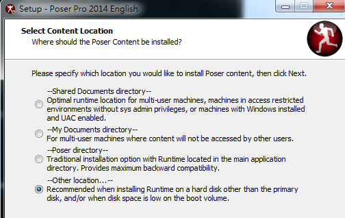

# Poser Pro 2014 放置模型問題

作者：wlp156858

TID：16562

<title>1</title> <link href="../Styles/Style.css" type="text/css" rel="stylesheet">

# 1

> [wlp156858 發表於 2014-3-28 18:38](https://giantessnight.cf/gnforum2012/forum.php?mod=redirect&goto=findpost&pid=219039&ptid=16562)
> 我大約知道為什麼會沒有-,-  原來是在C:\Users\xxxx\Documents\Poser Pro 2014 Content\Runtime  
> C:\Pro ...

哥们，我找到你的问题了，poser在安装时，会让你选择资源库的整理方式，你选的应该是存在文档里，我一般选的是传统方式，也就是存在poser的子文件夹里面，实在不行重新安装，或者，poser应该能重新设置资源库路径的。 <title>2</title> <link href="../Styles/Style.css" type="text/css" rel="stylesheet">

# 2

*本帖最後由 wlp156858 於 2014-3-31 13:47 編輯*

> [awkeygen 發表於 2014-3-28 20:30](http://www.giantessnight.com/gnforum2012/forum.php?mod=redirect&goto=findpost&pid=219048&ptid=16562)
> 哥们，我找到你的问题了，poser在安装时，会让你选择资源库的整理方式，你选的应该是存在文档里，我一般 ...

> [awkeygen 發表於 2014-3-28 20:30](http://www.giantessnight.com/gnforum2012/forum.php?mod=redirect&goto=findpost&pid=219048&ptid=16562)
> 哥们，我找到你的问题了，poser在安装时，会让你选择资源库的整理方式，你选的应该是存在文档里，我一般 ...

歉有點久 終於家裡沒什麼人了 呵呵
你說的是這個嗎 <ignore_js_op>

**23312312.png** *(41.22 KB, 下載次數: 0)*

[下載附件](forum.php?mod=attachment&aid=NDE5NDl8NzVlODQwN2F8MTY3NDA2OTY5N3wxODIzMHwxNjU2Mg%3D%3D&nothumb=yes)

2014-3-31 12:58 上傳

  英文很差不知道選那個-,-  【我以前是選第2個的
<ignore_js_op>

**1232.png** *(4.1 KB, 下載次數: 0)*

[下載附件](forum.php?mod=attachment&aid=NDE5NTB8NWZhNGZmMjB8MTY3NDA2OTY5N3wxODIzMHwxNjU2Mg%3D%3D&nothumb=yes)

2014-3-31 13:31 上傳

正常有8個
我選第一個安裝後 庫只有4個   第2個8個    第3個2個.... 有方法可以C:\Users\xxxx\Documents\Poser Pro 2014 Content\Runtime  中又是8個的

另外我那個模型 沒有Character資料夾 所以沒有.crz這類檔案 那是不是就不能導入了 ~_~?

我很笨抱歉-3-
<title>3</title> <link href="../Styles/Style.css" type="text/css" rel="stylesheet">

# 3

选第三个，Poser directory <title>4</title> <link href="../Styles/Style.css" type="text/css" rel="stylesheet">

# 4

> [awkeygen 發表於 2014-3-31 14:03](https://giantessnight.cf/gnforum2012/forum.php?mod=redirect&goto=findpost&pid=219290&ptid=16562)
> 选第三个，Poser directory

嗯~我的資料夾終於好了 最後一個問題就是 ....我下載了很多模型
但解壓後都 沒有.obj . obz .cr2 .cr2 這類檔案  只有.pz2 .p2z 這類的 是不是不能導入了 還是我不會-,-

例如下面這個 怎樣才可以導入Poser Pro 2014 我在庫有找到但拿不出來用 好像是因為沒有.obj . obz .cr2 .cr2 這類檔案

<ignore_js_op> [Lorella the Elf Maiden.part1.rar](forum.php?mod=attachment&aid=NDE5ODR8MGZhMjhlNmJ8MTY3NDA2OTY5N3wxODIzMHwxNjU2Mg%3D%3D) *(50 MB, 下載次數: 9)* 2014-3-31 23:25 上傳點擊文件名下載附件

<ignore_js_op> [Lorella the Elf Maiden.part2.rar](forum.php?mod=attachment&aid=NDE5ODV8YTJiYzViMjZ8MTY3NDA2OTY5N3wxODIzMHwxNjU2Mg%3D%3D) *(50 MB, 下載次數: 8)* 2014-3-31 23:28 上傳點擊文件名下載附件

<ignore_js_op> [Lorella the Elf Maiden.part3.rar](forum.php?mod=attachment&aid=NDE5ODZ8NTNhMTAyNWJ8MTY3NDA2OTY5N3wxODIzMHwxNjU2Mg%3D%3D) *(26.94 MB, 下載次數: 8)* 2014-3-31 23:29 上傳點擊文件名下載附件

130mB上傳不了所以分了3個出來  這東西當是送給前輩耐心教我

<title>5</title> <link href="../Styles/Style.css" type="text/css" rel="stylesheet">

# 5

.obj . obz .cr2 .cr2 是模型文件，.pz2 .p2z 是动作文件
.obj . obz .cr2 .cr2是必须的，.pz2 .p2z需要以.obj . obz .cr2 .cr2为基础的，所以，以后下载模型要先下载基础模型，再下载pz2 .p2z文件。
一般，.obj . obz .cr2 .cr2都在character文件夹里，pz2 .p2z在pose文件夹里。
Poser必须下载的基础摸是V4和M4，先把这两个基础模型装了是最重要的。
先载入characer中的模型，再添加pose文件夹中得美女贴图和美女变形。</ignore_js_op></ignore_js_op></ignore_js_op></ignore_js_op></ignore_js_op>