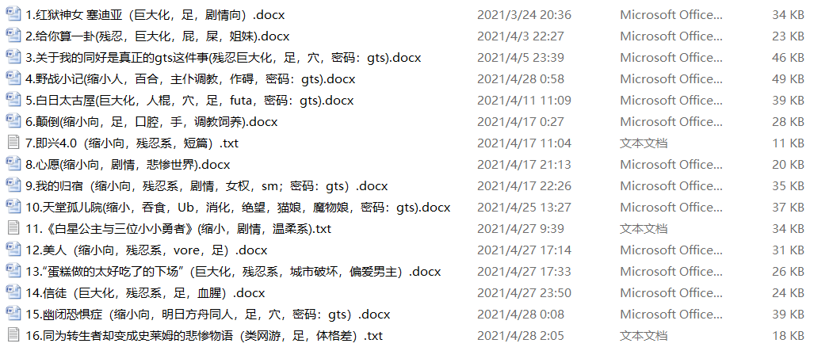
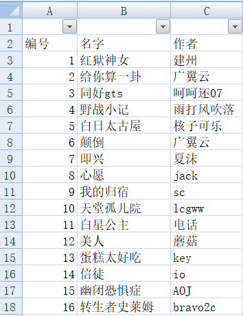

# Sc的Q群文赛

作者：scale君

TID：30836

<title>1</title> <link href="../Styles/Style.css" type="text/css" rel="stylesheet">

# 1

**麻吉科卡多哈自动！西夏嗦瑟哒！**本人sc，浮上来冒个泡，给大家带来一次我在Q群里举办的文赛。本文赛由sc（也就是我）举办，全程持续一个半月，共18人报名，诞生了16篇参赛文章，两人弃赛。文赛流程（报名，参赛，评选）现已结束，我将把文赛里的文章一一搬运过来，供各位赏阅。本次文赛的特色为“匿名”。利用Q群“仅管理员上传”的功能让管理员收集参赛文章，登记后代替作者上传，使群友们在不知道文章作者的情况下阅读，讨论，评选……当然，匿名作者本人也混在读者中间，假装读者进行讨论。本次文赛上传gn时不会匿名，全部上传后会进行投票，大家可以自由选出自己喜欢的文章，投票结束后将会公布Q群内的文赛排名与获奖情况，看看大家与Q群群友的喜好是否一致，文章的作者又猜对没有。（如果不想等着一篇篇发，或者不想猜作者，可以在论坛里私聊我或直接添加我的qq：976271434，我会把你拉进群里，群内已公布了作者信息与获奖情况，入群后可自行查看）以下为参赛文章详情，全部文章将会在一周内陆续上传完毕。获奖情况将会在一周后于本贴公布（不开新帖），感兴趣的朋友也可以看看。
<title>2</title> <link href="../Styles/Style.css" type="text/css" rel="stylesheet">

# 2

 <ignore_js_op>[QQ图片20210505183016.png](forum.php?mod=attachment&aid=ODg2NTh8M2Q5NzQxYzR8MTY3NDA2NjAyOXwxODIzMHwzMDgzNg%3D%3D&nothumb=yes) *(105.58 KB, 下載次數: 0)*

[下載附件](forum.php?mod=attachment&aid=ODg2NTh8M2Q5NzQxYzR8MTY3NDA2NjAyOXwxODIzMHwzMDgzNg%3D%3D&nothumb=yes)

2021-5-5 18:30 上傳  

</ignore_js_op> <ignore_js_op>[QQ图片20210504160605.png](forum.php?mod=attachment&aid=ODg2NTd8Y2JiZmE5OTB8MTY3NDA2NjAyOXwxODIzMHwzMDgzNg%3D%3D&nothumb=yes) *(38.2 KB, 下載次數: 0)*

[下載附件](forum.php?mod=attachment&aid=ODg2NTd8Y2JiZmE5OTB8MTY3NDA2NjAyOXwxODIzMHwzMDgzNg%3D%3D&nothumb=yes)

2021-5-5 18:29 上傳  

</ignore_js_op> <title>3</title> <link href="../Styles/Style.css" type="text/css" rel="stylesheet">

# 3

顺带说下举办本次文赛的感想吧：

1.文赛初公布时，宣发完全做的不到位，我仅仅@了全体，发布了公告，没有照顾到部分不是很喜欢本群的潜水群员，导致有些有意愿参赛的群友到文赛快要结束了都不知道本群有文赛的事情。

2.文赛中间也有部分作者/读者违规的情况，本人因工作压力与情绪管理不到位对这部分群友恶语相向，对此本人深表歉意，在此公开向文赛中攻击过的各位道歉。

3.文赛投票期间我才发现，催促读者投票的难度比我想象的更大，部分读者不知道有文赛举办，部分读者没有读完，部分读者读完了但是没法做选择，困扰颇多。

4.相当累，全程办完这次文赛真的有种如释重负的感觉，举办方，宣发，收集文章，登记作者作品信息，释放参赛文，与读者作者沟通，处理应急情况，维持匿名，催文催投票，登记投票，评选发奖……属实难顶，这次文赛后我至少半年不会再举办类似活动了（偶尔还是会更文的）。

5.其实原本打算发到gn时也匿名发布的，由我代替作者控制进度一篇篇上传，让大家也来猜猜作者，但考虑到涉嫌水贴，自身工作与休息时间，作者感受，维持匿名的成本等因素，最终还是选择这样公开文赛让作者自行上传。

大概就是这样，大家后面就会看到本次非专业的文赛作品，希望各位能够看得开心！

<title>4</title> <link href="../Styles/Style.css" type="text/css" rel="stylesheet">

# 4

顶一个，即便文赛拉的时间挺长，sc也很认真负责，参与体验还是很不错的
还希望大家能喜欢作者们的作品 <title>5</title> <link href="../Styles/Style.css" type="text/css" rel="stylesheet">

# 5

看上去很不错，QQ好友通过以下