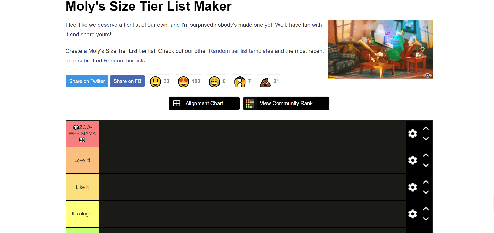
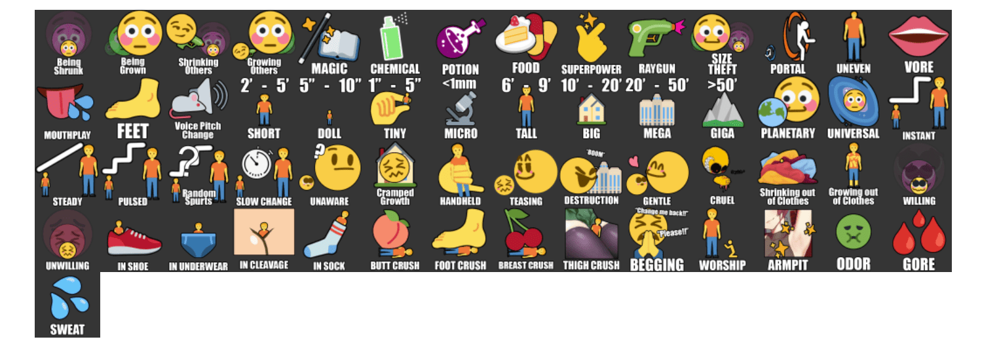

# Size Tier List

作者：静谧之影

TID：33325

<title>1</title> <link href="../Styles/Style.css" type="text/css" rel="stylesheet">

# 1

今天刷推意外发现外国友人整了一个xp的tier list
https://tiermaker.com/create/molys-size-tier-list-1627865

后来想想也是，毕竟tierlist最常见的用途还是xp排行榜上
<ignore_js_op>

**2022-05-27 (25).png** *(278.94 KB, 下載次數: 0)*

[下載附件](forum.php?mod=attachment&aid=OTY0NjV8ZGM3ZjA3ZTF8MTY3NDA2NTUyNnwxODIzMHwzMzMyNQ%3D%3D&nothumb=yes)

2022-5-27 21:19 上傳

<ignore_js_op>

**2022-05-27 (26).png** *(495.14 KB, 下載次數: 0)*

[下載附件](forum.php?mod=attachment&aid=OTY0NjZ8ZTIyMDE5ODB8MTY3NDA2NTUyNnwxODIzMHwzMzMyNQ%3D%3D&nothumb=yes)

2022-5-27 21:20 上傳

涵盖范围还是满广的，不过受于工具局限感觉确实没涵盖到所有要素
不过作为一个图一乐的小工具还是挺有意思的
（而且好像可以用来快速传教啥的？）

<title>2</title> <link href="../Styles/Style.css" type="text/css" rel="stylesheet">

# 2

这种内涵图确实挺有意思，感觉每一个都能理解 <title>3</title> <link href="../Styles/Style.css" type="text/css" rel="stylesheet">

# 3

做的挺不错的，内涵而不失风雅，圈内人一眼就能看懂，强( •̀ ω •́ )✧！！！ <title>4</title> <link href="../Styles/Style.css" type="text/css" rel="stylesheet">

# 4

看不懂是硬伤 有图片了还是很多不理解（英语能力丧失...） <title>5</title> <link href="../Styles/Style.css" type="text/css" rel="stylesheet">

# 5

这种图还蛮有意思的，最重要的是可以帮助你思考自己到底喜欢什么 <title>6</title> <link href="../Styles/Style.css" type="text/css" rel="stylesheet">

# 6

> [s孙晓美 發表於 2022-5-28 13:56](https://giantessnight.cf/gnforum2012/forum.php?mod=redirect&goto=findpost&pid=504554&ptid=33325)
> 这种图还蛮有意思的，最重要的是可以帮助你思考自己到底喜欢什么

而且这种梗图可以在圈内外都可以传播的，还是挺不错的，看懂的直接明白，不懂的会去了解，挺好的(○｀ 3′○)
<title>7</title> <link href="../Styles/Style.css" type="text/css" rel="stylesheet">

# 7

> [18069163385 發表於 2022-5-28 02:14](https://giantessnight.cf/gnforum2012/forum.php?mod=redirect&goto=findpost&pid=504516&ptid=33325)
> 看不懂是硬伤 有图片了还是很多不理解（英语能力丧失...）

第一排：
1，被缩小；2，被放大；3，缩小他人；4，放大他人；5，魔法；6，化学品；7，药水；8，食物；9，超能力；10，（放大/缩小）射线枪；11，身高夺取；12，传送门；13，非同比例缩放（例如只有手脚变大）；14，（无需翻译）

第二排：
15，口舌play（包括口内和口外）；16，足play；17，说话声调改变（例如gts声音沉重，小人尖锐）；18，矮个子（60-150cm）；19，人偶大小（12。5-25cm）；20，极小（2.5-12.5cm）；21,（无需翻译）；22，高个子（180-270cm）；23，大（3-6m）；24，*（6-15m）；25，*（15m以上）；26，行星级；27，宇宙级；28，突然式成长（估计也包括缩小，下同不赘述）

注：此处mega和giga不同于gn常用概念：
mega大约是千米级，giga千米级+，后者更常见且范围更广

第三排：
29，渐进式成长；30，阶段式成长；31，随机式成长；32，缓慢式成长；33，无意识；34，（室内）成长受限制；35，手握；36，玩弄；37，破坏；38，温柔系；39，残酷系；40，缩小至掉出衣服；41，放大至涨破衣服；42，自愿（被放大/缩小）

第四排：
43，非自愿；44，鞋内；45，胖次内；46，乳沟内；47，袜内；48，臀压；49，足压；50，胸压；51，大腿压；52，乞求；53，崇拜/侍奉；54，好腋；55，气味控；56，血腥（骨肉）

第五排：
57，汗水

<title>8</title> <link href="../Styles/Style.css" type="text/css" rel="stylesheet">

# 8

> [libido 發表於 2022-5-28 21:58](https://giantessnight.cf/gnforum2012/forum.php?mod=redirect&goto=findpost&pid=504587&ptid=33325)
> 第一排：
> 1，被缩小；2，被放大；3，缩小他人；4，放大他人；5，魔法；6，化学品；7，药水；8，食物；9， ...

谢谢大佬翻译 辛苦了</ignore_js_op></ignore_js_op>