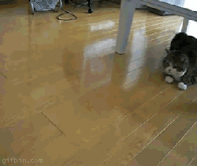

# Sizebooru

作者：mhnymhny

TID：8697

<title>1</title> <link href="../Styles/Style.css" type="text/css" rel="stylesheet">

# 1

K姐救回了Sizebooru City上得朋友可能都知道了 但是上面资源少的可怜
大家有时间去传传吧[http://size.booru.org/index.php](http://size.booru.org/index.php)

[ *本帖最後由 dirty 於 2010-11-26 22:58 編輯* ] <title>2</title> <link href="../Styles/Style.css" type="text/css" rel="stylesheet">

# 2

 <ignore_js_op>[4_163892_604961ade98d006.gif](forum.php?mod=attachment&aid=MjE5Mjh8ZTc0Nzg2N2R8MTY3NDA2ODg0MXwxODIzMHw4Njk3&nothumb=yes) *(521.15 KB, 下載次數: 1)*

[下載附件](forum.php?mod=attachment&aid=MjE5Mjh8ZTc0Nzg2N2R8MTY3NDA2ODg0MXwxODIzMHw4Njk3&nothumb=yes)

2010-11-26 22:55 上傳  

</ignore_js_op> <title>3</title> <link href="../Styles/Style.css" type="text/css" rel="stylesheet">

# 3

已经上去兜过了。呵呵 <title>4</title> <link href="../Styles/Style.css" type="text/css" rel="stylesheet">

# 4

不對,是K小姐買了原sizebooru網域名來用
而sizebooru只是換了網址,原資源都在 <title>5</title> <link href="../Styles/Style.css" type="text/css" rel="stylesheet">

# 5

 那猫好好玩~ <title>6</title> <link href="../Styles/Style.css" type="text/css" rel="stylesheet">

# 6

那是给日本的猫，有视频的，是很可爱。日本人特别喜欢猫。中国人喜欢狗 <title>7</title> <link href="../Styles/Style.css" type="text/css" rel="stylesheet">

# 7

.
有空的話我也來更新一下置頂帖吧，好像也很久沒 update 了…

Sizebooru 現在給 Katelyn 管理也好，她是有心投入在這個社群裡的。 <title>8</title> <link href="../Styles/Style.css" type="text/css" rel="stylesheet">

# 8

这个网站还是很好啊（宝刀未老啊） <title>9</title> <link href="../Styles/Style.css" type="text/css" rel="stylesheet">

# 9

楼上的头像真幸福啊~K姐看来是很投入啊。 <title>10</title> <link href="../Styles/Style.css" type="text/css" rel="stylesheet">

# 10

终于可以上了吗
真是感谢K姐啊 <title>11</title> <link href="../Styles/Style.css" type="text/css" rel="stylesheet">

# 11

这个不是K姐的SIZEBOORU，是原SIZEBOORU换个地址而已。

K姐的贴图版与SIZEBOORU是完全不一样的。

话说哪个脑残把《缩小学园》的插画都放上去了，果然是鱼龙混杂啊。。。 <title>12</title> <link href="../Styles/Style.css" type="text/css" rel="stylesheet">

# 12

不错的网站 第一次发现 真是太给力了 为了共同的爱好"万岁" <title>13</title> <link href="../Styles/Style.css" type="text/css" rel="stylesheet">

# 13

虽然类似名字，但是sizebooru怎么还没回归啊……sizebooru的账号什么的也有不少存货……都遗失了，早知道如此就不该上传后就删除啊…… <title>14</title> <link href="../Styles/Style.css" type="text/css" rel="stylesheet">

# 14

> 原帖由 *rce* 於 2010-11-28 00:43 發表 
> 虽然类似名字，但是sizebooru怎么还没回归啊……sizebooru的账号什么的也有不少存货……都遗失了，早知道如此就不该上传后就删除啊……

你丫不开窍啊 这就是Sizebooru 你的账号资料没了 这是被K借收购的
还什么类似 <title>15</title> <link href="../Styles/Style.css" type="text/css" rel="stylesheet">

# 15

.
單純購買域名是很簡單的，不過要繼承對方的會員帳號資料就很麻煩。

會員資料是一種可以被賦予價值的東西，而且也有隱私權的考量在，要交易這種東西的複雜程度是很難想像的。
以 katelyn 的情況來說，應該是自己以相同的系統程式而另外弄了個size.booru吧！
因為域名有變更是不爭的事實。

--
其實我們家的域名也變更過喔，從giantess-night到giantessnight。 <title>16</title> <link href="../Styles/Style.css" type="text/css" rel="stylesheet">

# 16

表示对但大所说的一知半解