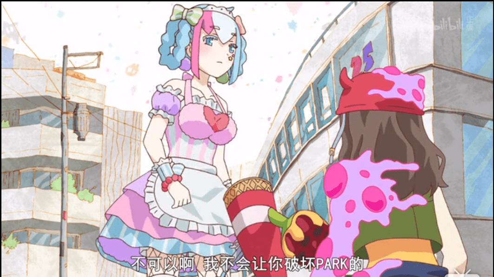
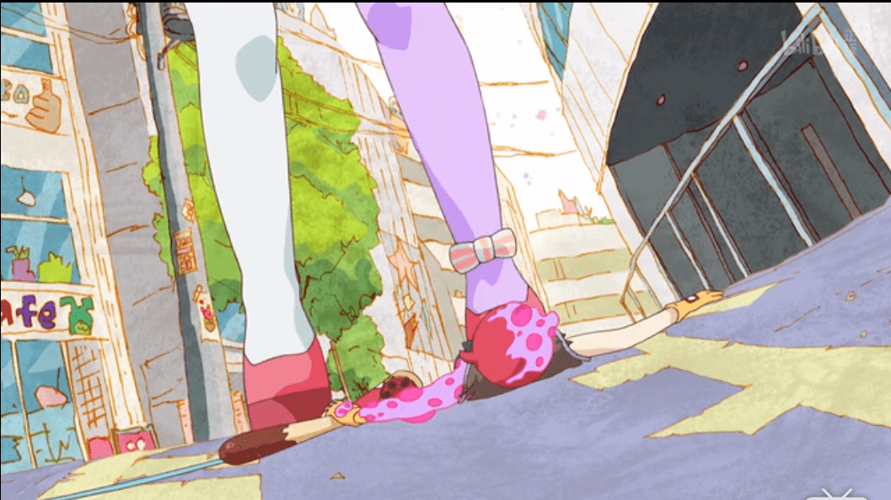

# URAHARA第八集

作者：qq1261029704

TID：26119

<title>1</title> <link href="../Styles/Style.css" type="text/css" rel="stylesheet">

# 1

*本帖最後由 qq1261029704 於 2018-11-29 15:25 編輯*

<ignore_js_op>

**图片1.png** *(750.31 KB, 下載次數: 0)*

[下載附件](forum.php?mod=attachment&aid=NzU1ODd8MWY1YTc0MDh8MTY3NDA2Njk2NHwxODIzMHwyNjExOQ%3D%3D&nothumb=yes)

2018-11-29 14:50 上傳

<ignore_js_op>

**图片2.png** *(788.48 KB, 下載次數: 0)*

[下載附件](forum.php?mod=attachment&aid=NzU1ODh8ZmMzMzZlM2V8MTY3NDA2Njk2NHwxODIzMHwyNjExOQ%3D%3D&nothumb=yes)

2018-11-29 14:50 上傳

在补番突然发现gts情节：
B站就有，可惜木有踩踏情节

<title>2</title> <link href="../Styles/Style.css" type="text/css" rel="stylesheet">

# 2

这个都火星多久了，，刚出的时候就有人发过了。。 <title>3</title> <link href="../Styles/Style.css" type="text/css" rel="stylesheet">

# 3

这个之前确实有人已经贴过。
然而二楼字里行间透露出的优越感无论对群众的积极性，还是对讨论的氛围，都没有半点好处…

<title>4</title> <link href="../Styles/Style.css" type="text/css" rel="stylesheet">

# 4

原来已经有人发过了？我找不到有相关的帖子啊，我一般也不会去追新番，而是过一段时间再看，嘛，有人发过那就请管理员删掉吧，我不知道怎么删帖子 <title>5</title> <link href="../Styles/Style.css" type="text/css" rel="stylesheet">

# 5

> [yugijimoh 發表於 2018-11-29 16:26](https://giantessnight.cf/gnforum2012/forum.php?mod=redirect&goto=findpost&pid=391585&ptid=26119)
> 这个之前确实有人已经贴过。
> 然而二楼字里行间透露出的优越感无论对群众的积极性，还是对讨论的氛围，都没 ...

老哥,,,说你什么好呢
人家仅仅那一句话你都能看出来什么优越感,至于吗
<title>6</title> <link href="../Styles/Style.css" type="text/css" rel="stylesheet">

# 6

> [hunj 發表於 2018-11-29 21:40](https://giantessnight.cf/gnforum2012/forum.php?mod=redirect&goto=findpost&pid=391593&ptid=26119)
> 老哥,,,说你什么好呢
> 人家仅仅那一句话你都能看出来什么优越感,至于吗

是啊，怎么了？浓浓的“我早就看过了你现在才发出来”您没读出来？
<title>7</title> <link href="../Styles/Style.css" type="text/css" rel="stylesheet">

# 7

以前那帖是我第一時間發的，現在不知為何消失了
大概但大在拯救伺服器時不小心噴了一點資料(? <title>8</title> <link href="../Styles/Style.css" type="text/css" rel="stylesheet">

# 8

> [yugijimoh 發表於 2018-11-29 23:02](https://giantessnight.cf/gnforum2012/forum.php?mod=redirect&goto=findpost&pid=391597&ptid=26119)
> 是啊，怎么了？浓浓的“我早就看过了你现在才发出来”您没读出来？

那句話裡完全沒有第一人稱主詞喔，所以是你過度解讀
過度解讀的意思是，就算人家真的有這個意思，也不是能從這句話裡看出來的
就算是對原po而言，如果人家真的出來跟你對質他也只會更尷尬啊
雖然我沒什麼資格說啦，但做人稍微和善點吧
<title>9</title> <link href="../Styles/Style.css" type="text/css" rel="stylesheet">

# 9

> [3213213210 發表於 2018-11-30 10:25](https://giantessnight.cf/gnforum2012/forum.php?mod=redirect&goto=findpost&pid=391609&ptid=26119)
> 那句話裡完全沒有第一人稱主詞喔，所以是你過度解讀
> 過度解讀的意思是，就算人家真的有這個意思，也不是 ...

行吧，既然都认为在人家发旧资源情报出来共享是不值得尊重，可以这种语气地说人落伍的，我也没啥好坚持了。
喜欢就好。</ignore_js_op></ignore_js_op>