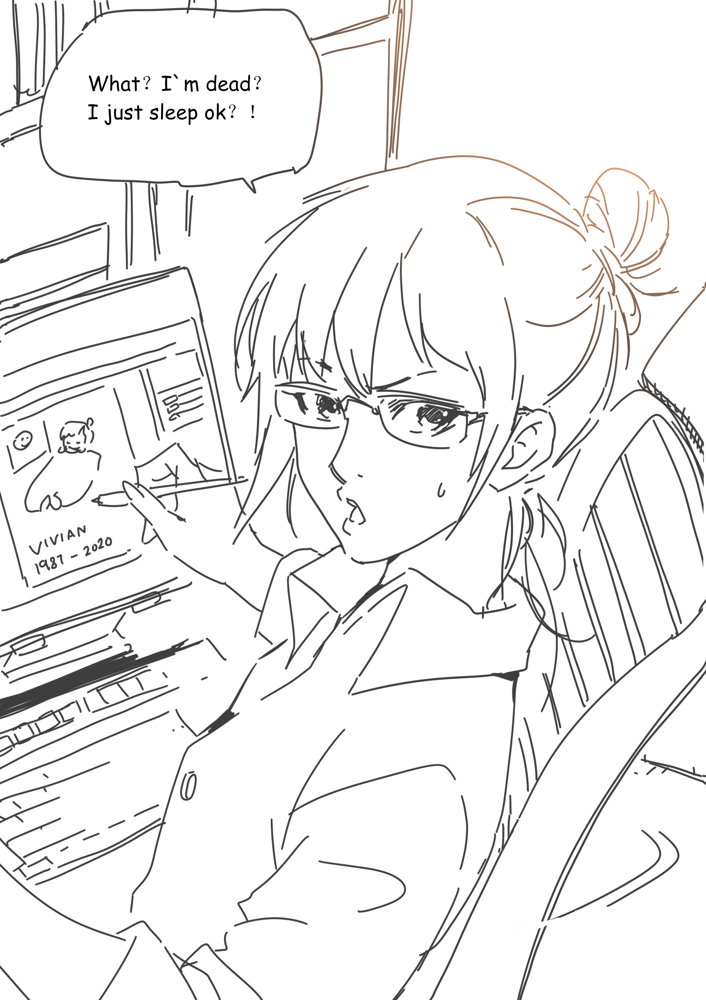

# V姐走了，这不是谣言，很难受

作者：fxwan321

TID：28079

<title>1</title> <link href="../Styles/Style.css" type="text/css" rel="stylesheet">

# 1

Vivian的作品表现力都很强，不幸去世真是令人惋惜。 <title>2</title> <link href="../Styles/Style.css" type="text/css" rel="stylesheet">

# 2

V姐R.I.P
推特上看到的消息，就感觉世事无常…好好珍惜身边人吧 <title>3</title> <link href="../Styles/Style.css" type="text/css" rel="stylesheet">

# 3

R.I.P VIVIAN
祝在彼方安好 <title>4</title> <link href="../Styles/Style.css" type="text/css" rel="stylesheet">

# 4

2月10号在她的patreon就说已经感染了新冠肺炎并住院，只是没想到竟然这么快...唉……愿逝者安息 <title>5</title> <link href="../Styles/Style.css" type="text/css" rel="stylesheet">

# 5

v姐
我們絕對不會忘記你。。
為華人GTS 付出很多
是我們最尊敬的人
一直以來謝謝你。。
安息

RIP
<title>6</title> <link href="../Styles/Style.css" type="text/css" rel="stylesheet">

# 6

v姐

謝謝你一直以來的付出

RIP
 <title>7</title> <link href="../Styles/Style.css" type="text/css" rel="stylesheet">

# 7

V姐走了
世间少了一抹光亮
谢谢你，V姐
但愿你在人间的彼岸能继续散发光芒
照亮另一个世界 <title>8</title> <link href="../Styles/Style.css" type="text/css" rel="stylesheet">

# 8

真的是新型冠状病毒？？？我真的是艹了，曾经我也天真的以为病毒离我们很远，直到看到这个消息。。。
v姐R.I.P. <title>9</title> <link href="../Styles/Style.css" type="text/css" rel="stylesheet">

# 9

I JUST  SLEEP ~

不行了，当年入坑之际看她的作品为前辈们的付出感到由衷的钦佩。还没有好好的支持她一下就这样了我很难接受…… <title>10</title> <link href="../Styles/Style.css" type="text/css" rel="stylesheet">

# 10

V姐一路平安，愿天堂有您最喜欢的gts <title>11</title> <link href="../Styles/Style.css" type="text/css" rel="stylesheet">

# 11

对圈内来说真的是沉重的打击，这么优秀的作者，心情很沉痛 <title>12</title> <link href="../Styles/Style.css" type="text/css" rel="stylesheet">

# 12

圈內少了一位優秀畫家真的令人心痛R.I.P. <title>13</title> <link href="../Styles/Style.css" type="text/css" rel="stylesheet">

# 13

今年意外去世的真不少。
Vivian R.I.P <title>14</title> <link href="../Styles/Style.css" type="text/css" rel="stylesheet">

# 14

实在想不到肺炎这玩意能把祸害到这小小圈子的一位大神... <title>15</title> <link href="../Styles/Style.css" type="text/css" rel="stylesheet">

# 15

致敬，向我们这小小世界中陨落的一颗星致敬。愿v姐在天堂能见到她喜欢的gts。R.I.P <title>16</title> <link href="../Styles/Style.css" type="text/css" rel="stylesheet">

# 16

向华人gts圈陨落的大神致敬，愿v姐在天堂一切安好 <title>17</title> <link href="../Styles/Style.css" type="text/css" rel="stylesheet">

# 17

*本帖最後由 ccccccccccc 於 2020-2-18 03:28 編輯*

> [田棒棒 發表於 2020-2-17 19:52](https://giantessnight.cf/gnforum2012/forum.php?mod=redirect&goto=findpost&pid=426719&ptid=28079)
> 她作品有让谁之后接着继续画么？

你這回復就像是你長輩死了還沒辦喪禮就在談遺產如何處理
EDIT:
漏了 RIP V姐 GTS界的世界名人了 我也是在推特上看到日本和世界各地的人在說我才知道... 希望疫情盡快好轉 <title>18</title> <link href="../Styles/Style.css" type="text/css" rel="stylesheet">

# 18

原来死亡离我们这么近。。。节哀 <title>19</title> <link href="../Styles/Style.css" type="text/css" rel="stylesheet">

# 19

目测好像是冠状病毒闹得，不过这次病毒致死率不高（大概4%，比2003年和中东的低很多），而且还都是老年人患有慢性病的，V姐怎么会中枪呢？是有自身疾病吗，还是耽误了？虽然我不知道V姐多大，但应该是30左右吧... <title>20</title> <link href="../Styles/Style.css" type="text/css" rel="stylesheet">

# 20

我的天呐，我是看了推特上有人说的才看到的。。。
愿死者安息。。。 <title>21</title> <link href="../Styles/Style.css" type="text/css" rel="stylesheet">

# 21

刚起床就听到这么悲伤的消息，没想到从刚入坑就关注的作者就这么走了，真是世事无常，愿逝者安息。 <title>22</title> <link href="../Styles/Style.css" type="text/css" rel="stylesheet">

# 22

虽然对v姐不熟悉，但是听说过她，没想到发生了这种事，希望天堂也有gts <title>23</title> <link href="../Styles/Style.css" type="text/css" rel="stylesheet">

# 23

默哀，惋惜，向大神致敬。 <title>24</title> <link href="../Styles/Style.css" type="text/css" rel="stylesheet">

# 24

> [4945 發表於 2020-2-18 03:53](https://giantessnight.cf/gnforum2012/forum.php?mod=redirect&goto=findpost&pid=426847&ptid=28079)
> 目测好像是冠状病毒闹得，不过这次病毒致死率不高（大概4%，比2003年和中东的低很多），而且还都是老年人患 ...

我记得她以前提到过她有一些健康问题，我是否记得不正确？

西方论坛也遭受了这一损失的沉重打击。 Vivian是许多成员遇到的最早的GTS艺术家之一

<title>25</title> <link href="../Styles/Style.css" type="text/css" rel="stylesheet">

# 25

微博上大连死亡人数还是0，到底还有多少瞒报的？ <title>26</title> <link href="../Styles/Style.css" type="text/css" rel="stylesheet">

# 26

不敢相信，V姐一路走好 <title>27</title> <link href="../Styles/Style.css" type="text/css" rel="stylesheet">

# 27

R.I.P.
......一路走好...... <title>28</title> <link href="../Styles/Style.css" type="text/css" rel="stylesheet">

# 28

> LiKNaRbCsFr 發表於 2020-2-18 10:04
> 微博上大连死亡人数还是0，到底还有多少瞒报的？

大连？v姐是大连人吗？ <title>29</title> <link href="../Styles/Style.css" type="text/css" rel="stylesheet">

# 29

难以相信……默哀，一路走好…… <title>30</title> <link href="../Styles/Style.css" type="text/css" rel="stylesheet">

# 30

我第一次知道v姐是在群里。但大聊天的时候说出门扔个垃圾，v姐来了张速写恶搞了一下。（我记得是很可爱的八爪鱼?）
之后关注她的作品，真的超级超级棒
有些语无伦次真的非常难过，很多话打不出来

R.I.P <title>31</title> <link href="../Styles/Style.css" type="text/css" rel="stylesheet">

# 31

卧槽！。。。。为什么这个肺炎会感染到我们业界的大佬！草！。。。。一直以为这次的疫情离我非常遥远！ <title>32</title> <link href="../Styles/Style.css" type="text/css" rel="stylesheet">

# 32

rip，愿已逝之人安息，希望v姐能在另一个世界找到属于自己的幸福 <title>33</title> <link href="../Styles/Style.css" type="text/css" rel="stylesheet">

# 33

对着屏幕看着看着突然就哭了，vivian的离世一下子带走了好多东西…… <title>34</title> <link href="../Styles/Style.css" type="text/css" rel="stylesheet">

# 34

天哪。。。 这这这

又一次感受到了这次肺炎的恐怖

哎 节哀

希望疫情也能早点过去 太难了 <title>35</title> <link href="../Styles/Style.css" type="text/css" rel="stylesheet">

# 35

第一次知道v姐老家在东北，要是她好好待在美国就没这些事了。。。同为东北人的我深深感到了害怕 <title>36</title> <link href="../Styles/Style.css" type="text/css" rel="stylesheet">

# 36

我已经是半退圈状态了，在p站看到有人发才知道这个事.....
真的，不知道该说什么。
只有悲伤。 <title>37</title> <link href="../Styles/Style.css" type="text/css" rel="stylesheet">

# 37

太可怕了，怎么会这样，看来这次疫情不会那么简单就结束了 <title>38</title> <link href="../Styles/Style.css" type="text/css" rel="stylesheet">

# 38

不想说什么了……
逝者安息
愿V姐家人能从痛苦中走出来 <title>39</title> <link href="../Styles/Style.css" type="text/css" rel="stylesheet">

# 39

*本帖最後由 克里亞 於 2020-2-19 00:38 編輯*

知道消息當下就去patreon補了最高的方案..
逛圈內的時間漸漸少了，常常推特神社P站一圈就收工
V姐的消息是真的震驚...，近期才因Kobe傷心了一次，2020真的是開頭就是一大悲劇，當初踏入gts圈內.V姐的作品就是品質的保證了，同時期現在一些大神的圖還像是一小時的速描呢..

不太會哀悼亡者，擠不出什麼話..只希望V姐能安息，在那邊能幸福，在天堂當一個能隨心所欲的女巨人也可以的..

最後就跟前面四樓說的一樣
這次疫情太大又重創中日地區，有管道都盡量去支持下自己喜歡的作者，畢竟今年才剛開始.疫情還沒結束，生存模式就提升了好幾個等級..(肯定會影響創作空間跟精神壓力)

<title>40</title> <link href="../Styles/Style.css" type="text/css" rel="stylesheet">

# 40

诶…世事无常，愿走好 <title>41</title> <link href="../Styles/Style.css" type="text/css" rel="stylesheet">

# 41

> [Doodadad 發表於 2020-2-18 10:03](https://giantessnight.cf/gnforum2012/forum.php?mod=redirect&goto=findpost&pid=426888&ptid=28079)
> 我记得她以前提到过她有一些健康问题，我是否记得不正确？
> 
> 西方论坛也遭受了这一损失的沉重打击。 Vivia ...

具体点？我完全不知道...
<title>42</title> <link href="../Styles/Style.css" type="text/css" rel="stylesheet">

# 42

顺便问一下，有没有V姐的照片，一直不知道长啥样 <title>43</title> <link href="../Styles/Style.css" type="text/css" rel="stylesheet">

# 43

虽然除了作品，对这人完全没太多了解。只能说逝者安息了… <title>44</title> <link href="../Styles/Style.css" type="text/css" rel="stylesheet">

# 44

*本帖最後由 dijkstra 於 2020-2-19 13:06 編輯*

太震惊了。这么久不上线竟然上来就听到的是这么糟糕的消息。我也刚刚把patreon加到最高的订阅费。
只希望V姐的家人朋友一切都好，愿来世没有病痛……

Patreon上Reol刚刚更新了V姐丈夫画的一幅纪念画作，看着DA上面几百条的comments，突然一下子眼眶就湿了。

V姐的离去太令人伤心，大家保重。

<title>45</title> <link href="../Styles/Style.css" type="text/css" rel="stylesheet">

# 45

 <ignore_js_op>[vivian1987-2020.jpg](forum.php?mod=attachment&aid=ODE1MTZ8NDc1YmVlY2J8MTY3NDA2NjU2NXwxODIzMHwyODA3OQ%3D%3D&nothumb=yes) *(954.7 KB, 下載次數: 0)*

[下載附件](forum.php?mod=attachment&aid=ODE1MTZ8NDc1YmVlY2J8MTY3NDA2NjU2NXwxODIzMHwyODA3OQ%3D%3D&nothumb=yes)

2020-2-19 09:24 上傳  

</ignore_js_op> <title>46</title> <link href="../Styles/Style.css" type="text/css" rel="stylesheet">

# 46

> [4945 發表於 2020-2-19 02:18](https://giantessnight.cf/gnforum2012/forum.php?mod=redirect&goto=findpost&pid=427099&ptid=28079)
> 具体点？我完全不知道...

5月，她的Patreon说她住院了一个多星期。 她还在7月和8月之间休息了一段时间，但没有提供详细信息

这不是健康不良的确认，只是我的猜测

<title>47</title> <link href="../Styles/Style.css" type="text/css" rel="stylesheet">

# 47

推特上好多老外也在默哀，，雅典娜5永远也无法看到了，RIP，逝者安息。 <title>48</title> <link href="../Styles/Style.css" type="text/css" rel="stylesheet">

# 48

几个群里的消息记录浏览了一下，都有人提到b姐去世的消息，但是知道v姐或者说会感到难过的却没几个，但我敢肯定大部分肯定都用过v姐的作品，甚至有个群的群相册里就有v姐的天山童姥

随着这股悲伤的情绪再看v姐给我们留下最后的一幅画。
是啊，她只是睡着了，一位给我们带来无数精美作品的画师她累了，放下笔要去休息了。

我只能这么去想了
<title>49</title> <link href="../Styles/Style.css" type="text/css" rel="stylesheet">

# 49

看见她说的不要怕眼泪都流出来了，她一定是一个很善良的人以后在天堂继续画画。 <title>50</title> <link href="../Styles/Style.css" type="text/css" rel="stylesheet">

# 50

唉...感覺很難過...
硬碟還有v姐的作品...
願逝者安息...
也希望v姐家人保重自己 <title>51</title> <link href="../Styles/Style.css" type="text/css" rel="stylesheet">

# 51

唉……她算得上是G圈最强画师之一了 <title>52</title> <link href="../Styles/Style.css" type="text/css" rel="stylesheet">

# 52

悲凉，V姐。。。。。。唉。。。。。突然有一种填坑的冲动，怕自己有一天也没了 <title>53</title> <link href="../Styles/Style.css" type="text/css" rel="stylesheet">

# 53

我更新了一下帖子，大家可以去链接看一下公告 <title>54</title> <link href="../Styles/Style.css" type="text/css" rel="stylesheet">

# 54

天啊...居然就走了吗？
病毒太可怕了...虽然致死率是2%，对那2%的人来说就是100%...
而且还带走的是圈内这么优秀的画师
哎 <title>55</title> <link href="../Styles/Style.css" type="text/css" rel="stylesheet">

# 55

最后一张画简直太让人伤心了，愿善良的人被世界温柔以待，v姐一路走好。 <title>56</title> <link href="../Styles/Style.css" type="text/css" rel="stylesheet">

# 56

天呐RIP. 真的非常喜欢v姐的本子。最早就是被v姐的vore漫带进坑的 <title>57</title> <link href="../Styles/Style.css" type="text/css" rel="stylesheet">

# 57

我真的哭了，为什么要带走她
<title>58</title> <link href="../Styles/Style.css" type="text/css" rel="stylesheet">

# 58

这。。。虽然知道新冠肺炎很严重，但是从来没想到圈内的一个大佬说没就没了。。。太可惜了，默哀 <title>59</title> <link href="../Styles/Style.css" type="text/css" rel="stylesheet">

# 59

> [帝宸 發表於 2020-2-17 19:47](https://giantessnight.cf/gnforum2012/forum.php?mod=redirect&goto=findpost&pid=426717&ptid=28079)
> 我真的有点接受不了，真的很难受

有人从一楼一直点反对点到最后一楼……能查出来吗？
<title>60</title> <link href="../Styles/Style.css" type="text/css" rel="stylesheet">

# 60

> [帝宸 發表於 2020-2-18 11:11](https://giantessnight.cf/gnforum2012/forum.php?mod=redirect&goto=findpost&pid=426903&ptid=28079)
> 大连？v姐是大连人吗？

VV是鞍山的。。。。。。。但是显示也是0
<title>61</title> <link href="../Styles/Style.css" type="text/css" rel="stylesheet">

# 61

> [abc-c 發表於 2020-2-21 03:48](https://giantessnight.cf/gnforum2012/forum.php?mod=redirect&goto=findpost&pid=427396&ptid=28079)
> VV是鞍山的。。。。。。。但是显示也是0

整个辽宁只有2月12号一例死亡，怎么回事？难道V姐不是在辽宁诊断出来的吗？
<title>62</title> <link href="../Styles/Style.css" type="text/css" rel="stylesheet">

# 62

真是震惊啊，她是在哪里染上CV又在哪里病逝的呢？R.I.P <title>63</title> <link href="../Styles/Style.css" type="text/css" rel="stylesheet">

# 63

這件事確實讓人非常遺憾，今年已經走掉太多人了。 <title>64</title> <link href="../Styles/Style.css" type="text/css" rel="stylesheet">

# 64

   {:7_351:} {:7_351:} <title>65</title> <link href="../Styles/Style.css" type="text/css" rel="stylesheet">

# 65

> [贴吧 發表於 2020-2-21 03:32](https://giantessnight.cf/gnforum2012/forum.php?mod=redirect&goto=findpost&pid=427395&ptid=28079)
> 有人从一楼一直点反对点到最后一楼……能查出来吗？

查不出，可能需要找管理员
<title>66</title> <link href="../Styles/Style.css" type="text/css" rel="stylesheet">

# 66

> [田棒棒 發表於 2020-2-19 18:30](https://giantessnight.cf/gnforum2012/forum.php?mod=redirect&goto=findpost&pid=427227&ptid=28079)
> 知道这个消息，要不是自己画技没那么好，还真考虑什么时候帮她作品接坑了。
> ...

她的丈夫可能会帮她延续下去
<title>67</title> <link href="../Styles/Style.css" type="text/css" rel="stylesheet">

# 67

悲痛悲痛悲痛，世事无常 <title>68</title> <link href="../Styles/Style.css" type="text/css" rel="stylesheet">

# 68

这。。。虽然知道新冠肺炎很严重，但是从来没想到圈内的一个大佬说没就没了。。。太可惜了，默哀 <title>69</title> <link href="../Styles/Style.css" type="text/css" rel="stylesheet">

# 69

> [帝宸 發表於 2020-2-17 19:47](https://giantessnight.cf/gnforum2012/forum.php?mod=redirect&goto=findpost&pid=426717&ptid=28079)
> 我真的有点接受不了，真的很难受

有人从一楼一直点反对点到最后一楼……能查出来吗？
<title>70</title> <link href="../Styles/Style.css" type="text/css" rel="stylesheet">

# 70

> [帝宸 發表於 2020-2-18 11:11](https://giantessnight.cf/gnforum2012/forum.php?mod=redirect&goto=findpost&pid=426903&ptid=28079)
> 大连？v姐是大连人吗？

VV是鞍山的。。。。。。。但是显示也是0
<title>71</title> <link href="../Styles/Style.css" type="text/css" rel="stylesheet">

# 71

> [abc-c 發表於 2020-2-21 03:48](https://giantessnight.cf/gnforum2012/forum.php?mod=redirect&goto=findpost&pid=427396&ptid=28079)
> VV是鞍山的。。。。。。。但是显示也是0

整个辽宁只有2月12号一例死亡，怎么回事？难道V姐不是在辽宁诊断出来的吗？
<title>72</title> <link href="../Styles/Style.css" type="text/css" rel="stylesheet">

# 72

真是震惊啊，她是在哪里染上CV又在哪里病逝的呢？R.I.P <title>73</title> <link href="../Styles/Style.css" type="text/css" rel="stylesheet">

# 73

這件事確實讓人非常遺憾，今年已經走掉太多人了。 <title>74</title> <link href="../Styles/Style.css" type="text/css" rel="stylesheet">

# 74

   {:7_351:} {:7_351:} <title>75</title> <link href="../Styles/Style.css" type="text/css" rel="stylesheet">

# 75

> [贴吧 發表於 2020-2-21 03:32](https://giantessnight.cf/gnforum2012/forum.php?mod=redirect&goto=findpost&pid=427395&ptid=28079)
> 有人从一楼一直点反对点到最后一楼……能查出来吗？

查不出，可能需要找管理员
<title>76</title> <link href="../Styles/Style.css" type="text/css" rel="stylesheet">

# 76

> [田棒棒 發表於 2020-2-19 18:30](https://giantessnight.cf/gnforum2012/forum.php?mod=redirect&goto=findpost&pid=427227&ptid=28079)
> 知道这个消息，要不是自己画技没那么好，还真考虑什么时候帮她作品接坑了。
> ...

她的丈夫可能会帮她延续下去
<title>77</title> <link href="../Styles/Style.css" type="text/css" rel="stylesheet">

# 77

悲痛悲痛悲痛，世事无常