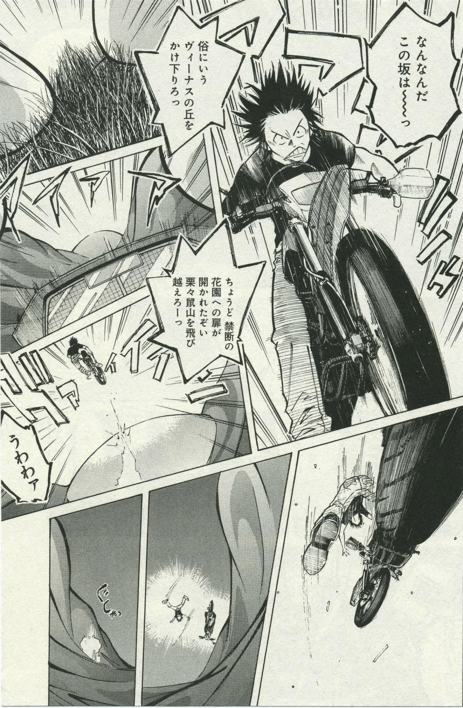

# What manga is this？

作者：Shibazaki

TID：24309

<title>1</title> <link href="../Styles/Style.css" type="text/css" rel="stylesheet">

# 1

I don't know how to put a saved image here. or like this? <title>2</title> <link href="../Styles/Style.css" type="text/css" rel="stylesheet">

# 2

 <ignore_js_op>[179373.JPG](forum.php?mod=attachment&aid=NzAzOTR8NTZmYmIxMWZ8MTY3NDA2NzI1OXwxODIzMHwyNDMwOQ%3D%3D&nothumb=yes) *(393.4 KB, 下載次數: 8)*

[下載附件](forum.php?mod=attachment&aid=NzAzOTR8NTZmYmIxMWZ8MTY3NDA2NzI1OXwxODIzMHwyNDMwOQ%3D%3D&nothumb=yes)

2018-1-15 22:45 上傳  

</ignore_js_op> <title>3</title> <link href="../Styles/Style.css" type="text/css" rel="stylesheet">

# 3

HAAAA,I think I made it...........XD <title>4</title> <link href="../Styles/Style.css" type="text/css" rel="stylesheet">

# 4

Emmm You can try editing HTML to make the link prefect <title>5</title> <link href="../Styles/Style.css" type="text/css" rel="stylesheet">

# 5

> [412592262 發表於 2018-1-16 22:09](https://giantessnight.cf/gnforum2012/forum.php?mod=redirect&goto=findpost&pid=355617&ptid=24309)
> zhuangzuo huishuo yingyu de yangzi

泥垢了啊，泥垢了！????