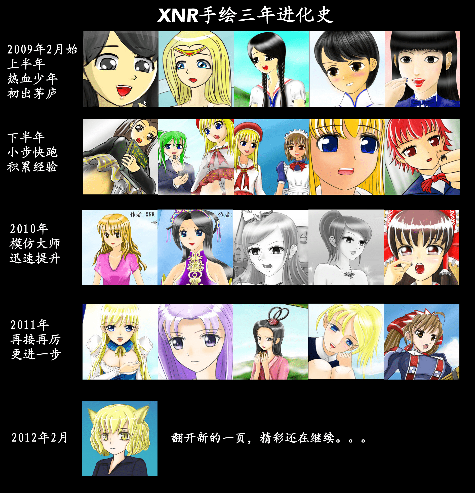

# XNR三年进化史

作者：Dante

TID：11826

<title>1</title> <link href="../Styles/Style.css" type="text/css" rel="stylesheet">

# 1

三年前的今天，是我正在画第一张GTS图的时候。。。
时间过得真快，转眼间三年就过去了。。。真是感慨良多啊。。。
对我产生较大影响的是三位日本GTS画家：SS、白兔和濑尾。

第一次画手绘图是受到了SS的影响，他是《缩小学园》主力画师之一，当时《缩》刚出炉不久，他曾经在2CH版上贴过一些草图
因为真的草，但是效果却又很好，引得我也跃跃欲试，于是就有了我2009年2月第一次手绘作品：
[http://giantessnight.com/gnforum ... ghlight=&page=1](http://giantessnight.com/gnforum/viewthread.php?tid=2082&extra=&highlight=&page=1)

当时《缩》火爆一时，于是我也在GN开展游戏制作计划，小步快跑的出了很多图，努力尝试了不同的画风，也算是前期的经验积累了。
直到2010年上半年认真的模仿了一次白兔的画风，才让我的作品有了质的提高，那一年GN也因为服务器问题停罢了很长时间，出图不多，下半年尝试了下GTS漫画。
[http://giantessnight.com/gnforum ... p;extra=&page=1](http://giantessnight.com/gnforum/viewthread.php?tid=7870&extra=&page=1)

2009~2010这两年也是我压力倍大的时候，因为画的差强人意，自尊心又强，心高气傲，年少轻狂，跟其他人在版上和线上发生过不少冲突。。。
有人受到了我的热血激励也参与了创作，也有人因为跟我对喷被封了帐号，自己也曾经被关了一个礼拜的小黑屋，不管怎样，我还是感谢那些一如既往支持我的同好，也感谢那些批评谩骂和指责我的人，是你们让我变得更加坚强和执着，不断的突破自我。

后来，我在画风上受到了濑尾辰也手绘风格的启发，对脸型和视角的把握有了很大的提高，为我今后的创作尤其是GTS漫画方面奠定了坚实的基础。
说到底，更要感谢自己孜孜不倦的努力，才有我今天的成就。

去年底发布的最新作：
[http://giantessnight.com/gnforum ... ghlight=&page=1](http://giantessnight.com/gnforum/viewthread.php?tid=11352&extra=&highlight=&page=1)

—————————————————————————————————————————————————

<ignore_js_op>

**xnr3year.jpg** *(1.83 MB, 下載次數: 0)*

[下載附件](forum.php?mod=attachment&aid=Mjc3MjN8MjI4ZmE0NDF8MTY3NDA2ODcyM3wxODIzMHwxMTgyNg%3D%3D&nothumb=yes)

2012-2-11 19:48 上傳

我觉得从以上图片集合中的画风变迁来看，还是蛮励志的。
你们也完全可能画得跟我一样好，希望那些有爱、有才华的同好们，也拿起自己的笔，创造和丰富我们的GTS文化，自己动手丰衣足食！

PS：三年过去了，你进化了没有？

[ *本帖最後由 xnr 於 2012-2-11 19:51 編輯* ] <title>2</title> <link href="../Styles/Style.css" type="text/css" rel="stylesheet">

# 2

回眸總是很感慨的，不管是輕狂的過去還是什麼。
該說是被激勵到的感覺吧？也該填坑了。。。才不填，乾脆開坑好了。
話說X大的新圖令HUNTER迷（在下）無限期待~ <title>3</title> <link href="../Styles/Style.css" type="text/css" rel="stylesheet">

# 3

像俺这种上年纪的人第一反应就是感慨时间飞快啊
看的出来你是个目标清晰善于总结反思，坚持梦想始终执着努力的人。3年来的进步是相当明显的，离梦想也越来越近咯。
辛勤的耕耘便会收获丰收的果实，新的2012，期待你的大作哦！ <title>4</title> <link href="../Styles/Style.css" type="text/css" rel="stylesheet">

# 4

3年弹指一挥间。。以前的事情已经过去，，我们也要向前方看齐，，这几年我也进化了，，，变的更加成熟，，更加老实  本分 纯洁 善良 尊老爱幼，英俊潇洒 风流倜傥、玉树临风、、桀骜不羁、一表人才 、风度翩翩 、衣冠楚楚 、相貌堂堂、文字彬彬、幽默风趣。帅气逼人 孔武有力 心胸开阔 机智灵便 为人诚实 稳重。。。。2" />
男人要有骨气
男人要有激情
男人要有才华
男人要坚强
男人要幽默
男人要有智慧
男人要踏实
男人要善良

男人要有梦想
男人要有霸气
男人要豁达
男人要英明
男人要有野心
男人要有魅力
因为我就i是这样的男人。。。因为我进化了 

[ *本帖最後由 嘯天淫狼 於 2012-2-11 21:43 編輯* ] <title>5</title> <link href="../Styles/Style.css" type="text/css" rel="stylesheet">

# 5

XNR大大三年啦……
画技一直都很令人眼亮
蛋白什么的YY的时候看的都是您的图吧（笑
继续加油吧！
以上，潜水的陆 <title>6</title> <link href="../Styles/Style.css" type="text/css" rel="stylesheet">

# 6

突然发现有几张图没看过
补去了 <title>7</title> <link href="../Styles/Style.css" type="text/css" rel="stylesheet">

# 7

看了XNR大的進化史
還真是感觸良多啊
原來XNR大的畫工也是努力鍛鍊出來的
這經歷讓我想到我在GN上的文啊
我是在去年開始寫文的
雖然到現在只有三篇文
不過我覺得我的文筆有在慢慢進步
更感謝支持我的人
希望以後也能創作出更好的GTS作品啊 <title>8</title> <link href="../Styles/Style.css" type="text/css" rel="stylesheet">

# 8

- -看XNR大，再看看自己这2年（羞 <title>9</title> <link href="../Styles/Style.css" type="text/css" rel="stylesheet">

# 9

這幾年的改變...
我的歷史還是另外開一帖討論，感傷話別在這裡說了

另外，個人很好奇X兄有無在畫GTS以外的作品? <title>10</title> <link href="../Styles/Style.css" type="text/css" rel="stylesheet">

# 10

顶顶 希望画的越来越好
时光真是飞逝唉 感叹一下 <title>11</title> <link href="../Styles/Style.css" type="text/css" rel="stylesheet">

# 11

.
圈內能在有限的作品數量當中取得顯著進步，近年來除了xnr也暫時想不到別人了。
可見xnr的確很努力，在創作的領域精益求精，這個精神我們是必須要感佩的。
越是有心創作的人，越知道進步是多麼困難的一件事。

期待16號那天發出新圖的一刻！ <title>12</title> <link href="../Styles/Style.css" type="text/css" rel="stylesheet">

# 12

最近一年都没怎么看过gts
不过XNR你的图真的进步很大啊
期待你的大作哦秦 <title>13</title> <link href="../Styles/Style.css" type="text/css" rel="stylesheet">

# 13

還是披上L&R的皮膚。。。
『裝配獵槍子彈、蹲在窗口旁、街頭兩排人民夾道熱烈歡呼、行駛道上汽車揮手的某名人。。。
他們不知道未來，這個人當上這國家領導後發生的事，他們膜拜聖人，因為他們攀不到的地位，他成功了，他從某個無名小毛頭變成了國家的重點人物，一人之下萬人之上的夢魘找上了他。
誠實的槍手，準繩，車上男人，只是一睥，國家歷史改變。儘管大家還是維持不高不低的生活，儘管大家會忘記一個偉人，他為大眾福祉，化身人民公敵，用手上那長個青綠鐵銹的獵槍，了結一個令末日降臨的聖人。
獵人等待的機會來臨了。
粉紅色的PLYMOUTH XNR 100汽車。
這天是2月16日。』
。
L&R，謹此向XNR祝壽。
脫下L&R的人皮逃跑。。。。。。 <title>14</title> <link href="../Styles/Style.css" type="text/css" rel="stylesheet">

# 14

感谢大家的回复，你们对我的支持我都看在眼里、记在心里，我会继续努力的。

另外回9楼 无边落木兄，我确实有在圈外画其他图。</ignore_js_op>