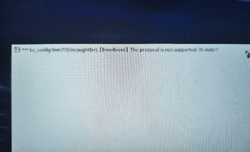

# air游戏到底要咋弄...安到电脑上就白屏...

作者：kim

TID：34131

<title>1</title> <link href="../Styles/Style.css" type="text/css" rel="stylesheet">

# 1

*本帖最後由 kim 於 2022-9-19 13:56 編輯*

如图，实在没辙了Q_Q，谁能来救救我游戏名ミモザの咲く頃
win10系统
已经装了adobe air
栏内文字：**fn: config line:22(UncaughtErr) 【ErrorEvent] The protocol is not supported. th state:1

<title>2</title> <link href="../Styles/Style.css" type="text/css" rel="stylesheet">

# 2

 <ignore_js_op>[IMG_20220918_150128.jpg](forum.php?mod=attachment&aid=OTkzMDh8NGQ4N2RlYjh8MTY3NDA2NTMxNnwxODIzMHwzNDEzMQ%3D%3D&nothumb=yes) *(35.84 KB, 下載次數: 1)*

[下載附件](forum.php?mod=attachment&aid=OTkzMDh8NGQ4N2RlYjh8MTY3NDA2NTMxNnwxODIzMHwzNDEzMQ%3D%3D&nothumb=yes)

2022-9-18 15:03 上傳  

</ignore_js_op> <title>3</title> <link href="../Styles/Style.css" type="text/css" rel="stylesheet">

# 3

等等，我是不是发错区了...牙白.......... <title>4</title> <link href="../Styles/Style.css" type="text/css" rel="stylesheet">

# 4

这区不就是用来谈天说地的嘛，啥都能发的万能区 <title>5</title> <link href="../Styles/Style.css" type="text/css" rel="stylesheet">

# 5

air，是啥..我淦，一起蹲下等着吧。 <title>6</title> <link href="../Styles/Style.css" type="text/css" rel="stylesheet">

# 6

什么游戏什么系统什么报错的不知道图还一片糊，真就两眼抹黑 Debug  <title>7</title> <link href="../Styles/Style.css" type="text/css" rel="stylesheet">

# 7

> Foobarz 發表於 2022-9-19 10:19
> 什么游戏什么系统什么报错的不知道图还一片糊，真就两眼抹黑 Debug

已经编辑出来啦...Q_Q大佬看一眼不......... <title>8</title> <link href="../Styles/Style.css" type="text/css" rel="stylesheet">

# 8

> [kim 發表於 2022-9-19 13:57](https://giantessnight.cf/gnforum2012/forum.php?mod=redirect&goto=findpost&pid=516150&ptid=34131)
> 已经编辑出来啦...Q_Q大佬看一眼不.........

结果还是不知道，有没有安装包给我试试 
<title>9</title> <link href="../Styles/Style.css" type="text/css" rel="stylesheet">

# 9

> Foobarz 發表於 2022-9-19 19:10
> 结果还是不知道，有没有安装包给我试试

https://pan.baidu.com/s/1XEz2Cgd_P3T5xEj5lcvGNQ 提取码：xrx1
琉璃的帖子复制来的 <title>10</title> <link href="../Styles/Style.css" type="text/css" rel="stylesheet">

# 10

> [kim 發表於 2022-9-19 20:42](https://giantessnight.cf/gnforum2012/forum.php?mod=redirect&goto=findpost&pid=516161&ptid=34131)
> https://pan.baidu.com/s/1XEz2Cgd_P3T5xEj5lcvGNQ 提取码：xrx1
> 琉璃的帖子复制来的

复现出来了，看起来是脚本的问题。然而首先这玩意是编译过的没源代码，然后我也不会 Air 。所以帮不上什么忙真是抱歉  <title>11</title> <link href="../Styles/Style.css" type="text/css" rel="stylesheet">

# 11

> Foobarz 發表於 2022-9-19 21:53
> 复现出来了，看起来是脚本的问题。然而首先这玩意是编译过的没源代码，然后我也不会 Air 。所以帮不上什 ...

没有没有，谢谢你啦，非常感谢！