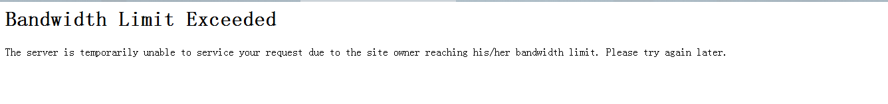

# booru不能上了。。。。

作者：蜡下翁

TID：14845

<title>1</title> <link href="../Styles/Style.css" type="text/css" rel="stylesheet">

# 1

今天打开booru之后就发下啊不能上了并出现下面这东西。。。求大神们解释一下
ps：不应该都是404吗，怎么变成509了 <title>2</title> <link href="../Styles/Style.css" type="text/css" rel="stylesheet">

# 2

 <ignore_js_op>[捕获.PNG](forum.php?mod=attachment&aid=MzUzODh8NmQwM2VjYWR8MTY3NDA2ODQ3OHwxODIzMHwxNDg0NQ%3D%3D&nothumb=yes) *(1.95 KB, 下載次數: 1)*

[下載附件](forum.php?mod=attachment&aid=MzUzODh8NmQwM2VjYWR8MTY3NDA2ODQ3OHwxODIzMHwxNDg0NQ%3D%3D&nothumb=yes)

2013-7-29 09:24 上傳  

</ignore_js_op> <ignore_js_op>[捕获.,.PNG](forum.php?mod=attachment&aid=MzUzODl8MTkxNmM2ZTB8MTY3NDA2ODQ3OHwxODIzMHwxNDg0NQ%3D%3D&nothumb=yes) *(11 KB, 下載次數: 0)*

[下載附件](forum.php?mod=attachment&aid=MzUzODl8MTkxNmM2ZTB8MTY3NDA2ODQ3OHwxODIzMHwxNDg0NQ%3D%3D&nothumb=yes)

2013-7-29 09:25 上傳  

</ignore_js_op> <title>3</title> <link href="../Styles/Style.css" type="text/css" rel="stylesheet">

# 3

稍安勿躁，应该是网站在更新吧。 <title>4</title> <link href="../Styles/Style.css" type="text/css" rel="stylesheet">

# 4

嗯，我也不能上了显示“Bandwidth Limit Exceeded”的中文意思是带宽限制超过不知道什么情况 <title>5</title> <link href="../Styles/Style.css" type="text/css" rel="stylesheet">

# 5

这真是太可怕了！！！
我和我的小伙伴都惊呆了
服务器在更新吧.....总不会被墙了吧 <title>6</title> <link href="../Styles/Style.css" type="text/css" rel="stylesheet">

# 6

昨天晚上就感觉上着很卡...
嘛,等等吧...以前也有时候上不去呢. <title>7</title> <link href="../Styles/Style.css" type="text/css" rel="stylesheet">

# 7

显示是连接不上啊，不是被封了，应该在更新。 <title>8</title> <link href="../Styles/Style.css" type="text/css" rel="stylesheet">

# 8

不是被墙，因为翻也翻不过去。
应该就如字面意思上来说是被超载的东西挤爆了？
等等就行了......着急也没用。 <title>9</title> <link href="../Styles/Style.css" type="text/css" rel="stylesheet">

# 9

*本文章最後由 shendanxiaogui 於 2013-7-29 12:11 編輯*

_(:зゝ∠)_嗯。。。这个可能需要部分网络知识。。。
404是未找到。。。也是最普遍的网络报错。。。
509的话。。。带宽超限。。。
换句话说流量超标了。。。8月1日自动就会好的吧。。。应该。。。
---
刚才被人说了。。。那边的情况是网站更新_(:зゝ∠)_
其实我觉得多等2天和多等两年没什么区别啦_(:зゝ∠)_反正梦想夏乡都等到第二集了_(:зゝ∠)_ <title>10</title> <link href="../Styles/Style.css" type="text/css" rel="stylesheet">

# 10

只是多等兩天，問題不大
唯有忍耐一下吧 <title>11</title> <link href="../Styles/Style.css" type="text/css" rel="stylesheet">

# 11

在等几天吧，应该是那边流量超标，都登不上去了 <title>12</title> <link href="../Styles/Style.css" type="text/css" rel="stylesheet">

# 12

应该不是被封了吧~509按字面理解就好 了~ <title>13</title> <link href="../Styles/Style.css" type="text/css" rel="stylesheet">

# 13

真希望快點好!! <title>14</title> <link href="../Styles/Style.css" type="text/css" rel="stylesheet">

# 14

只能说哪个服务器越来越火了 <title>15</title> <link href="../Styles/Style.css" type="text/css" rel="stylesheet">

# 15

是被河蟹了还是怎么了 <title>16</title> <link href="../Styles/Style.css" type="text/css" rel="stylesheet">

# 16

流量竟然超了…… <title>17</title> <link href="../Styles/Style.css" type="text/css" rel="stylesheet">

# 17

看来那个网站太受欢迎了....昨天就感觉访问速度慢... <title>18</title> <link href="../Styles/Style.css" type="text/css" rel="stylesheet">

# 18

。。。。。。看到了帖子再去booru看才发现真的509了。。。。_(:з」∠)_那里很多图还是可以看的。。。。 <title>19</title> <link href="../Styles/Style.css" type="text/css" rel="stylesheet">

# 19

加油！一定不能被封啊！ <title>20</title> <link href="../Styles/Style.css" type="text/css" rel="stylesheet">

# 20

我倒是發現用TPE-FREE連會被擋XD

會出現以下訊息：

> 抱歉！  您欲前往的內容可能涉及色情、暴力或其他限制性網站  由於此為公眾區免費無線上網    暫不提供此網站瀏覽  謝謝。

<title>21</title> <link href="../Styles/Style.css" type="text/css" rel="stylesheet">

# 21

今天去上又能上了，现在你们去试试看 <title>22</title> <link href="../Styles/Style.css" type="text/css" rel="stylesheet">

# 22

现在可以上booru但是在看到图之前会出现一大堆英文大概意思是问你到没到18岁... <title>23</title> <link href="../Styles/Style.css" type="text/css" rel="stylesheet">

# 23

現在在百度上都被和諧了，搜不出來了 <title>24</title> <link href="../Styles/Style.css" type="text/css" rel="stylesheet">

# 24

那个网站好像每天晚上都上不去 但是白天能上 <title>25</title> <link href="../Styles/Style.css" type="text/css" rel="stylesheet">

# 25

明天再说