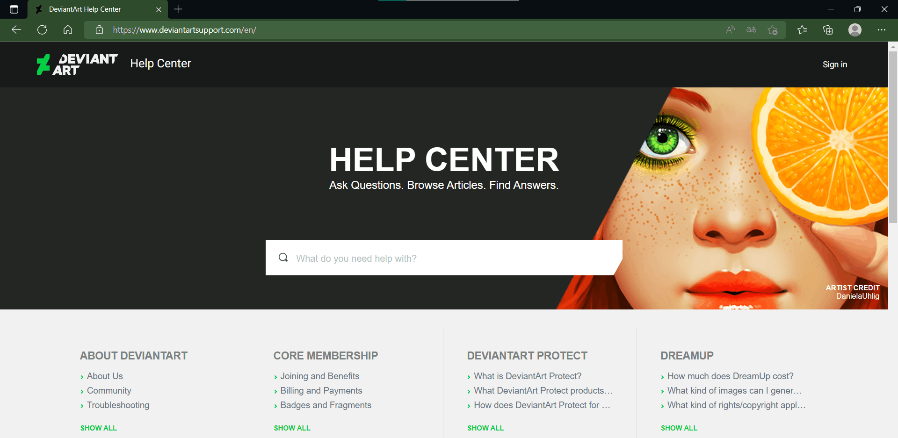
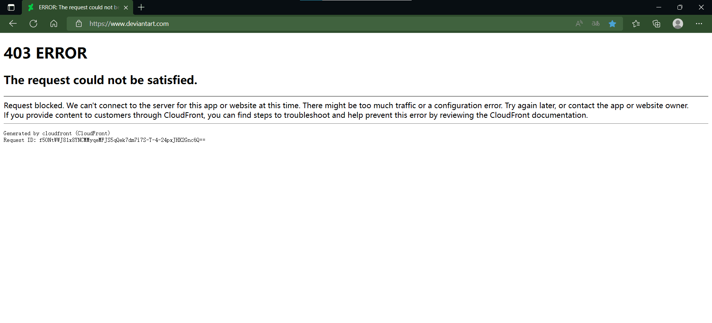

# deviantart是怎么了，一直403

作者：自然醒

TID：34588

<title>1</title> <link href="../Styles/Style.css" type="text/css" rel="stylesheet">

# 1

vpn试了所有节点都是403，从几个月前就一直这样，改host也试了没有用，之前手机电脑上网站都是403，昨天下了个app发现可以用，通过app把网站打开后网站也没问题可以用了，可电脑上还是403，看其他网站都没问题，有hxd知道怎么解决吗devaintartsupport可以上，点左上角的deviantart和右上角的log in进去都是403

<title>2</title> <link href="../Styles/Style.css" type="text/css" rel="stylesheet">

# 2

 <ignore_js_op>[QQ图片20221219113303.png](forum.php?mod=attachment&aid=MTAxMDkwfDVmNjYzZjY0fDE2NzQwNjUxNzd8MTgyMzB8MzQ1ODg%3D&nothumb=yes) *(133.17 KB, 下載次數: 0)*

[下載附件](forum.php?mod=attachment&aid=MTAxMDkwfDVmNjYzZjY0fDE2NzQwNjUxNzd8MTgyMzB8MzQ1ODg%3D&nothumb=yes)

2022-12-19 11:36 上傳  

</ignore_js_op> <ignore_js_op>[QQ图片20221219113254.png](forum.php?mod=attachment&aid=MTAxMDg5fGM2ZmE3MzFmfDE2NzQwNjUxNzd8MTgyMzB8MzQ1ODg%3D&nothumb=yes) *(19.43 KB, 下載次數: 0)*

[下載附件](forum.php?mod=attachment&aid=MTAxMDg5fGM2ZmE3MzFmfDE2NzQwNjUxNzd8MTgyMzB8MzQ1ODg%3D&nothumb=yes)

2022-12-19 11:36 上傳  

</ignore_js_op> <title>3</title> <link href="../Styles/Style.css" type="text/css" rel="stylesheet">

# 3

是你的问题，估计你用的是免费梯子 <title>4</title> <link href="../Styles/Style.css" type="text/css" rel="stylesheet">

# 4

> [my94my 發表於 2022-12-19 11:58](https://giantessnight.cf/gnforum2012/forum.php?mod=redirect&goto=findpost&pid=522285&ptid=34588)
> 是你的问题，估计你用的是免费梯子

不是免费，我用的蚂蚁，请问你用的是什么梯子
<title>5</title> <link href="../Styles/Style.css" type="text/css" rel="stylesheet">

# 5

网站一切正常，换个机场解决问题 <title>6</title> <link href="../Styles/Style.css" type="text/css" rel="stylesheet">

# 6

> [Dawnrise 發表於 2022-12-19 15:38](https://giantessnight.cf/gnforum2012/forum.php?mod=redirect&goto=findpost&pid=522298&ptid=34588)
> 网站一切正常，换个机场解决问题

好的好的，，请问你是用的什么vpn <title>7</title> <link href="../Styles/Style.css" type="text/css" rel="stylesheet">

# 7

> [Dawnrise 發表於 2022-12-19 15:38](https://giantessnight.cf/gnforum2012/forum.php?mod=redirect&goto=findpost&pid=522298&ptid=34588)
> 网站一切正常，换个机场解决问题

没事解决了，没想到还真是梯子的问题
<title>8</title> <link href="../Styles/Style.css" type="text/css" rel="stylesheet">

# 8

我可以上啊。原来就是梯子的问题吗lol，下次至少也有个经验了哈哈