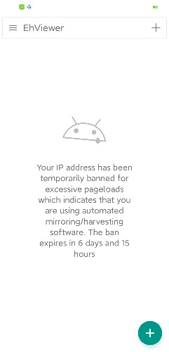

# ehviewer老被ban怎么回事

作者：speepian

TID：32747

<title>1</title> <link href="../Styles/Style.css" type="text/css" rel="stylesheet">

# 1

已经是最新版本了，老被说是harvest软件而被ban，有的救吗 <title>2</title> <link href="../Styles/Style.css" type="text/css" rel="stylesheet">

# 2

 <ignore_js_op>[Screenshot_2022-02-27-08-39-42-742_io.github.nekoinverter.ehviewer.jpg](forum.php?mod=attachment&aid=OTQwODV8MmVkOGM5MjB8MTY3NDA2NTYwNHwxODIzMHwzMjc0Nw%3D%3D&nothumb=yes) *(16.79 KB, 下載次數: 1)*

[下載附件](forum.php?mod=attachment&aid=OTQwODV8MmVkOGM5MjB8MTY3NDA2NTYwNHwxODIzMHwzMjc0Nw%3D%3D&nothumb=yes)

2022-2-27 08:44 上傳  

</ignore_js_op> <title>3</title> <link href="../Styles/Style.css" type="text/css" rel="stylesheet">

# 3

换梯子节点, 这个节点的 IP 被 eh 拉黑了 <title>4</title> <link href="../Styles/Style.css" type="text/css" rel="stylesheet">

# 4

> StarWish星愿 發表於 2022-2-27 16:28
> 换梯子节点, 这个节点的 IP 被 eh 拉黑了

换了其他节点也全被ban……ehviewer是最新版本了 <title>5</title> <link href="../Styles/Style.css" type="text/css" rel="stylesheet">

# 5

系统后台退出ehviewer，再重新连VPN节点，再重新打开应用。多试几次就可以了 <title>6</title> <link href="../Styles/Style.css" type="text/css" rel="stylesheet">

# 6

有没有推荐的可以上里站的vpn，我几个节点都进不去里站 <title>7</title> <link href="../Styles/Style.css" type="text/css" rel="stylesheet">

# 7

如果你最近有缓存的话，检查一下你的设置原图下载一定要关上。如果这个关上了检查高级（Advance）里面的选项用不到就全关上 <title>8</title> <link href="../Styles/Style.css" type="text/css" rel="stylesheet">

# 8

也遇到过这个问题，换了个手机重新下的新版客户端后下一张图后台给你计几张十几张的量，下个一百两百就会被ban离谱的很。后来不知道关了啥就好了，实在找不到问题建议换个客户端版本