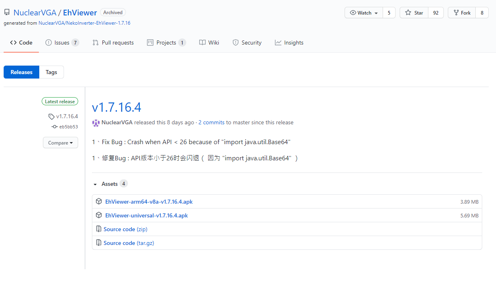

# exhentai被DNS污染了，想直连需要改下host

作者：zrb0000000

TID：29925

<title>1</title> <link href="../Styles/Style.css" type="text/css" rel="stylesheet">

# 1

先贴解决办法
178.175.129.254 exhentai.org
178.175.132.22 exhentai.org
178.175.132.20 exhentai.org
178.175.128.252 exhentai.org
178.175.128.254 exhentai.org
178.175.129.252 exhentai.org
然后EhViewer看不了缩略图，把设置里内置hosts.txt关了就好了

看大家都没提我还以为是单纯我这出问题了呢
可能是因为能上GN的都已经有梯子了吧 <title>2</title> <link href="../Styles/Style.css" type="text/css" rel="stylesheet">

# 2

EhViewer好像不只是host的问题了，现在是不爬梯子就一直显示超时，什么都没有。 <title>3</title> <link href="../Styles/Style.css" type="text/css" rel="stylesheet">

# 3

亲测EhViewer改host以后可以用。前两天确实没梯子就网络错误，挂梯子就没下载配额 <title>4</title> <link href="../Styles/Style.css" type="text/css" rel="stylesheet">

# 4

帮了我大忙了，非常感谢，这下E站和GN都改host上了
啊。。突然想到的，如果是P站，能不能改host也上去呢？ <title>5</title> <link href="../Styles/Style.css" type="text/css" rel="stylesheet">

# 5

非常感谢！一直以为是自己的问题 <title>6</title> <link href="../Styles/Style.css" type="text/css" rel="stylesheet">

# 6

弱弱的问一下，app怎么改
<title>7</title> <link href="../Styles/Style.css" type="text/css" rel="stylesheet">

# 7

又不行了啊，这就又不行了，上不去了 <title>8</title> <link href="../Styles/Style.css" type="text/css" rel="stylesheet">

# 8

*本帖最後由 phone2345 於 2020-12-13 15:28 編輯*

网上找到的e站阅读器：
[https://github.com/NuclearVGA/EhViewer](https://github.com/NuclearVGA/EhViewer)
目前是v1.7.16.4版
[https://github.com/NuclearVGA/EhViewer/releases/tag/v1.7.16.4](https://github.com/NuclearVGA/EhViewer/releases/tag/v1.7.16.4)
[https://github.com/NuclearVGA/EhViewer/releases/download/v1.7.16.4/EhViewer-universal-v1.7.16.4.apk](https://github.com/NuclearVGA/EhViewer/releases/download/v1.7.16.4/EhViewer-universal-v1.7.16.4.apk)

GW分流
[https://giantesswaltz.org/download/EhViewer-universal-v1.7.16.4.apk](https://giantesswaltz.org/download/EhViewer-universal-v1.7.16.4.apk)
有空也请帮忙测试墙内能不能用吧 <title>9</title> <link href="../Styles/Style.css" type="text/css" rel="stylesheet">

# 9

 <ignore_js_op>[Github頁面截圖.png](forum.php?mod=attachment&aid=ODYzNjJ8MDkzODg0ODB8MTY3NDA2NjE4OHwxODIzMHwyOTkyNQ%3D%3D&nothumb=yes) *(59.41 KB, 下載次數: 0)*

[下載附件](forum.php?mod=attachment&aid=ODYzNjJ8MDkzODg0ODB8MTY3NDA2NjE4OHwxODIzMHwyOTkyNQ%3D%3D&nothumb=yes)

2020-12-13 15:27 上傳  

</ignore_js_op> <title>10</title> <link href="../Styles/Style.css" type="text/css" rel="stylesheet">

# 10

> [phone2345 發表於 2020-12-13 15:25](https://giantessnight.cf/gnforum2012/forum.php?mod=redirect&goto=findpost&pid=453935&ptid=29925)
> 网上找到的e站阅读器：
> https://github.com/NuclearVGA/EhViewer
> 目前是v1.7.16.4版

请问ios上有没有解决方案呀？
<title>11</title> <link href="../Styles/Style.css" type="text/css" rel="stylesheet">

# 11

大佬，APP上怎么该才能看啊。。。。。。。。。。。。。 <title>12</title> <link href="../Styles/Style.css" type="text/css" rel="stylesheet">

# 12

现在貌似挂梯子都上不去了。。。什么情况 <title>13</title> <link href="../Styles/Style.css" type="text/css" rel="stylesheet">

# 13

> [zrb0000000 發表於 2021-1-20 07:21](https://giantessnight.cf/gnforum2012/forum.php?mod=redirect&goto=findpost&pid=457345&ptid=29925)
> 现在貌似挂梯子都上不去了。。。什么情况

挂梯子可以的，检查一下梯子，或者你是不是挂了日区，我记得日区好像屏蔽了ex