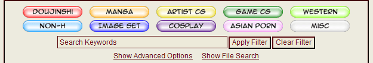
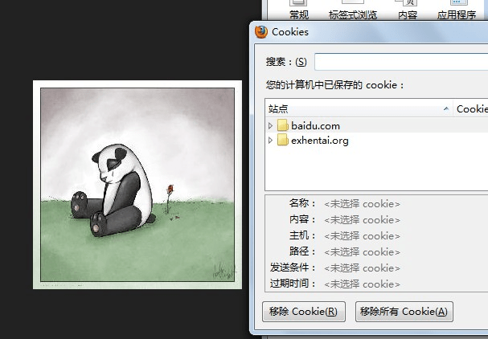
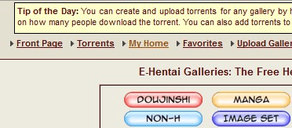
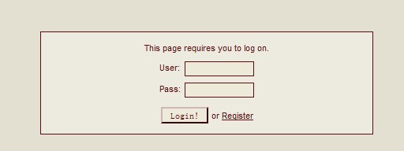
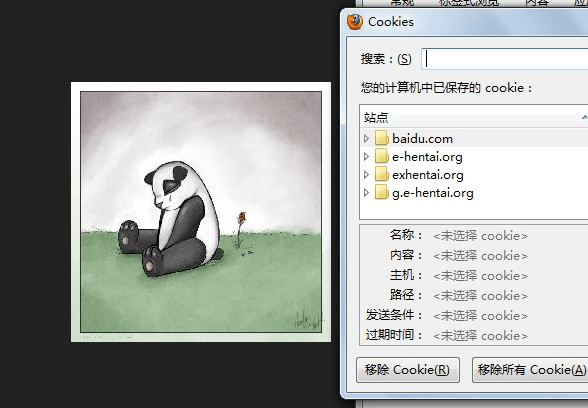
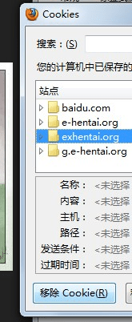
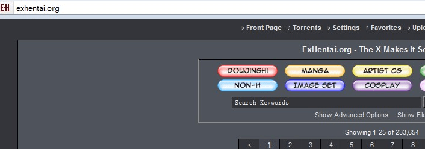

# exhentai進入方法

作者：xnr

TID：13402

<title>1</title> <link href="../Styles/Style.css" type="text/css" rel="stylesheet">

# 1

*本文章最後由 3213213210 於 2012-9-30 01:52 編輯*

首先我們要了解
g.e-hentai.org
此網站有非常多漫畫資源
(當然不盡跟我們想看得有關)
在搜尋打giantess
真的各種口味都有
<ignore_js_op>

**2.png** *(29.53 KB, 下載次數: 2)*

[下載附件](forum.php?mod=attachment&aid=MzEyNDR8OTc4MDA3ZGV8MTY3NDA2ODU1MXwxODIzMHwxMzQwMg%3D%3D&nothumb=yes)

2012-9-30 00:49 上傳

doujinshi：同人誌
mansa：...就...求解答
artist cg
game cg：遊戲CG之類的
western：西方的...
non-h：非H
image set：圖集...?
cosplay：不解釋
asian porn：A片...
misc：雜項
我也還沒摸清
進入正題!
上面的網站已經很...厲害
但還有更隱密 資源更猛的網站----------
別急 首先在 e-hentai.org 設立帳號
並登入
然後!
輸入網址 exhentai.org
有個驚喜...
但若你沒登入就進去
會出現一隻熊貓
出現熊貓時
請消除exhentai.org的cookie(不解釋)
再試一次
有什麼感想請留言...
註：重點在搜尋giantess
裡面...真的一堆驚喜
PS:最好把western點掉
最好留doujinshi mansa image set
之類的
原因...
看遍就知道了 <title>2</title> <link href="../Styles/Style.css" type="text/css" rel="stylesheet">

# 2

為何發文不清不楚?
因為...培養大家的
成就感 <title>3</title> <link href="../Styles/Style.css" type="text/css" rel="stylesheet">

# 3

大大不說我也不知那網站裏還有這麼多我未看過 <title>4</title> <link href="../Styles/Style.css" type="text/css" rel="stylesheet">

# 4

那不是mansa
是manga...漫画 <title>5</title> <link href="../Styles/Style.css" type="text/css" rel="stylesheet">

# 5

我想请问下，注册账号的按钮在哪…… <title>6</title> <link href="../Styles/Style.css" type="text/css" rel="stylesheet">

# 6

先按My Home，然後網站會要求你登入(login)
在login旁會有一個register的按紐，這就可以註冊了
<title>7</title> <link href="../Styles/Style.css" type="text/css" rel="stylesheet">

# 7

登陆成功了，谢谢楼主分享方法 <title>8</title> <link href="../Styles/Style.css" type="text/css" rel="stylesheet">

# 8

請消除exhentai.org的cookie(不解釋)

关于这一点还是不知道如何操作，工具栏里面的删除COOKIE还是没用，谢谢。 <title>9</title> <link href="../Styles/Style.css" type="text/css" rel="stylesheet">

# 9

消除Cookie的這個我試過了，無效中
我懷疑跟IP有關係…… <title>10</title> <link href="../Styles/Style.css" type="text/css" rel="stylesheet">

# 10

概括得简单点.
1:删除所有cookie.
2:上[http://g.e-hentai.org/](http://g.e-hentai.org/)注册并登陆账号.
3:上[http://exhentai.org/.](http://exhentai.org/.)
注:在g.e-hentai注册完并登陆前,不要进exhentai,如果以前进过请单独删除exhentai的cookie

exhentai不出现熊猫的判断就是"你的ie里有登陆了g.e-hentai账号的cookie,并且这个判断是一次性的,哪怕里后来在g.e-hentai注册并且登陆了,只要你没删除exhentai的cookie那永远是熊猫" <title>11</title> <link href="../Styles/Style.css" type="text/css" rel="stylesheet">

# 11

*本文章最後由 sunnygoon 於 2012-9-30 18:51 編輯*

发个图片教程吧
1可以看到这是大多数人的情况"熊猫",可以看cookie只有exhentai的.这里先不管吧
<ignore_js_op>

**2.jpg** *(52.88 KB, 下載次數: 0)*

[下載附件](forum.php?mod=attachment&aid=MzEyNDZ8OTRlNmVjNTR8MTY3NDA2ODU1M3wxODIzMHwxMzQwMg%3D%3D&nothumb=yes)

2012-9-30 17:22 上傳

2:去[http://g.e-hentai.org/](http://g.e-hentai.org/)上注册并且登陆."点myhome-->register注册"
<ignore_js_op>

**3.jpg** *(24.46 KB, 下載次數: 7)*

[下載附件](forum.php?mod=attachment&aid=MzEyNDd8NjQzYzBlZDJ8MTY3NDA2ODU1M3wxODIzMHwxMzQwMg%3D%3D&nothumb=yes)

2012-9-30 17:22 上傳

<ignore_js_op>

**4.jpg** *(10.39 KB, 下載次數: 0)*

[下載附件](forum.php?mod=attachment&aid=MzEyNDh8NTY0ZGIzZjZ8MTY3NDA2ODU1M3wxODIzMHwxMzQwMg%3D%3D&nothumb=yes)

2012-9-30 17:22 上傳

3再次进入exhentai,可以看到依然是熊猫,这就是许多人卡住的地方了.
<ignore_js_op>

**5.jpg** *(51.21 KB, 下載次數: 0)*

[下載附件](forum.php?mod=attachment&aid=MzEyNDl8NGE5YTBmMjJ8MTY3NDA2ODU1M3wxODIzMHwxMzQwMg%3D%3D&nothumb=yes)

2012-9-30 17:22 上傳

4单独删除exhentai的cookie
<ignore_js_op>

**6.jpg** *(26.74 KB, 下載次數: 0)*

[下載附件](forum.php?mod=attachment&aid=MzEyNTB8Y2FiMjUxYTN8MTY3NDA2ODU1M3wxODIzMHwxMzQwMg%3D%3D&nothumb=yes)

2012-9-30 17:22 上傳

5再次进入exhentai就ok了.
<ignore_js_op>

**7.jpg** *(31.71 KB, 下載次數: 0)*

[下載附件](forum.php?mod=attachment&aid=MzEyNTF8NjljM2IyZDR8MTY3NDA2ODU1M3wxODIzMHwxMzQwMg%3D%3D&nothumb=yes)

2012-9-30 17:22 上傳

<title>12</title> <link href="../Styles/Style.css" type="text/css" rel="stylesheet">

# 12

我连注册都注册不了，啥原因？ <title>13</title> <link href="../Styles/Style.css" type="text/css" rel="stylesheet">

# 13

非常感谢分享！强大的资源～～ <title>14</title> <link href="../Styles/Style.css" type="text/css" rel="stylesheet">

# 14

我把exhentai.org的網址放再最後講就是怕
大家在註冊前就點...
用心白費 <title>15</title> <link href="../Styles/Style.css" type="text/css" rel="stylesheet">

# 15

[http://exhentai.org/g/23787/a7a88ce74a/](http://exhentai.org/g/23787/a7a88ce74a/)
[http://exhentai.org/g/219475/6fcffeb65f/](http://exhentai.org/g/219475/6fcffeb65f/)
[http://exhentai.org/g/390769/d7bab1e60f/](http://exhentai.org/g/390769/d7bab1e60f/)
[http://exhentai.org/g/492860/a443ea424d/](http://exhentai.org/g/492860/a443ea424d/)
[http://exhentai.org/g/501330/7c17ea53f2/](http://exhentai.org/g/501330/7c17ea53f2/)
[http://exhentai.org/g/507170/77580b8738/](http://exhentai.org/g/507170/77580b8738/)
[http://exhentai.org/g/524522/b994304496/](http://exhentai.org/g/524522/b994304496/)
[http://exhentai.org/g/526020/75b242ad71/](http://exhentai.org/g/526020/75b242ad71/)
低調是什麼?能上嗎? <title>16</title> <link href="../Styles/Style.css" type="text/css" rel="stylesheet">

# 16

註：g.e-hentai.org東西容易被移除
exhentai.org則否
但看到資源先載再說
很多irafyou的被和諧了
註2：hentai不是雞和領帶
是日文「變態」的拼音... <title>17</title> <link href="../Styles/Style.css" type="text/css" rel="stylesheet">

# 17

长姿势了，不过外文不过关依旧无力 <title>18</title> <link href="../Styles/Style.css" type="text/css" rel="stylesheet">

# 18

我想请问下，注册账号的按钮在哪…… <title>19</title> <link href="../Styles/Style.css" type="text/css" rel="stylesheet">

# 19

> 3213213210 發表於 2012-10-1 22:05 
> 註：g.e-hentai.org東西容易被移除
> exhentai.org則否
> 但看到資源先載再說

難怪我看不出區別，原來被移除
<title>20</title> <link href="../Styles/Style.css" type="text/css" rel="stylesheet">

# 20

里面的内容不是和[http://g.e-hentai.org/](http://g.e-hentai.org/)一样么？ <title>21</title> <link href="../Styles/Style.css" type="text/css" rel="stylesheet">

# 21

注册g.e-hentai.org之后就能上了，谢谢帮助。 <title>22</title> <link href="../Styles/Style.css" type="text/css" rel="stylesheet">

# 22

g.e-hentai本子其實比較少
因為ex站很難進入所以本子多（沒被告）
差距要仔細點才看得出來 <title>23</title> <link href="../Styles/Style.css" type="text/css" rel="stylesheet">

# 23

用IE怎么打开cookies？ <title>24</title> <link href="../Styles/Style.css" type="text/css" rel="stylesheet">

# 24

其实我还不知道这是什么东西 <title>25</title> <link href="../Styles/Style.css" type="text/css" rel="stylesheet">

# 25

那不是mansa的把
<title>26</title> <link href="../Styles/Style.css" type="text/css" rel="stylesheet">

# 26

多谢，成功登陆进去了，好多资源 <title>27</title> <link href="../Styles/Style.css" type="text/css" rel="stylesheet">

# 27

为什么我连注册的那个网址都打不开？？ 大陆党如此悲剧？？？？ <title>28</title> <link href="../Styles/Style.css" type="text/css" rel="stylesheet">

# 28

頂一個 裏站資源比較多 不過相對直接下載的花費是2倍(ˊ・ω・ˋ) <title>29</title> <link href="../Styles/Style.css" type="text/css" rel="stylesheet">

# 29

终于有对抗熊猫的办法了，非常感谢楼长大大 <title>30</title> <link href="../Styles/Style.css" type="text/css" rel="stylesheet">

# 30

真心不错....感谢分享~~</ignore_js_op></ignore_js_op></ignore_js_op></ignore_js_op></ignore_js_op></ignore_js_op></ignore_js_op>