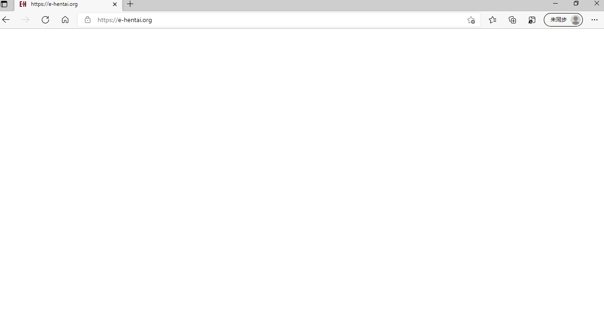

# e站为什么上不去了呢？

作者：960721

TID：31899

<title>1</title> <link href="../Styles/Style.css" type="text/css" rel="stylesheet">

# 1

*本帖最後由 960721 於 2021-10-18 18:43 編輯*

最近上不去e站了，一打开就是空白界面，一直都是挂着梯子上的，以前也没遇到过这种情况，现在为啥上不了了呢?
<ignore_js_op>

**屏幕截图 2021-10-18 184140.png** *(13.98 KB, 下載次數: 0)*

[下載附件](forum.php?mod=attachment&aid=OTE3OTh8ODc4NzllNmJ8MTY3NDA2NTgxNnwxODIzMHwzMTg5OQ%3D%3D&nothumb=yes)

2021-10-18 18:42 上傳

<title>2</title> <link href="../Styles/Style.css" type="text/css" rel="stylesheet">

# 2

是你那边的问题，反正我是上得去的，你换其他国家节点上去看看，多切切 <title>3</title> <link href="../Styles/Style.css" type="text/css" rel="stylesheet">

# 3

换个节点试试                                                       1 <title>4</title> <link href="../Styles/Style.css" type="text/css" rel="stylesheet">

# 4

e站出现空白页面的话，八成是Cookie的问题，进浏览器设置里把Cookie清理一下就好了。 <title>5</title> <link href="../Styles/Style.css" type="text/css" rel="stylesheet">

# 5

我的没问题，换个节点或者梯子试试</ignore_js_op>