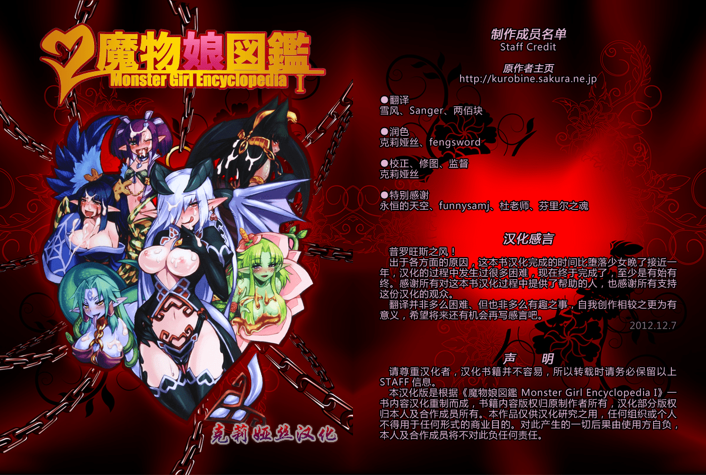

# e站最全的關鍵詞 轉載自e紳士吧

作者：gaojiabao

TID：15851

<title>1</title> <link href="../Styles/Style.css" type="text/css" rel="stylesheet">

# 1

1.語言和色彩類
chinese=中文本
translated=翻譯本
Italian=義大利文
english=英文
portuguese=葡萄牙文
french=法文
full color=全彩本

2.外觀類
big breasts=大胸部(不壹定要非常大，因爲還有個huge breasts)
huge breasts=超級大胸部
pantyhose=連褲襪
stockings=長筒襪
bloomers=燈籠褲
glasses=有戴眼鏡的
exhibitionism=暴露狂
breast expansion=**膨脹
swimsuit=泳裝
leotard=緊身衣
lingerie=女用貼身內衣褲
mind break=失神或精神受創(嘿休到失去意識或兩眼無神，呆若木雞，宛如死魚者)
ahegao=アヘ顔=因高潮而崩壞的臉

3.年齡、職業或身分類
sister=姐姐或妹妹
daughter=女兒
lolicon=蘿莉
shotacon=正太
mature=成熟的(通常指年紀較大的女性)
schoolgirl=女學生(非特殊職業和類別的女性大部分都歸類於此)
maid=女仆
nurse=護士
teacher=教師
bride=新娘
princess=公主
nun=修女
vampire=吸血鬼
monster girl=怪物女孩
dog=狗
interracial=不同人種間的
futanari=雙性人(天生的)
shemale=人妖(後天的)
gender bender=跟異性的舉動、打扮壹樣的人(僞娘或僞男)
crossdressing=穿異性服裝(女裝或男裝)

4.動作類
defloration=摘花=上了處女
bondage=綁縛
group=群P=複數以上的生命體(人、狗、馬、羊等)同時進行性行爲
附注：壹般的純愛漫幾乎都不會有此tag
discipline=調教
x-ray=內色
ray=射晶
paizuri=乳蕉
blowjob=口蕉
footjob=足蕉
anal=肛蕉
enema=灌腸
rape=強間
Scat=吃或喝排泄物
pregnant=懷孕的
birth=分娩
double penetration=雙削差入
lactation=乳汁
sex toys=性玩具
urination=排尿
armpit sex=腋下性愛
5.類型類
netorare=NTR=寢取
guro=獵奇
yuri=女同(GL)
yaoi=男同(BL)
femdom=女性支配
original=原創
mind control=精神控制
body swap=身體交換
tentacles=觸手
bestiality=獸性
cheating=不忠貞=偷腥、出軌或外遇(和NTR的分類不同)
monster=怪物
XXX Girl=依XXX而定
XXX monster=依XXX而定
bestiality(獸性)
vore 丸吞（丸不丸不太確定，不過角色壹般會吃掉）
inflation 膨脹（丸吞後肚子脹大屬于此類）
unbirth 從B裏鑽進去
skinsuit 皮類（壹個男的穿女人的皮成了女人）
absorb/possession 融合、占據（皮類常用標簽）
birth 出産，出現頻率較pregnant少
eggs 生蛋
guro 讓人反胃的（壹般是暴力血腥，秀色向常用）
furry 毛皮（主角身上長毛帶皮，或是動物X動物）
worm 蟲子（monster Tag下分離）
amputee 殘肢（四肢切斷的人棍）
BBW/giantess 巨大的女性（常與unbirth聯用）
博麗 靈夢 =hakurei_reimu
霧雨 魔理沙 =kirisame_marisa
露米娅 =rumia
琪露諾 =cirno
大妖精 =daiyousei
紅 美鈴 =hong_meiling
帕秋莉·諾蕾姬 =patchouli_knowledge
小惡魔 =koakuma
十六夜 咲夜 =izayoi_sakuya
蕾米莉亞·斯卡雷特 =remilia_scarlet
芙蘭朵露·斯卡雷特 =flandre_scarlet
蕾迪·霍瓦特羅克 =letty_whiterock
橙 =chen
愛麗絲·瑪格特羅依德 =alice_margatroid
上海 =shanghai
蓬萊 =hourai
莉莉白 =lily_white
露娜薩·普莉茲姆利巴 =lunasa_prismriver
莉莉卡·普莉茲姆利巴 =lyrica_prismriver
梅露蘭·普莉茲姆利巴 =merlin_prismriver
魂魄 妖夢 =konpaku_youmu
妖夢的幽靈 =myon
魂魄 妖忌 =konpaku_youki
西行寺 幽幽子 =ex_keine
八雲 藍 =yakumo_ran
八雲 紫 =yakumo_yukari
莉格露·奈特巴格 =wriggle_nightbug
米斯蒂娅·蘿蕾拉 =mystia_lorelei
上白澤 慧音 =kamishirasawa_keine
EX上白澤 慧音 =ex_keine
因幡 帝 =inaba_tewi
鈴仙·優昙華院·因幡 =reisen_udongein_inaba
八意 永琳 =yagokoro_eirin
蓬萊山 輝夜 =houraisan_kaguya
藤原 妹紅 =fujiwara_no_mokou
伊吹 萃香 =ibuki_suika

莉莉黑 =lily_black
梅蒂欣·梅蘭克莉 =medicine_melancholy
風見 幽香 =kazami_yuuka
小野冢 小釘 =onozuka_komachi
四季映姬·亞瑪撒那度 =shikieiki_yamaxanadu
秋 靜葉 =aki_shizuha
秋 穣子 =aki_minoriko
鍵 山雛 =kagiyama_hina
河城 荷取 =key
犬走 椛 =inubashiri_momiji
射命丸 文 =shameimaru_aya
東風谷 早苗 =kochiya_sanae
八坂 神奈子 =yasaka_kanako
泄矢 诹訪子 =moriya_suwako
比那名居 天子 =hinanawi_tenshi
永江 衣玖 =nagae_iku
琪絲美 =kisume
黑谷 山女 =kurodani_yamame
水橋 帕露希 =mizuhashi_parsee
星熊 勇儀 =hoshiguma_yuugi
古明地 覺 =komeiji_satori
火焰貓 燐 =kaenbyou_rin
火焰貓 燐（貓狀態） =kaenbyou_rin_(cat)
靈烏路 空 =reiuji_utsuho
古明地 戀 =komeiji_satori
娜茲琳 =nazrin
多多良 小傘 =tatara_kogasa
雲居 壹輪 =kumoi_ichirin
雲山 =unzan
村紗 水蜜 =murasa_minamitsu
寅丸 星 =toramaru_shou
聖 白蓮 =hijiri_byakuren
封獸 鵺 =houjuu_nue
森近霖之助 =morichika_rinnosuke
朱鹭子 =tokiko_(touhou)
稗田阿求 =hieda_no_akyuu
露娜 切雲德 =luna_child
斯塔 塞菲爾 =star_sapphire
桑妮 米爾克 =sunny_milk
魅魔 =mima
神绮 =shinki
4koma(四格）
ponytail（馬尾）
side_ponytail（雙馬尾）
glasses（眼鏡）
cat_ears（貓耳）
breast_grab（**劫掠）
yukkuri_shiteitte_ne（油庫裏）
caramelldansen（某著名伸手扭腰動作）
white_panties(白色的…）
striped（條文的…）
muscle（肌肉發達的）
2girls（兩人百合）
3girls……（依次類推）
skirt_lift（掀裙）
fangs（具有僚牙的…）
gun（搶）
bikini（比基尼）
what（我也不知道是什麽）
abyss_of_parliament（別告訴我妳不認識深淵大人）
ideolo（國內某僞黃昏畫師）
auer（某僞黃昏畫師）
kasuga_sunao（彩色娃娃畫風畫師）
katahira_masashi（超級有愛長方形可愛畫風畫師）
geister（國內某寫實畫師）
hounori(某特殊畫風畫師）
lili_(artist)（壹個捆綁狂）
ham_(artist)（畫loli的）
nekoguruma（某Q圖+剛大木畫師）
taka_tony（壹位神）
kfc（畫風很舒服的畫師）
buriki（某高畫質畫師）
capura.l（大圖畫師）
orenji_zerii（東方角鬥祭作者）
colonel_aki（歡樂的紅魔館作者）
saigyouji_yuyuko （西行寺幽幽子）
p.s.求獎勵點
<title>2</title> <link href="../Styles/Style.css" type="text/css" rel="stylesheet">

# 2

现在还不知道E绅士是什么的路过。。 <title>3</title> <link href="../Styles/Style.css" type="text/css" rel="stylesheet">

# 3

表示用giantess和chinese打天下 <title>4</title> <link href="../Styles/Style.css" type="text/css" rel="stylesheet">

# 4

1.红村かる 2.Futabu 3.Gura Nyuuto 4.仆だけの爆乳オナメイド5.hroz6.Arsenal7\. volei 8.红楼梦9.bareisho10.e-musu aki11.[新堂エル]12.上乃龙也13.type.90 14.歌麿15.此花16.草凪蜻蛉17.东方Project18.Island19.急行兎20.[天鹅之恋]21.はるゆき 22.Takaharu23.竜汤 24.笑花伪25.井云くす26.CL-orz27.Marui Maru28.warashibe29.红茶屋30.Kinbou Sokai31.[Marukidou]まるキ堂32.Kerorin33.中寺明良34.Deep Valley35.Kazuhiro36.放课后プレイ37.fuuga（枫牙）38.setouchi seiyaku（濑户内）39.Nakadera Akira（中寺明良）40.Doumou 41.Kobayashi Youkoh（小林由高）42.Kuro no Miki[黒ノ树] 43.皆素人(Minamoto Jin)44.三色坊 45.Artist-fumio 46.Behind Moon 47.Z-Ton(Zトン)48.葵渚49.太平天极[Taihei Tengoku]50.でん吉51.天月るり52.Atelier Bord 53.Cle Masahiro54.Shiashiya55.Ahobaka56.ジャム王子57.rukasu58.雾恵マサノブ 59.雑破业（）60.ぽ～じゅ（Po-Ju） 61.senpenbankashiki62.ZION63.行脚堂64.Artist - DrGraevling65.艶々 66.piyokorota（ぴよころた） 67.黒岩玛瑙（ACG）68.堀博昭 69.uthstar01 70.Anthology 71.Horitomo 72.光华猟兵 73.ZeN 74.fei(飛燕) 75.HELLHOUND 76.DISTANCE 77.etcycle 78.流一本 79.unbirth（胎内回归） 80.しいなかずき（Shiina Kazuki）81.- Artist - OrionM 82.Tomomimi Shimon 83.柳田史太 84.toro toro resistance 85.DAIGO 86.袁藤冲人（endou okito）87.祭野剃刀 （matsurino naginata） 88.葵渚（Aoi Nagisa）89.softhouse-seal 90.逝印乳业（Yukijirushi Nyuugyou） 91.嘘つき屋（oouso）92.somejima93.cosine94.赤月みゅうと95.carcharias96.紅ゆーじ(kurenai yuuji)97.オカヤド@乾武丸98.谷口さん（taniguchi-san）99.RAYMON100.lunch（らんち）101.Shindou(しんどう)102.Urahyakkiyakou（裏百鬼夜行）103.Honnojihen（ホンノーヂヘン） 104.q-gaku 105.Himekuri（ヒめくり）106.ムサシマル（Musashimaru）107.Thetsuuyaku108.Demon Heart 109.宮原歩[Miyahara Ayumu]110.しなま[Shinama]111.モチ[Mochi]112.RIN (モチ)113.EROQUIS114.fuan no hitori[煌野一人]115.sanagi torajirou[蛹虎次郎]116.高久屋 (高久としひこ)[Takakuya (Takaku Toshihiko)] 117.アクメナリ（akumenari）118.AskRay[Bosshi][ぼっしい]119.Fanatic Fetish120.kiya shii（木谷椎）121.Ishigaki Takashi(イシガキタカシ)type-g 122.或十濑音香（或十せねか）（Alto Seneka）123.Chinbotsu 124.えむあ[Emua]125.Bakuretsu Fusen(Denkichi)[爆裂風船 (でん吉)]126.Arsenothelus (Rebis)（迷宫王女系列）127.ARCHETYPE (Akaza)（あかざ）128.Harurun[はるるん]129.Bukatoma 300g 130.Cauldron
<title>5</title> <link href="../Styles/Style.css" type="text/css" rel="stylesheet">

# 5

monster girl应该翻译为魔物娘才对
<title>6</title> <link href="../Styles/Style.css" type="text/css" rel="stylesheet">

# 6

 <ignore_js_op>[00-01魔物娘图鉴1封皮.jpg](forum.php?mod=attachment&aid=Mzg4ODd8YjVkMjAxOTB8MTY3NDA2OTU1NXwxODIzMHwxNTg1MQ%3D%3D&nothumb=yes) *(968.32 KB, 下載次數: 1)*

[下載附件](forum.php?mod=attachment&aid=Mzg4ODd8YjVkMjAxOTB8MTY3NDA2OTU1NXwxODIzMHwxNTg1MQ%3D%3D&nothumb=yes)

2013-12-29 16:24 上傳  

</ignore_js_op> <title>7</title> <link href="../Styles/Style.css" type="text/css" rel="stylesheet">

# 7

魅魔 demon girl <title>8</title> <link href="../Styles/Style.css" type="text/css" rel="stylesheet">

# 8

我在SS论坛也看到了 跟咱GTS根本没关系
我一般只需要giantess femdom
还有就是游戏名预览下CG <title>9</title> <link href="../Styles/Style.css" type="text/css" rel="stylesheet">

# 9

楼主这个是搜H漫用的吧 <title>10</title> <link href="../Styles/Style.css" type="text/css" rel="stylesheet">

# 10

*本文章最後由 中文之許. 於 2013-12-29 23:04 編輯*

...感覺實在太雜了吧，而且這些東西根本不是gts控會喜歡的吧

縮小系的

shrink
miniguy
male:miniguy

shrink其實分類沒有那麼細，而且shrink偏縮小女，建議想查縮小系的，用miniguy或是giantess就可以了，但miniguy有一定程度會搜尋到巨大男/縮小男，所以用giantess

本來想貼生長系的，但growth的範圍實在是太大了，包夸dick growth(這邊不是巨根化，比較多是女性長出老二的扶他化)跟巨乳化，能夠找到純巨大化的資源是很少的

巨大娘系

giantess
female:tall

若是通吃系的，就可以嘗試female:tall或tall girl，後者的漫畫比較多，而且+上female後，會分類得更加仔細，中到沒有相關的漫畫機率更低了，至於midget就不用嘗試了，midget是偏矮小女的，而且通常男方的話大多都是侏儒群姦漫比較多

至於size difference 就不要去嘗試了，booru(除了sizebooru跟giantess booru等以外的booru)跟ex不同，ex這個分類沒有做得很完善，很容易查到亂七八糟的漫畫，若是不是通吃系的，就不要嘗試了

大致上，搭配上g-zone的g's mall的查詢功能或是nights站主官網的漫畫資訊，大部分的漫畫都可以看到，若是遇到那種月刊/特別刊，可以用g-zone的查詢系統，他會告訴你裡頭的巨大娘內容在那個篇幅，這時配合上月刊官網上的目錄或是漫畫本身的目錄，就可以很容易猜出頁數，不用那麼麻煩

當然，這些只是初心者的心得而已，我也只是個初心者，用這種就可以在我自己的小世界裡爽爽過了，至於高階者的教學，就交給其他更厲害的元老吧

<title>11</title> <link href="../Styles/Style.css" type="text/css" rel="stylesheet">

# 11

沒有性轉換........................ <title>12</title> <link href="../Styles/Style.css" type="text/css" rel="stylesheet">

# 12

很实用诶！经常上EX，但是只能懂部分关键词，有了这个就能搜更多喜欢内容了～顶！ <title>13</title> <link href="../Styles/Style.css" type="text/css" rel="stylesheet">

# 13

以前经常有东西搜不到，有这个帖子真是帮助太大了。