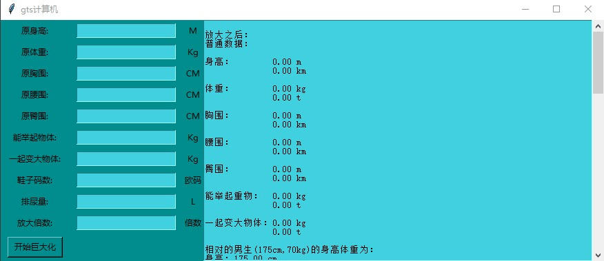

# gts计算器(第三弹)

作者：study

TID：26811

<title>1</title> <link href="../Styles/Style.css" type="text/css" rel="stylesheet">

# 1

*本帖最後由 study 於 2019-5-3 12:41 編輯*

没错，还是我，Study
上一次的gts计算器发布将近一年半后
再一次发布了新一代的gts计算器
相比于上一代，他有了UI界面
这是一个质的飞跃啊！！！ <ignore_js_op>

**批注 2019-05-03 103629.jpg** *(50.14 KB, 下載次數: 3)*

[下載附件](forum.php?mod=attachment&aid=NzgwNjl8NDA0YTVmYTh8MTY3NDA2OTQzOXwxODIzMHwyNjgxMQ%3D%3D&nothumb=yes)

2019-5-3 11:11 上傳

然后新增加了一些数据
那些数据是什么就让你自己探索了
毕竟我也忘了，反正相比于GN的计算器
这个计算器有很多微妙的数据
正经的数据？挺少的

注1：你问我问什么这玩意这么大(7mb)
        我。。。能用就行
注2：以上所有数据，都是假设你整个身子都受到地球重力
        平且一部分数据是在理想情况下的数据
        所以部分数据笑笑就好
        如有错误或者想增加的数值，回复即可
<title>2</title> <link href="../Styles/Style.css" type="text/css" rel="stylesheet">

# 2

 <ignore_js_op>

[计算（图像版2）.exe](forum.php?mod=attachment&aid=NzgwNzF8ZjNmOGFjNWR8MTY3NDA2OTQzOXwxODIzMHwyNjgxMQ%3D%3D)

2019-5-3 12:40 上傳

點擊文件名下載附件

7.89 MB, 下載次數: 630</ignore_js_op> <title>3</title> <link href="../Styles/Style.css" type="text/css" rel="stylesheet">

# 3

你这鞋子长度不对啊...而且十万倍以上相对高度和质量就几乎为零了 <title>4</title> <link href="../Styles/Style.css" type="text/css" rel="stylesheet">

# 4

> [我记不起来了啊 發表於 2019-5-3 11:29](https://giantessnight.cf/gnforum2012/forum.php?mod=redirect&goto=findpost&pid=404255&ptid=26811)
> 你这鞋子长度不对啊...而且十万倍以上相对高度和质量就几乎为零了

看清楚鞋子长度的单位
还有
都十万倍以上了
那人相对高度
就直接被我给约掉了
毕竟这么小
<title>5</title> <link href="../Styles/Style.css" type="text/css" rel="stylesheet">

# 5

> [study 發表於 2019-5-3 11:33](https://giantessnight.cf/gnforum2012/forum.php?mod=redirect&goto=findpost&pid=404256&ptid=26811)
> 看清楚鞋子长度的单位
> 还有
> 都十万倍以上了

没看错，你自己再看看，反正我这边鞋子都比人大了
<title>6</title> <link href="../Styles/Style.css" type="text/css" rel="stylesheet">

# 6

好奇能不能搞个APP出来
<title>7</title> <link href="../Styles/Style.css" type="text/css" rel="stylesheet">

# 7

> [我记不起来了啊 發表於 2019-5-3 11:41](https://giantessnight.cf/gnforum2012/forum.php?mod=redirect&goto=findpost&pid=404257&ptid=26811)
> 没看错，你自己再看看，反正我这边鞋子都比人大了

单位记错了，抱歉了
我已经修改了</ignore_js_op>