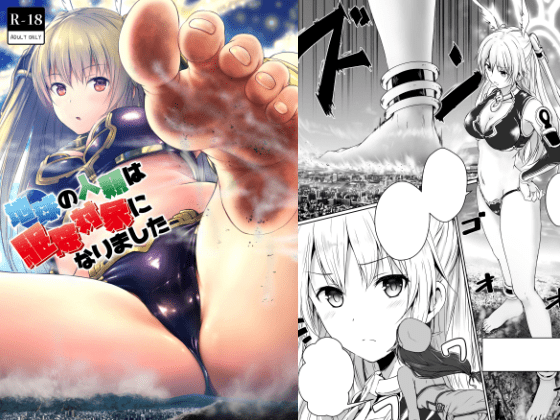
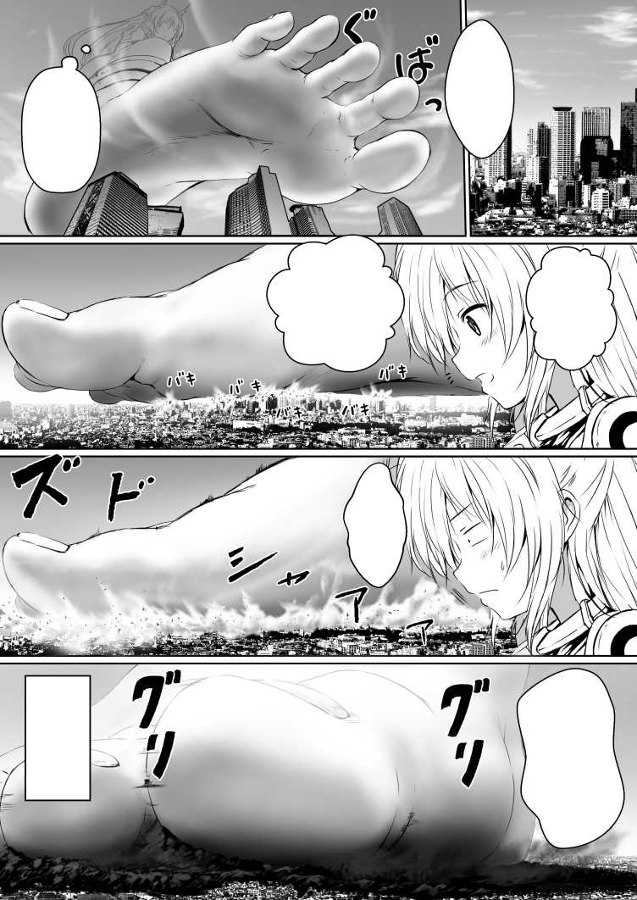
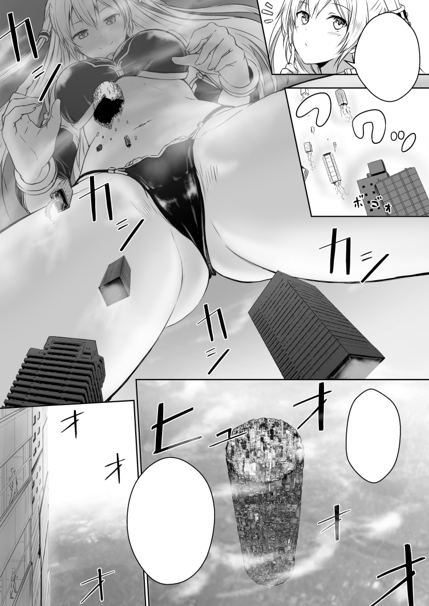
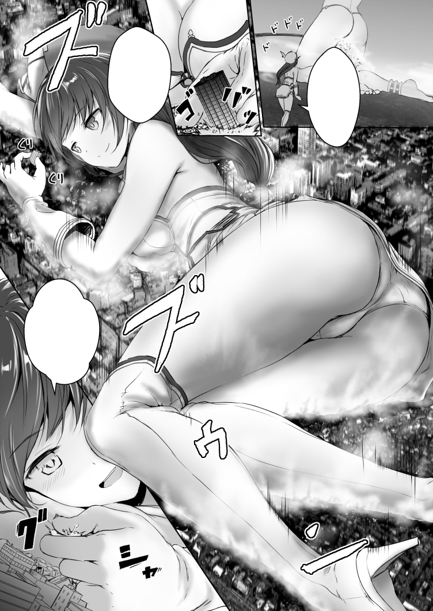
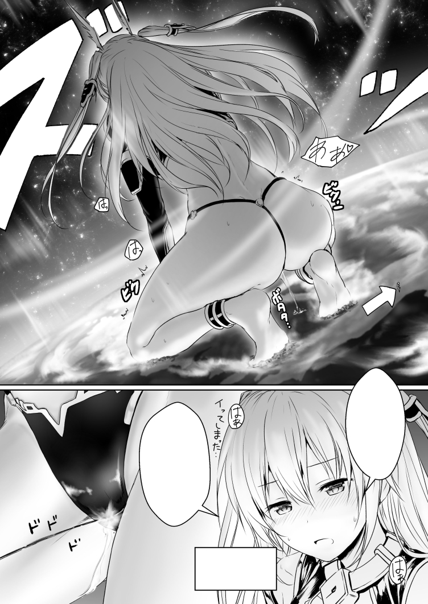

# honey lounge 新作 地球の人類は駆除対象になりました

作者：maoerqla

TID：23560

<title>1</title> <link href="../Styles/Style.css" type="text/css" rel="stylesheet">

# 1

*本帖最後由 灰塵 於 2017-7-28 20:45 編輯*

等了很久終於有新作啦! 趕快朝聖!
這次應該是GIGA級別
支持作者就請於melonbooks購買囉
<title>2</title> <link href="../Styles/Style.css" type="text/css" rel="stylesheet">

# 2

 <ignore_js_op>[IT0000196478p.jpg](forum.php?mod=attachment&aid=Njg5NzR8YWVhNDZiZDJ8MTY3NDA2OTQ1M3wxODIzMHwyMzU2MA%3D%3D&nothumb=yes) *(241.3 KB, 下載次數: 20)*

[下載附件](forum.php?mod=attachment&aid=Njg5NzR8YWVhNDZiZDJ8MTY3NDA2OTQ1M3wxODIzMHwyMzU2MA%3D%3D&nothumb=yes)

2017-7-28 20:40 上傳  

</ignore_js_op> <ignore_js_op>[IT000019647801.jpg](forum.php?mod=attachment&aid=Njg5NzV8MDM1YTU0MjR8MTY3NDA2OTQ1M3wxODIzMHwyMzU2MA%3D%3D&nothumb=yes) *(419.6 KB, 下載次數: 17)*

[下載附件](forum.php?mod=attachment&aid=Njg5NzV8MDM1YTU0MjR8MTY3NDA2OTQ1M3wxODIzMHwyMzU2MA%3D%3D&nothumb=yes)

2017-7-28 20:44 上傳  

</ignore_js_op> <ignore_js_op>[IT000019647802.jpg](forum.php?mod=attachment&aid=Njg5NzZ8YmZkNWVmMzN8MTY3NDA2OTQ1M3wxODIzMHwyMzU2MA%3D%3D&nothumb=yes) *(380.7 KB, 下載次數: 14)*

[下載附件](forum.php?mod=attachment&aid=Njg5NzZ8YmZkNWVmMzN8MTY3NDA2OTQ1M3wxODIzMHwyMzU2MA%3D%3D&nothumb=yes)

2017-7-28 20:44 上傳  

</ignore_js_op> <ignore_js_op>[IT000019647803.jpg](forum.php?mod=attachment&aid=Njg5Nzd8MzEyOTRmMWR8MTY3NDA2OTQ1M3wxODIzMHwyMzU2MA%3D%3D&nothumb=yes) *(437.26 KB, 下載次數: 13)*

[下載附件](forum.php?mod=attachment&aid=Njg5Nzd8MzEyOTRmMWR8MTY3NDA2OTQ1M3wxODIzMHwyMzU2MA%3D%3D&nothumb=yes)

2017-7-28 20:45 上傳  

</ignore_js_op> <ignore_js_op>[IT000019647804.jpg](forum.php?mod=attachment&aid=Njg5Nzh8NzQ2YTYzOGN8MTY3NDA2OTQ1M3wxODIzMHwyMzU2MA%3D%3D&nothumb=yes) *(414.7 KB, 下載次數: 29)*

[下載附件](forum.php?mod=attachment&aid=Njg5Nzh8NzQ2YTYzOGN8MTY3NDA2OTQ1M3wxODIzMHwyMzU2MA%3D%3D&nothumb=yes)

2017-7-28 20:45 上傳  

</ignore_js_op> <title>3</title> <link href="../Styles/Style.css" type="text/css" rel="stylesheet">

# 3

感謝提供資訊
補個連結 [http://www.melonbooks.com/index. ... cts_id=IT0000196478](http://www.melonbooks.com/index.php?main_page=product_info&products_id=IT0000196478)
我好興奮RRRRRRR <title>4</title> <link href="../Styles/Style.css" type="text/css" rel="stylesheet">

# 4

明天发售呢。
即使新年时候的本子崩坏了，依然不能够阻止我为信仰剁手(๑•̀ㅂ•́)و✧
蜂蜜赛高！ <title>5</title> <link href="../Styles/Style.css" type="text/css" rel="stylesheet">

# 5

光看預覽頁就受不了呢

蜂蜜老師筆下女孩子.那種渾然天成的惡戲感搭配GTS簡直完美 <title>6</title> <link href="../Styles/Style.css" type="text/css" rel="stylesheet">

# 6

哇，足控本赛高，超喜欢蜂蜜的画风 <title>7</title> <link href="../Styles/Style.css" type="text/css" rel="stylesheet">

# 7

GIGA说实话感觉太大了啦！！！！
但是还是好想买啊 <title>8</title> <link href="../Styles/Style.css" type="text/css" rel="stylesheet">

# 8

这本必须入手、感谢情报、

时隔好长时间终于又有giga本了！！！ <title>9</title> <link href="../Styles/Style.css" type="text/css" rel="stylesheet">

# 9

看到标题特兴奋，但是一进来，what，giga。
变成普通兴奋了，但是蜂蜜必须顶呀 <title>10</title> <link href="../Styles/Style.css" type="text/css" rel="stylesheet">

# 10

這個大小這種女主真的受不了雖然巨大娘都沒有給小人機會具征服這座巨大的肉山
但是身為一個小人還是會想去征服這座巨大的肉山的
不知道為什麼想到毛細孔交或是指紋交就好興奮
如果我是浩克就好了
越大越興奮
越興奮越強
而且不怕被壓死
可以無限體力興奮

<title>11</title> <link href="../Styles/Style.css" type="text/css" rel="stylesheet">

# 11

蜂蜜大大又有新刊了，giga太棒了，谢谢lz的情报 <title>12</title> <link href="../Styles/Style.css" type="text/css" rel="stylesheet">

# 12

这画风对我这个萝莉控都欲罢不能 <title>13</title> <link href="../Styles/Style.css" type="text/css" rel="stylesheet">

# 13

这个NB，必须拿下！！！ <title>14</title> <link href="../Styles/Style.css" type="text/css" rel="stylesheet">

# 14

*本帖最後由 thanksdd 於 2017-7-29 08:57 編輯*

大神又出新作了，质量一如既往的高。
一直想吐槽，这个作者的名字不是应该翻译成甜蜜休息室 <title>15</title> <link href="../Styles/Style.css" type="text/css" rel="stylesheet">

# 15

已買的心得
只能說物超所值啊
從GIGA長到TERA
而且跟周圍的互動也不錯
真是太讚了 <title>16</title> <link href="../Styles/Style.css" type="text/css" rel="stylesheet">

# 16

終於可以看到蜂蜜大大的新本子了 <title>17</title> <link href="../Styles/Style.css" type="text/css" rel="stylesheet">

# 17

坐等汉化组汉化翻译    <title>18</title> <link href="../Styles/Style.css" type="text/css" rel="stylesheet">

# 18

好期待，不过不懂日语，那个melonbooks的链接里卖的是实体本还是电子档啊？ <title>19</title> <link href="../Styles/Style.css" type="text/css" rel="stylesheet">

# 19

还是蜜蜂的画风最正常。。。 <title>20</title> <link href="../Styles/Style.css" type="text/css" rel="stylesheet">

# 20

意外的是。蜂蜜的本子，我更喜欢一般向的，真是奇怪呢 <title>21</title> <link href="../Styles/Style.css" type="text/css" rel="stylesheet">

# 21

蜂蜜大大的画风超喜欢，然而，为何是giga的剧情而不是缩小的啊。。。 <title>22</title> <link href="../Styles/Style.css" type="text/css" rel="stylesheet">

# 22

终于不画缩小了 我立刻就买了 而且没有墙melonbooks实在是太好了 <title>23</title> <link href="../Styles/Style.css" type="text/css" rel="stylesheet">

# 23

表示大爱这种画风的说~~~ <title>24</title> <link href="../Styles/Style.css" type="text/css" rel="stylesheet">

# 24

久违的giga为何不是缩小....虽然一样硬了 <title>25</title> <link href="../Styles/Style.css" type="text/css" rel="stylesheet">

# 25

稍微吐槽一下
雖然最後破壞神跟太陽系的比例很讚
但真要達到這樣的大小差距
破壞神最後一頁的身高最少要再多一個零才合理
算是小小的美中不足 <title>26</title> <link href="../Styles/Style.css" type="text/css" rel="stylesheet">

# 26

感谢资讯 终于有新本的消息了 <title>27</title> <link href="../Styles/Style.css" type="text/css" rel="stylesheet">

# 27

蜂蜜大大的画风还是这么棒 <title>28</title> <link href="../Styles/Style.css" type="text/css" rel="stylesheet">

# 28

画风很赞啊，giga破坏系很有感觉 <title>29</title> <link href="../Styles/Style.css" type="text/css" rel="stylesheet">

# 29

美,漂亮,这种画风看多少遍都不嫌烦,就是爱这种画风,再加上超巨大级别,666 <title>30</title> <link href="../Styles/Style.css" type="text/css" rel="stylesheet">

# 30

大赞啊好激动啊 已经在隔壁买了  
【honey lounge】地球の人類は駆除対象になりました
w ww.gtslo ver.com/foru m.php?mod=viewthread&tid=7862&fromuid=6017[/url]
(出处: GTS lover)
<title>31</title> <link href="../Styles/Style.css" type="text/css" rel="stylesheet">

# 31

> [tjx5546 發表於 2017-7-29 10:45](https://giantessnight.cf/gnforum2012/forum.php?mod=redirect&goto=findpost&pid=341939&ptid=23560)
> 大赞啊好激动啊 已经在隔壁买了  
> 【honey lounge】地球の人類は駆除対象になりました
> w ww.gtslo v ...

前面加个 http//         
<title>32</title> <link href="../Styles/Style.css" type="text/css" rel="stylesheet">

# 32

这个本子感觉很不错的啊 <title>33</title> <link href="../Styles/Style.css" type="text/css" rel="stylesheet">

# 33

无论是giga、mega还是micro都没关系，有趣的地方就在体型差距上，看的就是差距 <title>34</title> <link href="../Styles/Style.css" type="text/css" rel="stylesheet">

# 34

已经购买请蜂蜜大大放心，原本蜂蜜画风就是我的最爱，这次又是giga哈不解释了，希望蜂蜜能够收到很多的报酬很快启动下一次~~giga足控growth~~本子 <title>35</title> <link href="../Styles/Style.css" type="text/css" rel="stylesheet">

# 35

秒速買了，非常高質量!已經等了很久終於有新作!!!!! <title>36</title> <link href="../Styles/Style.css" type="text/css" rel="stylesheet">

# 36

       是不是没有嵌字... <title>37</title> <link href="../Styles/Style.css" type="text/css" rel="stylesheet">

# 37

> [tjx5546 發表於 2017-7-29 10:46](https://giantessnight.cf/gnforum2012/forum.php?mod=redirect&goto=findpost&pid=341940&ptid=23560)
> 前面加个 http//

为什么被删掉了好想看啊 <title>38</title> <link href="../Styles/Style.css" type="text/css" rel="stylesheet">

# 38

看完了 个人感觉 没有作者缩小向 画得好啊 <title>39</title> <link href="../Styles/Style.css" type="text/css" rel="stylesheet">

# 39

> [duoduo096 發表於 2017-7-30 03:29](https://giantessnight.cf/gnforum2012/forum.php?mod=redirect&goto=findpost&pid=342028&ptid=23560)
> 为什么被删掉了好想看啊

gts.lover 上有分享啊所以取消合购了
<title>40</title> <link href="../Styles/Style.css" type="text/css" rel="stylesheet">

# 40

蜂蜜买买买，管他是什么类型的都买 <title>41</title> <link href="../Styles/Style.css" type="text/css" rel="stylesheet">

# 41

gtslover的搬运工已经下手了~ <title>42</title> <link href="../Styles/Style.css" type="text/css" rel="stylesheet">

# 42

虽说不是特别钟爱giga但是冲着画风还是买了 <title>43</title> <link href="../Styles/Style.css" type="text/css" rel="stylesheet">

# 43

哇，足控本赛高，超喜欢蜂蜜的画风 <title>44</title> <link href="../Styles/Style.css" type="text/css" rel="stylesheet">

# 44

这本必须入手、感谢情报、

时隔好长时间终于又有giga本了！！！ <title>45</title> <link href="../Styles/Style.css" type="text/css" rel="stylesheet">

# 45

小小的搬運：hitomi.la/galleries/1095848.html <title>46</title> <link href="../Styles/Style.css" type="text/css" rel="stylesheet">

# 46

貌似隔壁汉化已经出了.... <title>47</title> <link href="../Styles/Style.css" type="text/css" rel="stylesheet">

# 47

够大，可以的，赞！！ <title>48</title> <link href="../Styles/Style.css" type="text/css" rel="stylesheet">

# 48

画风看起来很不错，一直想找出这个名字的系列在哪看的，可我一直不懂怎么涨积分，想回帖却老是权限不够 <title>49</title> <link href="../Styles/Style.css" type="text/css" rel="stylesheet">

# 49

喜欢蜂蜜大神好长时间了！！ <title>50</title> <link href="../Styles/Style.css" type="text/css" rel="stylesheet">

# 50

其实这次的绑定比例这个设定还是很有趣的，对喜欢多重大小来说的简直就是巨大福利 <title>51</title> <link href="../Styles/Style.css" type="text/css" rel="stylesheet">

# 51

已经有汉化了？隔壁是哪。。。。 <title>52</title> <link href="../Styles/Style.css" type="text/css" rel="stylesheet">

# 52

虽说不是特别钟爱giga但是冲着画风还是买了 <title>53</title> <link href="../Styles/Style.css" type="text/css" rel="stylesheet">

# 53

哇，足控本赛高，超喜欢蜂蜜的画风 <title>54</title> <link href="../Styles/Style.css" type="text/css" rel="stylesheet">

# 54

这本必须入手、感谢情报、

时隔好长时间终于又有giga本了！！！ <title>55</title> <link href="../Styles/Style.css" type="text/css" rel="stylesheet">

# 55

小小的搬運：hitomi.la/galleries/1095848.html <title>56</title> <link href="../Styles/Style.css" type="text/css" rel="stylesheet">

# 56

貌似隔壁汉化已经出了.... <title>57</title> <link href="../Styles/Style.css" type="text/css" rel="stylesheet">

# 57

够大，可以的，赞！！ <title>58</title> <link href="../Styles/Style.css" type="text/css" rel="stylesheet">

# 58

画风看起来很不错，一直想找出这个名字的系列在哪看的，可我一直不懂怎么涨积分，想回帖却老是权限不够 <title>59</title> <link href="../Styles/Style.css" type="text/css" rel="stylesheet">

# 59

喜欢蜂蜜大神好长时间了！！ <title>60</title> <link href="../Styles/Style.css" type="text/css" rel="stylesheet">

# 60

其实这次的绑定比例这个设定还是很有趣的，对喜欢多重大小来说的简直就是巨大福利 <title>61</title> <link href="../Styles/Style.css" type="text/css" rel="stylesheet">

# 61

已经有汉化了？隔壁是哪。。。。