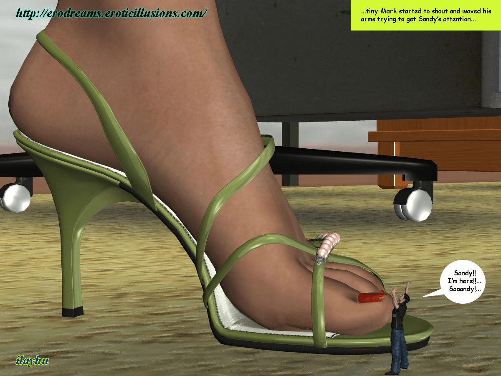

# ilayhu - Ilayhutube (Youtube)

作者：ilayhu

TID：7056

<title>1</title> <link href="../Styles/Style.css" type="text/css" rel="stylesheet">

# 1

Hello my friends, I am not sure if you can watch youtube in China, however I send you the links of my work I posted in youtube, thanks
I hope you like them 

[http://www.youtube.com/watch?v=3hMSXKnrJxs](http://www.youtube.com/watch?v=3hMSXKnrJxs)

[http://www.youtube.com/watch?v=3xq11P5jjuI](http://www.youtube.com/watch?v=3xq11P5jjuI)

[http://www.youtube.com/watch?v=dgx02Rga3V8](http://www.youtube.com/watch?v=dgx02Rga3V8)

[http://www.youtube.com/watch?v=RZOwfWG-0Ic](http://www.youtube.com/watch?v=RZOwfWG-0Ic)

comments are welcome, in there or here 

ilayhu

**(google translator)**

你好我的朋友，我不知道你可以觀看 YouTube在中國，但是我給你的鏈接我的工作我張貼在YouTube，謝謝
我希望你喜歡：dctg24

[http://www.youtube.com/watch?v=3hMSXKnrJxs](http://www.youtube.com/watch?v=3hMSXKnrJxs)

[http://www.youtube.com/watch?v=3xq11P5jjuI](http://www.youtube.com/watch?v=3xq11P5jjuI)

[http://www.youtube.com/watch?v=dgx02Rga3V8](http://www.youtube.com/watch?v=dgx02Rga3V8)

[http://www.youtube.com/watch?v=RZOwfWG-0Ic](http://www.youtube.com/watch?v=RZOwfWG-0Ic)

歡迎評論，在那裡，或瀏覽：dctg5

ilayhu <title>2</title> <link href="../Styles/Style.css" type="text/css" rel="stylesheet">

# 2

 <ignore_js_op>[nr034 copia.jpg](forum.php?mod=attachment&aid=MTgxOTh8MDc1YWU0NTV8MTY3NDA2ODkxOHwxODIzMHw3MDU2&nothumb=yes) *(191.07 KB, 下載次數: 0)*

[下載附件](forum.php?mod=attachment&aid=MTgxOTh8MDc1YWU0NTV8MTY3NDA2ODkxOHwxODIzMHw3MDU2&nothumb=yes)

2010-3-10 08:29 上傳  

</ignore_js_op> <title>3</title> <link href="../Styles/Style.css" type="text/css" rel="stylesheet">

# 3

打不开啊 <title>4</title> <link href="../Styles/Style.css" type="text/css" rel="stylesheet">

# 4

WOw! It's great!

thank you ilayhu

回2L: 在lz给的链接中加几个字母就行了，比如，链接是[http://www.youtube.com/watch?v=RZOwfWG-0Ic](http://www.youtube.com/watch?v=RZOwfWG-0Ic)
把它变成 [https://www.youtubecn.com/watch?v=RZOwfWG-0Ic](https://www.youtubecn.com/watch?v=RZOwfWG-0Ic)
在http后加个s,在youtube后加个cn <title>5</title> <link href="../Styles/Style.css" type="text/css" rel="stylesheet">

# 5

> 原帖由 *KID* 於 2010-3-10 09:30 發表 
> WOw! It's great!
> 
> thank you ilayhu
> 
> 回2L: 在lz给的链接中加几个字母就行了，比如，链接是[http://www.youtube.com/watch?v=RZOwfWG-0Ic](http://www.youtube.com/watch?v=RZOwfWG-0Ic)
> 把它变成 [https://www.youtubecn.com/w](https://www.youtubecn.com/w) ...

太强大了 ，谢谢^_^ <title>6</title> <link href="../Styles/Style.css" type="text/css" rel="stylesheet">

# 6

太感谢了！！！！！！！ <title>7</title> <link href="../Styles/Style.css" type="text/css" rel="stylesheet">

# 7

不胜感激噢~~~！ <title>8</title> <link href="../Styles/Style.css" type="text/css" rel="stylesheet">

# 8

KID强大啊  另外  谢谢楼主！ <title>9</title> <link href="../Styles/Style.css" type="text/css" rel="stylesheet">

# 9

PERFECT! 高品质 <title>10</title> <link href="../Styles/Style.css" type="text/css" rel="stylesheet">

# 10

PERFECT! 高品质
3楼大哥 给的网站也帅啊 <title>11</title> <link href="../Styles/Style.css" type="text/css" rel="stylesheet">

# 11

谢谢楼主！