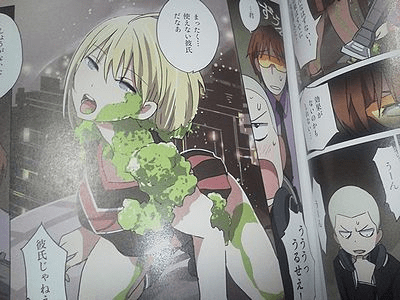
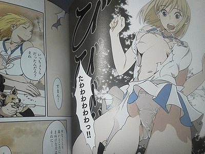
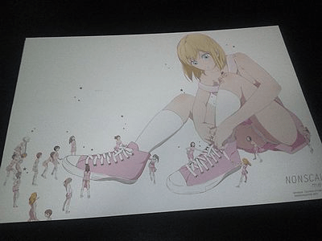

# mebae初單行本NONSCALE

作者：ckw

TID：13181

<title>1</title> <link href="../Styles/Style.css" type="text/css" rel="stylesheet">

# 1

首先說我為什麼要POST這件事,一切都是個意外。
我一直流連PIXIV,一直看到NONSCALE發售的廣告,畫風很熟,但沒在意
(順便說妹>兄也在P站出現好一陣子)
當我到這裡重看……
[http://giantessnight.com/gnforum ... =&page=1###zoom](http://giantessnight.com/gnforum/viewthread.php?tid=5802&extra=&page=1###zoom)
再估狗,原來是同一人「mebae」,ノンスケール也是第一部漫畫(By wiki)
mebae參與過不少動畫部份原畫,更有擔當角色設計,倒是單行本到今年才出。
…總覺得mebae畫建築物的風格跟細田守(導演)的風格有些像

關於NONSCALE
[http://www.wani.com/nonscale/](http://www.wani.com/nonscale/)
介紹那里……
身長18メートルの美少女が奮闘する表題作シリーズ（略）
(身長18米的美少女的奮鬥的作品系列（略）)
喔。身長18米？
最後想了想「單行本」,原來是指ノンスケール。

(PS：巨大女似乎正是ノンスケール的女主角）
(PS2：根據出處信息,圖是卡來的,而且是「先着」入手品)
(圖出處：[http://enokoromia.blog106.fc2.com/blog-entry-348.html](http://enokoromia.blog106.fc2.com/blog-entry-348.html))

話說,mebae還滿喜歡縮小女,巨大娘…
9個作品,已各佔一個,單行本的卡也是巨大女作主體。
ノンスケール會有下一作嗎？ <title>2</title> <link href="../Styles/Style.css" type="text/css" rel="stylesheet">

# 2

图叉了。。 <title>3</title> <link href="../Styles/Style.css" type="text/css" rel="stylesheet">

# 3

楼主 图挂啦
那网站就这3张GTS吧

[ *本帖最後由 390004989 於 2012-8-29 13:16 編輯* ] <title>4</title> <link href="../Styles/Style.css" type="text/css" rel="stylesheet">

# 4

 <ignore_js_op>[NEC_0545.jpg](forum.php?mod=attachment&aid=MzA1OTh8NTkxNjcyZGV8MTY3NDA2ODU3N3wxODIzMHwxMzE4MQ%3D%3D&nothumb=yes) *(43.7 KB, 下載次數: 0)*

[下載附件](forum.php?mod=attachment&aid=MzA1OTh8NTkxNjcyZGV8MTY3NDA2ODU3N3wxODIzMHwxMzE4MQ%3D%3D&nothumb=yes)

2012-8-29 13:14 上傳  

</ignore_js_op> <ignore_js_op>[NEC_0544_20120330180827.jpg](forum.php?mod=attachment&aid=MzA1OTl8ZTc0YjNjODJ8MTY3NDA2ODU3N3wxODIzMHwxMzE4MQ%3D%3D&nothumb=yes) *(42.34 KB, 下載次數: 0)*

[下載附件](forum.php?mod=attachment&aid=MzA1OTl8ZTc0YjNjODJ8MTY3NDA2ODU3N3wxODIzMHwxMzE4MQ%3D%3D&nothumb=yes)

2012-8-29 13:16 上傳  

</ignore_js_op> <ignore_js_op>[NEC_0536_20120330180827.jpg](forum.php?mod=attachment&aid=MzA2MDB8Zjk2OGI1NGR8MTY3NDA2ODU3N3wxODIzMHwxMzE4MQ%3D%3D&nothumb=yes) *(21.76 KB, 下載次數: 8)*

[下載附件](forum.php?mod=attachment&aid=MzA2MDB8Zjk2OGI1NGR8MTY3NDA2ODU3N3wxODIzMHwxMzE4MQ%3D%3D&nothumb=yes)

2012-8-29 13:16 上傳  

</ignore_js_op> <title>5</title> <link href="../Styles/Style.css" type="text/css" rel="stylesheet">

# 5

这本书我买了，实际上许多书我都买了，但我现在催着四个本子，连扫图修图都没有人能分担，我实在忙不过来了，所以你看不到本子就去骂那些个懒人吧 <title>6</title> <link href="../Styles/Style.css" type="text/css" rel="stylesheet">

# 6

这是新作吗？？