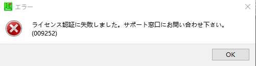

# melonbooks求助

作者：maker13

TID：29957

<title>1</title> <link href="../Styles/Style.css" type="text/css" rel="stylesheet">

# 1

今天在上面买了一本电子书，但是用电子书指定文件打开却是这样，大伙知道怎么解决吗
<title>2</title> <link href="../Styles/Style.css" type="text/css" rel="stylesheet">

# 2

 <ignore_js_op>[QQ图片20201215215633.png](forum.php?mod=attachment&aid=ODY0MTN8YjA2ZDE3NDB8MTY3NDA2NjIyM3wxODIzMHwyOTk1Nw%3D%3D&nothumb=yes) *(2.81 KB, 下載次數: 0)*

[下載附件](forum.php?mod=attachment&aid=ODY0MTN8YjA2ZDE3NDB8MTY3NDA2NjIyM3wxODIzMHwyOTk1Nw%3D%3D&nothumb=yes)

2020-12-15 21:58 上傳  

</ignore_js_op> <title>3</title> <link href="../Styles/Style.css" type="text/css" rel="stylesheet">

# 3

情报太少，你是说你用网站指定的软件来打开下载的文件妈，那应该要输入你在网站的用户名和密码来认证，你输入正确了吗 <title>4</title> <link href="../Styles/Style.css" type="text/css" rel="stylesheet">

# 4

> dfggggx 發表於 2020-12-15 23:21
> 情报太少，你是说你用网站指定的软件来打开下载的文件妈，那应该要输入你在网站的用户名和密码来认证，你输 ...

输入是正确的，其他的都可以，这个就打不开 <title>5</title> <link href="../Styles/Style.css" type="text/css" rel="stylesheet">

# 5

好像之前我也遇到过类似的问题，说是VPN没覆盖全，然后认证软件就连不上服务器

现在依然不懂