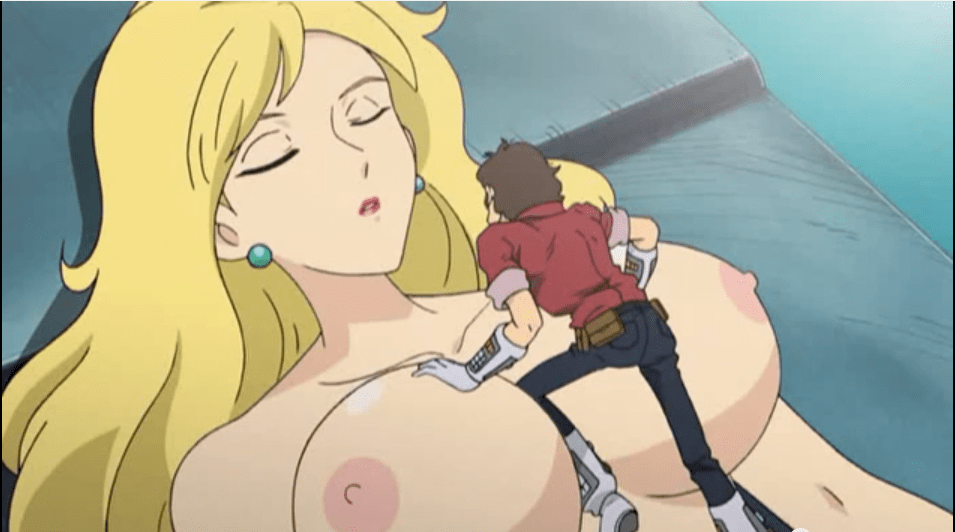
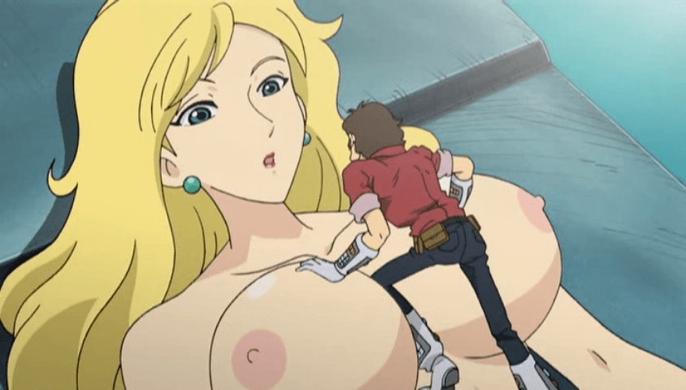
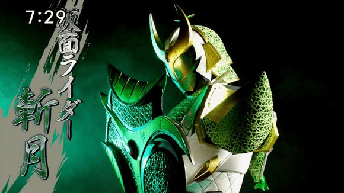

# monkey punch ep10

作者：CEW

TID：17095

<title>1</title> <link href="../Styles/Style.css" type="text/css" rel="stylesheet">

# 1

[https://www.youtube.com/watch?v=dgC9SrCKlXw](https://www.youtube.com/watch?v=dgC9SrCKlXw)
youtube看到的沒看到人發，所以分享一下，我沒看過這動畫有人看過嗎?

<title>2</title> <link href="../Styles/Style.css" type="text/css" rel="stylesheet">

# 2

 <ignore_js_op>[預覽圖.png](forum.php?mod=attachment&aid=NDM4MTN8ZmI1M2Q2M2V8MTY3NDA2OTQ2NHwxODIzMHwxNzA5NQ%3D%3D&nothumb=yes) *(629.22 KB, 下載次數: 9)*

[下載附件](forum.php?mod=attachment&aid=NDM4MTN8ZmI1M2Q2M2V8MTY3NDA2OTQ2NHwxODIzMHwxNzA5NQ%3D%3D&nothumb=yes)

2014-6-21 17:40 上傳  

</ignore_js_op> <title>3</title> <link href="../Styles/Style.css" type="text/css" rel="stylesheet">

# 3

需要跳墙，请问楼主可不可以直接发视频？ <title>4</title> <link href="../Styles/Style.css" type="text/css" rel="stylesheet">

# 4

> [hiahia 發表於 2014-6-21 19:52](https://giantessnight.cf/gnforum2012/forum.php?mod=redirect&goto=findpost&pid=225086&ptid=17095)
> 需要跳墙，请问楼主可不可以直接发视频？

不好意思，我沒有視頻，youtube的也已經被刪掉了，沒辦法發了
<title>5</title> <link href="../Styles/Style.css" type="text/css" rel="stylesheet">

# 5

> [apple 發表於 2014-6-21 21:41](https://giantessnight.cf/gnforum2012/forum.php?mod=redirect&goto=findpost&pid=225087&ptid=17095)
> 不好意思，我沒有視頻，youtube的也已經被刪掉了，沒辦法發了

我的天，删的这么快
<title>6</title> <link href="../Styles/Style.css" type="text/css" rel="stylesheet">

# 6

> [hiahia 發表於 2014-6-22 09:07](https://giantessnight.cf/gnforum2012/forum.php?mod=redirect&goto=findpost&pid=225113&ptid=17095)
> 我的天，删的这么快

是阿，畢竟露點了，看的時候就立刻分享了，沒想到幾個小時後就不見了 <title>7</title> <link href="../Styles/Style.css" type="text/css" rel="stylesheet">

# 7

[http://www.dailymotion.com/video ... 10-giantess_redband](http://www.dailymotion.com/video/x11c1sj_monkey-punch-ep-10-giantess_redband)
新的分享點..不知要不要翻牆就是了 <title>8</title> <link href="../Styles/Style.css" type="text/css" rel="stylesheet">

# 8

這個試試看嗎？

[http://www.dailymotion.com/embed/video/x11c1sj?syndication=112314](http://www.dailymotion.com/embed/video/x11c1sj?syndication=112314)
<title>9</title> <link href="../Styles/Style.css" type="text/css" rel="stylesheet">

# 9

 <ignore_js_op>[Brxcm.jpg](forum.php?mod=attachment&aid=NDgwODF8ODY4MWU0OWN8MTY3NDA2OTQ2NHwxODIzMHwxNzA5NQ%3D%3D&nothumb=yes) *(51.35 KB, 下載次數: 1)*

[下載附件](forum.php?mod=attachment&aid=NDgwODF8ODY4MWU0OWN8MTY3NDA2OTQ2NHwxODIzMHwxNzA5NQ%3D%3D&nothumb=yes)

2014-10-30 23:42 上傳  

</ignore_js_op> <title>10</title> <link href="../Styles/Style.css" type="text/css" rel="stylesheet">

# 10

> [小蚱蜢 發表於 2014-10-30 23:42](https://giantessnight.cf/gnforum2012/forum.php?mod=redirect&goto=findpost&pid=237672&ptid=17095)
> 這個試試看嗎？
> 
> http://www.dailymotion.com/embed/video/x11c1sj?syndication=112314

这个网页也打不开。 <title>11</title> <link href="../Styles/Style.css" type="text/css" rel="stylesheet">

# 11

好像不行  有木有国产网址的链接啊 <title>12</title> <link href="../Styles/Style.css" type="text/css" rel="stylesheet">

# 12

感謝樓主分享，更感謝蚱蜢哥補完。 <title>13</title> <link href="../Styles/Style.css" type="text/css" rel="stylesheet">

# 13

看了看右下角的内存占用率后果断放弃翻墙……

<ignore_js_op>

**斩月.jpg** *(38.62 KB, 下載次數: 0)*

[下載附件](forum.php?mod=attachment&aid=NDgzNDR8Y2Q4YTM1MTR8MTY3NDA2OTUyM3wxODIzMHwxNzA5NQ%3D%3D&nothumb=yes)

2014-11-9 11:35 上傳

<title>14</title> <link href="../Styles/Style.css" type="text/css" rel="stylesheet">

# 14

啊啊啊 好想看 被封了啊 <title>15</title> <link href="../Styles/Style.css" type="text/css" rel="stylesheet">

# 15

又是youtube的， 万恶的墙壁 <title>16</title> <link href="../Styles/Style.css" type="text/css" rel="stylesheet">

# 16

链接进不去啊。。。。 <title>17</title> <link href="../Styles/Style.css" type="text/css" rel="stylesheet">

# 17

不是不知道是美漫还是日漫诶，有时间查下喽 <title>18</title> <link href="../Styles/Style.css" type="text/css" rel="stylesheet">

# 18

好吧我翻墙过去也看不了...

不过还是要感谢楼主分享以及蚱蜢哥补档（？）~

有机会去找找看~ <title>19</title> <link href="../Styles/Style.css" type="text/css" rel="stylesheet">

# 19

monkey punch不应该是鲁邦三世么，这是哪一季哪一集的场景谁能找出来.. <title>20</title> <link href="../Styles/Style.css" type="text/css" rel="stylesheet">

# 20

又是youtube,真心不会翻墙 <title>21</title> <link href="../Styles/Style.css" type="text/css" rel="stylesheet">

# 21

鲁邦三世啊，里面有好多GTS情节 <title>22</title> <link href="../Styles/Style.css" type="text/css" rel="stylesheet">

# 22

话说秋季要把鲁邦的新剧场版剪裁一下播成季番啊... <title>23</title> <link href="../Styles/Style.css" type="text/css" rel="stylesheet">

# 23

這畫風跟造型感覺不是最近10年的作品，要翻舊的話資料上不好找 <title>24</title> <link href="../Styles/Style.css" type="text/css" rel="stylesheet">

# 24

这个动画好像之前看过 印象有点 <title>25</title> <link href="../Styles/Style.css" type="text/css" rel="stylesheet">

# 25

画风想起了鲁邦三世。</ignore_js_op>