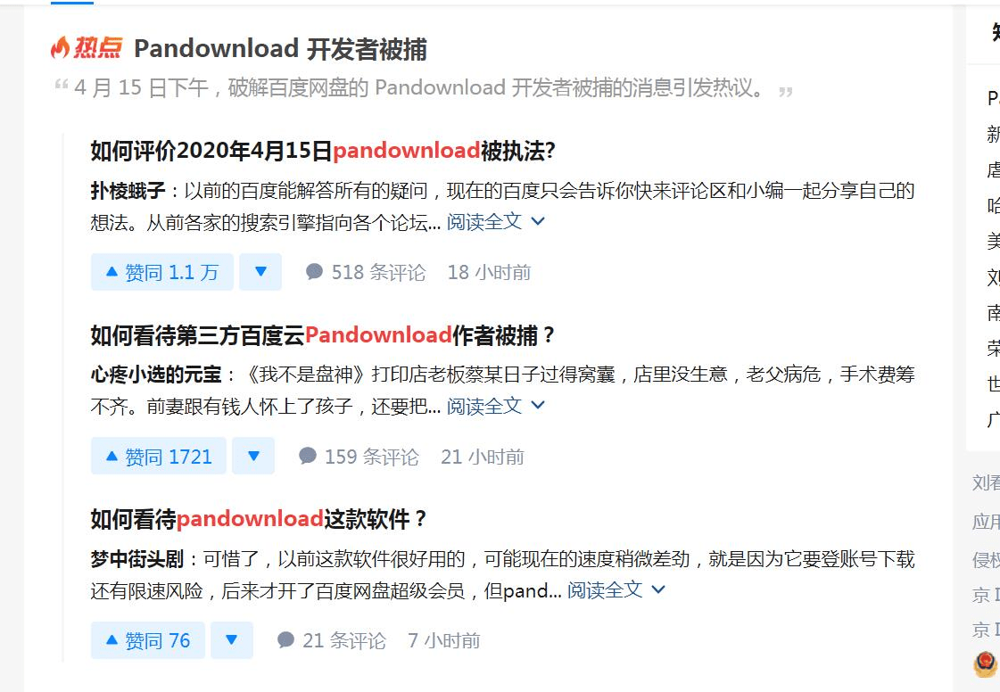

# pandownload被抓了。。。以后大家尽量用别的的方式分享资源⑧

作者：夏游云

TID：28504

<title>1</title> <link href="../Styles/Style.css" type="text/css" rel="stylesheet">

# 1

sad。。。
<ignore_js_op>

**QQ截图20200416165857.jpg** *(98.53 KB, 下載次數: 0)*

[下載附件](forum.php?mod=attachment&aid=ODI0NjJ8ZmVlZTE2NWR8MTY3NDA2NjQ1OXwxODIzMHwyODUwNA%3D%3D&nothumb=yes)

2020-4-16 17:03 上傳

<title>2</title> <link href="../Styles/Style.css" type="text/css" rel="stylesheet">

# 2

垃圾百度，典型的暴君                        <title>3</title> <link href="../Styles/Style.css" type="text/css" rel="stylesheet">

# 3

肯定是度娘搞的鬼…另外如果只是偶尔用一用可以在淘宝按天租用，不过只有下载功能没有储存功能了。 <title>4</title> <link href="../Styles/Style.css" type="text/css" rel="stylesheet">

# 4

会员也是被限速的，花钱买会员就是傻了 <title>5</title> <link href="../Styles/Style.css" type="text/css" rel="stylesheet">

# 5

墙外无所谓，墙内涉及到大文件分享还是只有百度了吧
抛开这件事来说，百度确乎是目前国内使用范围最广、门槛最低、最便宜且白嫖方式最多的大文件分享网盘了。就国内的环境，这种网盘服务也只有百度烧得起钱，所以现在再垃圾我们也只有将就用了 <title>6</title> <link href="../Styles/Style.css" type="text/css" rel="stylesheet">

# 6

个人感觉mega盘还是很香的，速度也很快 <title>7</title> <link href="../Styles/Style.css" type="text/css" rel="stylesheet">

# 7

MEGA地方有限制，下东西方便，转存东西就算了 <title>8</title> <link href="../Styles/Style.css" type="text/css" rel="stylesheet">

# 8

网盘没会员能勉勉强强到1m左右 将就用吧 破解出来的pd估计也撑不了多久 <title>9</title> <link href="../Styles/Style.css" type="text/css" rel="stylesheet">

# 9

买个vpn后长期用mega了，不过近期我一个号被封了，mega管的好像挺严 <title>10</title> <link href="../Styles/Style.css" type="text/css" rel="stylesheet">

# 10

要不试试GitHub怎么样，听说最近好像免费来着，不过我没用过，不怎么清楚 <title>11</title> <link href="../Styles/Style.css" type="text/css" rel="stylesheet">

# 11

> [dfggggx 發表於 2020-4-16 19:35](https://giantessnight.cf/gnforum2012/forum.php?mod=redirect&goto=findpost&pid=433443&ptid=28504)
> 会员也是被限速的，花钱买会员就是傻了

超级会员就没限速了，你买的普通会员吧
<title>12</title> <link href="../Styles/Style.css" type="text/css" rel="stylesheet">

# 12

超级会员贵得一逼，有这个钱不如拿来赞助几个画师 <title>13</title> <link href="../Styles/Style.css" type="text/css" rel="stylesheet">

# 13

> [dfggggx 發表於 2020-4-17 01:01](https://giantessnight.cf/gnforum2012/forum.php?mod=redirect&goto=findpost&pid=433484&ptid=28504)
> 超级会员贵得一逼，有这个钱不如拿来赞助几个画师

说实话一个月几十块钱我觉得还可以，至少安心使用，速度也可以接受。你用pandownload这种一直要担心账号会不会被百度拉黑，或者哪天不能用了，太烦了，还不如花钱。
<title>14</title> <link href="../Styles/Style.css" type="text/css" rel="stylesheet">

# 14

没事，还有一个叫speedpan的活了下来，但是不知道这个还能活多久 <title>15</title> <link href="../Styles/Style.css" type="text/css" rel="stylesheet">

# 15

> [泡面 發表於 2020-4-16 23:21](https://giantessnight.cf/gnforum2012/forum.php?mod=redirect&goto=findpost&pid=433472&ptid=28504)
> 超级会员就没限速了，你买的普通会员吧

超会有时候也会限速，下到一定量就限制了
<title>16</title> <link href="../Styles/Style.css" type="text/css" rel="stylesheet">

# 16

我一直觉得mega大法好，刚刚楼上有人说mega被封号，小白不懂就问，请问有什么封号原因吗 <title>17</title> <link href="../Styles/Style.css" type="text/css" rel="stylesheet">

# 17

墙外人民可选择的比较多，墙内的目前也就只有百度了，虽说有vpn但还是觉得不保险。 <title>18</title> <link href="../Styles/Style.css" type="text/css" rel="stylesheet">

# 18

百度默认开启激励计划这和当年迅雷吸血有什么区别。能不用百度网盘就别用是我们唯一的能做的了 <title>19</title> <link href="../Styles/Style.css" type="text/css" rel="stylesheet">

# 19

挺好用的软件，没想到就这么没有了。 <title>20</title> <link href="../Styles/Style.css" type="text/css" rel="stylesheet">

# 20

Mega GoogleDrive OneDrive Dropbox MediaFire 哪个不都比百度强... <title>21</title> <link href="../Styles/Style.css" type="text/css" rel="stylesheet">

# 21

我买超级会员大部分原因是为了那5个T空间…… <title>22</title> <link href="../Styles/Style.css" type="text/css" rel="stylesheet">

# 22

现在用idm下载网盘里还挺快的 <title>23</title> <link href="../Styles/Style.css" type="text/css" rel="stylesheet">

# 23

还是mega大法好，虽然要翻墙！</ignore_js_op>