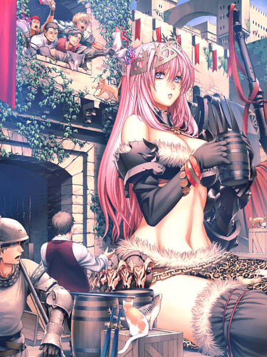
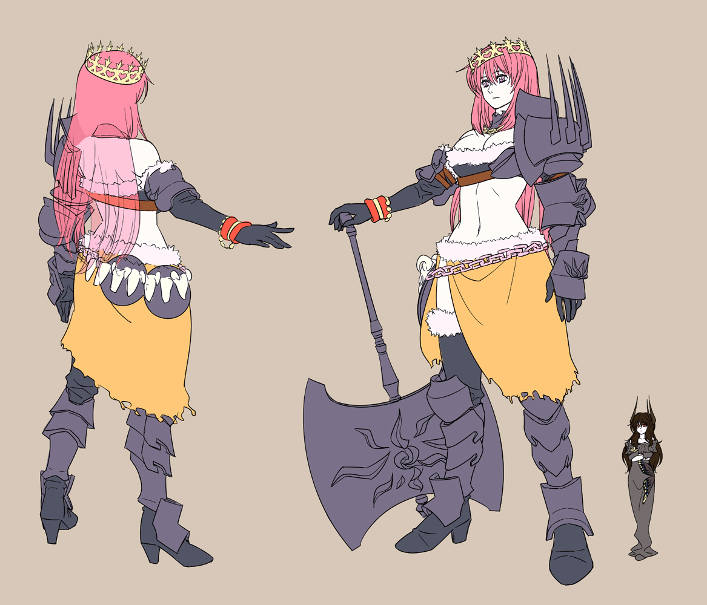

# pixivファンタジアⅣ又要开幕了...!

作者：yudish

TID：6524

<title>1</title> <link href="../Styles/Style.css" type="text/css" rel="stylesheet">

# 1

话说PF4(本届)的世界观不像第三届那么直白(第三届有巨人国家),算起来非GTS画家的优秀作品应该无限接近于0了(残念)
首先回顾一下上届的优秀作品,应该是时间段"黒耀門の守護者"中的优胜作品!
大图我放在16楼了,下面的那个网址请在登录pixiv后使用

以上小图....大图去作者的PIXIV页上看

当然,介绍一下作者....这个作者习惯于凑热闹,证据就是每次只有有活动开办的时候才来画几张,所以各位不用期待了,哈哈(别打脸!)
附上作者的pixiv页: [http://www.pixiv.net/member_illust.php?id=65081](http://www.pixiv.net/member_illust.php?id=65081)

然后来张GTS界生力军寺田落子的PF4企划

最后,炮姐式标题威武!

[ *本帖最後由 Eltshan0G 於 2010-2-5 17:38 編輯* ] <title>2</title> <link href="../Styles/Style.css" type="text/css" rel="stylesheet">

# 2

 <ignore_js_op>[3936316_m.jpg](forum.php?mod=attachment&aid=MTY5ODl8YTE0MjY0NmV8MTY3NDA2ODk0NXwxODIzMHw2NTI0&nothumb=yes) *(420.2 KB, 下載次數: 2)*

[下載附件](forum.php?mod=attachment&aid=MTY5ODl8YTE0MjY0NmV8MTY3NDA2ODk0NXwxODIzMHw2NTI0&nothumb=yes)

2010-2-4 02:35 上傳  

</ignore_js_op> <ignore_js_op>[3956200_m.jpg](forum.php?mod=attachment&aid=MTY5OTB8NjlkMWQ2MWV8MTY3NDA2ODk0NXwxODIzMHw2NTI0&nothumb=yes) *(167.48 KB, 下載次數: 0)*

[下載附件](forum.php?mod=attachment&aid=MTY5OTB8NjlkMWQ2MWV8MTY3NDA2ODk0NXwxODIzMHw2NTI0&nothumb=yes)

2010-2-4 02:35 上傳  

</ignore_js_op> <title>3</title> <link href="../Styles/Style.css" type="text/css" rel="stylesheet">

# 3

所以還是他呀...
還以為能看到新星呢(寺田落子絕對不是新人...) <title>4</title> <link href="../Styles/Style.css" type="text/css" rel="stylesheet">

# 4

> 原帖由 *killer9999* 於 2010-2-3 23:00 發表 
> 所以還是他呀...
> 還以為能看到新星呢(寺田落子絕對不是新人...)

我刚开始逛PIXIV的时候真没见过寺田落子的画,我第一次看到寺田的时候大概是08年夏秋的时候吧,PIXIV上我发现的时候大概是08年年末......说实在的....他的产量真的是很惊人,虽然画质不能用豪华形容,但是效率确实也相当不错了

不过说实在的.....在GTS这方面活跃一年半的人不能算是老人吧....所以我感觉楼主的"生力军"这一词用的是很贴切的

顺便一说,那个巨人的公主我的硬盘里面不知道备了多少份了 <title>5</title> <link href="../Styles/Style.css" type="text/css" rel="stylesheet">

# 5

我現在上PIXIV好慢，大陸都這樣？ <title>6</title> <link href="../Styles/Style.css" type="text/css" rel="stylesheet">

# 6

兔子表示到P站只用丸吞み的KEY WORD= = <title>7</title> <link href="../Styles/Style.css" type="text/css" rel="stylesheet">

# 7

- -寺田落子不是新人+1 <title>8</title> <link href="../Styles/Style.css" type="text/css" rel="stylesheet">

# 8

俺借楼求下寺田落子2008年夏秋之前的作品,对于这位作者的作品我是很喜欢的,十分想收集齐寺田落子的手绘作品......

[ *本帖最後由 JOYYSOSOSO 於 2010-2-4 15:56 編輯* ] <title>9</title> <link href="../Styles/Style.css" type="text/css" rel="stylesheet">

# 9

 哦哦哦，虽然不知道楼上那个你们说的什么，但是寺田落子的全集同求啊同求！， <title>10</title> <link href="../Styles/Style.css" type="text/css" rel="stylesheet">

# 10

他的pivix帳戶加上gts/shrinker uploader就是了... <title>11</title> <link href="../Styles/Style.css" type="text/css" rel="stylesheet">

# 11

听不懂饿 <title>12</title> <link href="../Styles/Style.css" type="text/css" rel="stylesheet">

# 12

又是好作品，本人收下啦！ <title>13</title> <link href="../Styles/Style.css" type="text/css" rel="stylesheet">

# 13

听不懂说什么。。。 <title>14</title> <link href="../Styles/Style.css" type="text/css" rel="stylesheet">

# 14

  炮姐威武

去p站嗎？一定要打開18X哦 <title>15</title> <link href="../Styles/Style.css" type="text/css" rel="stylesheet">

# 15

炮姐标题的图我怎么找不到？在哪的？ <title>16</title> <link href="../Styles/Style.css" type="text/css" rel="stylesheet">

# 16

我點網址怎麼是一片空白... <title>17</title> <link href="../Styles/Style.css" type="text/css" rel="stylesheet">

# 17

> 原帖由 *lovegts* 於 2010-2-5 11:15 發表 
> 我點網址怎麼是一片空白...

哎,又搞错一件事,我那个网址需要登录,干脆我传一份大的上来好了,省得麻烦,顺带一个巨人姬的拉拉队装 <title>18</title> <link href="../Styles/Style.css" type="text/css" rel="stylesheet">

# 18

 <ignore_js_op>[3936316.jpg](forum.php?mod=attachment&aid=MTcwNTJ8NTA5YzNkMTl8MTY3NDA2ODk1NHwxODIzMHw2NTI0&nothumb=yes) *(1.97 MB, 下載次數: 2)*

[下載附件](forum.php?mod=attachment&aid=MTcwNTJ8NTA5YzNkMTl8MTY3NDA2ODk1NHwxODIzMHw2NTI0&nothumb=yes)

2010-2-5 17:07 上傳  

</ignore_js_op> <ignore_js_op>[3956200.jpg](forum.php?mod=attachment&aid=MTcwNTN8MjUzN2NhNTZ8MTY3NDA2ODk1NHwxODIzMHw2NTI0&nothumb=yes) *(447.3 KB, 下載次數: 0)*

[下載附件](forum.php?mod=attachment&aid=MTcwNTN8MjUzN2NhNTZ8MTY3NDA2ODk1NHwxODIzMHw2NTI0&nothumb=yes)

2010-2-5 17:07 上傳  

</ignore_js_op> <ignore_js_op>[4207421.jpg](forum.php?mod=attachment&aid=MTcwNTR8YmZiZDljZjN8MTY3NDA2ODk1NHwxODIzMHw2NTI0&nothumb=yes) *(1.24 MB, 下載次數: 0)*

[下載附件](forum.php?mod=attachment&aid=MTcwNTR8YmZiZDljZjN8MTY3NDA2ODk1NHwxODIzMHw2NTI0&nothumb=yes)

2010-2-5 17:07 上傳  

</ignore_js_op>