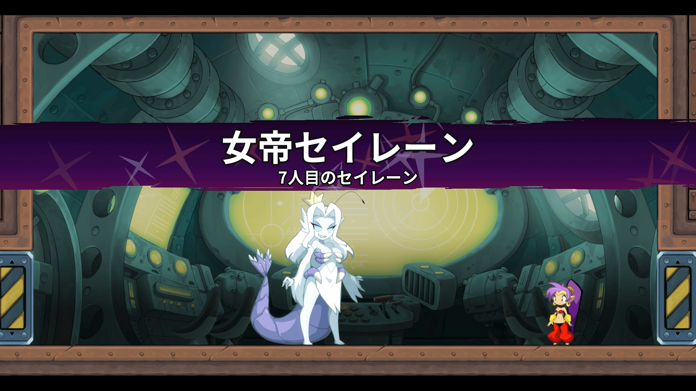
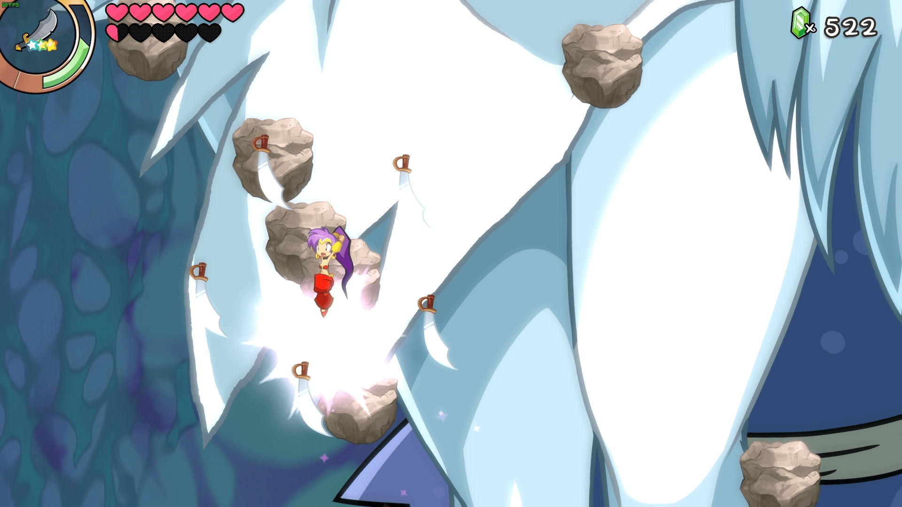

# shantae遊戲裡，除了giga mermaid的另一個GTS

作者：BAss926

TID：30263

<title>1</title> <link href="../Styles/Style.css" type="text/css" rel="stylesheet">

# 1

*本帖最後由 BAss926 於 2021-2-1 19:02 編輯*

Seven Sirens 裡的的最終頭目 Empress Siren
第一戰
<ignore_js_op>

**未命名 - 1.jpg** *(1.05 MB, 下載次數: 0)*

[下載附件](forum.php?mod=attachment&aid=ODcxMzV8MmZmZDZiNjB8MTY3NDA2NjE1OXwxODIzMHwzMDI2Mw%3D%3D&nothumb=yes)

2021-2-1 18:55 上傳

第二戰
<ignore_js_op>

**未命名 - 2.jpg** *(621.97 KB, 下載次數: 0)*

[下載附件](forum.php?mod=attachment&aid=ODcxMzZ8MWVjYmRmZDZ8MTY3NDA2NjE1OXwxODIzMHwzMDI2Mw%3D%3D&nothumb=yes)

2021-2-1 18:56 上傳

雖然是2020年5月的遊戲，不過相關創作的數量比人魚少非常多

是說為什麼感覺大部分遊戲裡的女巨人幾乎都沒在用物理攻擊的
姑且不論GTS愛好，既然都玩巨大化這一套了
不是更應該儘量發揮身體大小上的優勢才對嗎...

<title>2</title> <link href="../Styles/Style.css" type="text/css" rel="stylesheet">

# 2

第一次看到有同好聊桑塔2333，之前就在想明明有两个gts角色，怎么论坛里都没人讨论</ignore_js_op></ignore_js_op>