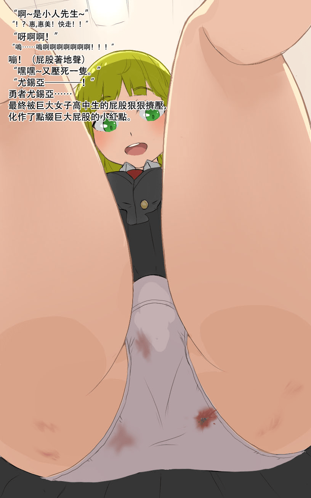

# uru size master

作者：AOLZLAL25

TID：26607

<title>1</title> <link href="../Styles/Style.css" type="text/css" rel="stylesheet">

# 1

*本帖最後由 闲余ノ 於 2019-3-23 18:52 編輯*

大家觉得这种形式怎么样 ，收录台词的cg
<ignore_js_op>

**綠髮少女.jpg** *(101.15 KB, 下載次數: 6)*

[下載附件](forum.php?mod=attachment&aid=NzcyODZ8ZDc5Njc1MzR8MTY3NDA2Njg0M3wxODIzMHwyNjYwNw%3D%3D&nothumb=yes)

2019-3-23 18:38 上傳

<ignore_js_op>

**size master香蕉皮事件.jpg** *(182.42 KB, 下載次數: 9)*

[下載附件](forum.php?mod=attachment&aid=NzcyODd8OWRiZjM0MDN8MTY3NDA2Njg0M3wxODIzMHwyNjYwNw%3D%3D&nothumb=yes)

2019-3-23 18:42 上傳

<title>2</title> <link href="../Styles/Style.css" type="text/css" rel="stylesheet">

# 2

不管你们怎么样
反正我是资瓷的 <title>3</title> <link href="../Styles/Style.css" type="text/css" rel="stylesheet">

# 3

必须支持啊，这样看cg别有一番风味 <title>4</title> <link href="../Styles/Style.css" type="text/css" rel="stylesheet">

# 4

这表现形式挺不错啊，大力支持 <title>5</title> <link href="../Styles/Style.css" type="text/css" rel="stylesheet">

# 5

uru的作品质量都好高啊
<title>6</title> <link href="../Styles/Style.css" type="text/css" rel="stylesheet">

# 6

有人做那肯定是最好的了【暗示】 <title>7</title> <link href="../Styles/Style.css" type="text/css" rel="stylesheet">

# 7

那肯定棒的一批啦
像我这种没空玩整个游戏的社畜举双手支持 <title>8</title> <link href="../Styles/Style.css" type="text/css" rel="stylesheet">

# 8

棒的没话说
故事再长一点就好了 <title>9</title> <link href="../Styles/Style.css" type="text/css" rel="stylesheet">

# 9

这种模式看起来超棒！  寺田总是会图配文也是这个原因吧！ <title>10</title> <link href="../Styles/Style.css" type="text/css" rel="stylesheet">

# 10

非常棒！赞到没话说（想起不久前图片区有几张很不错的现实p图配文 <title>11</title> <link href="../Styles/Style.css" type="text/css" rel="stylesheet">

# 11

这种形式的作品当然好阿!既有图可以看又有文字可以知道在干嘛，这样就可以更轻松的融入剧情中了！ <title>12</title> <link href="../Styles/Style.css" type="text/css" rel="stylesheet">

# 12

0.5版本是不是已经有翻译了？和翻译这商量下是不是能缩短工程 <title>13</title> <link href="../Styles/Style.css" type="text/css" rel="stylesheet">

# 13

> [huixiangya 發表於 2019-4-6 23:19](https://giantessnight.cf/gnforum2012/forum.php?mod=redirect&goto=findpost&pid=402025&ptid=26607)
> 0.5版本是不是已经有翻译了？和翻译这商量下是不是能缩短工程

我这个只是图片化罢了，也和汉化版关系不大。
<title>14</title> <link href="../Styles/Style.css" type="text/css" rel="stylesheet">

# 14

感谢楼主分享                        </ignore_js_op></ignore_js_op>