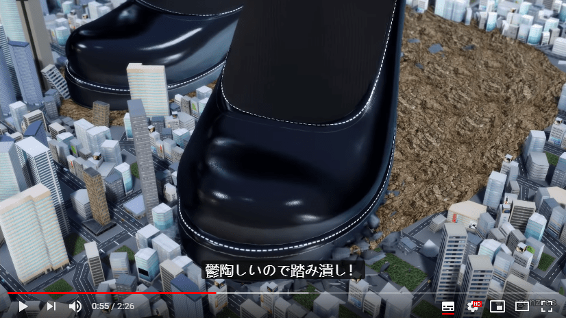

# youtube上gonzres制作的MMD

作者：fall_down

TID：28105

<title>1</title> <link href="../Styles/Style.css" type="text/css" rel="stylesheet">

# 1

gonzres在youtube上：[地址在这](https://www.youtube.com/channel/UCG-WciaK1Dn-Lj59QPMFiXg)  制作的MMD十分惊艳，一起聊聊他是用那款建模软件制作的吧。 <ignore_js_op>

**tmp.PNG** *(862.75 KB, 下載次數: 1)*

[下載附件](forum.php?mod=attachment&aid=ODE1MTh8MTJiZGI5NzV8MTY3NDA2NjU1N3wxODIzMHwyODEwNQ%3D%3D&nothumb=yes)

2020-2-19 11:50 上傳

<title>2</title> <link href="../Styles/Style.css" type="text/css" rel="stylesheet">

# 2

不要问，问就是blender。 <title>3</title> <link href="../Styles/Style.css" type="text/css" rel="stylesheet">

# 3

你是不會留言問他本人逆 <title>4</title> <link href="../Styles/Style.css" type="text/css" rel="stylesheet">

# 4

简介有写
＜使用ソフト＞

MMD（MikuMikuDance）
MMM（MikuMikuMoving）
PmxEditor
aviutl
Sou <title>5</title> <link href="../Styles/Style.css" type="text/css" rel="stylesheet">

# 5

要是能够用更好的模型就好了，这个确实很牛，但是MMD的局限性也有，画面怎么看都是二次元的，缺少了一个真实感 <title>6</title> <link href="../Styles/Style.css" type="text/css" rel="stylesheet">

# 6

是很精致的mmd啊，感谢分享这个作者
<title>7</title> <link href="../Styles/Style.css" type="text/css" rel="stylesheet">

# 7

> [dfggggx 發表於 2020-2-19 15:56](https://giantessnight.cf/gnforum2012/forum.php?mod=redirect&goto=findpost&pid=427215&ptid=28105)
> 要是能够用更好的模型就好了，这个确实很牛，但是MMD的局限性也有，画面怎么看都是二次元的，缺少了一个真 ...

也不是每張圖都該以真實性為目標啦 平面感有平面感的魅力
Blender裡也有一種工作流叫非寫實算繪(Non-Photorealistic Rendering, NPR) 也是在玩看起來很二次元的畫面啊
別歧視二次元豪嗎
<title>8</title> <link href="../Styles/Style.css" type="text/css" rel="stylesheet">

# 8

我其实是喜欢2D的画面的，给人一种清新的感觉，但是我看过绝大多数的MMD的人物画风都是比较简单那种，要是能做到紫罗兰永恒花园那种就完美了，另外就是MMD对于物体的表现力确实是比不上3D。
也许是我没见过建模好的人物模型做成的MMD吧 <title>9</title> <link href="../Styles/Style.css" type="text/css" rel="stylesheet">

# 9

这个作者不光做得好
而且超级高产 真的是吊 <title>10</title> <link href="../Styles/Style.css" type="text/css" rel="stylesheet">

# 10

*本帖最後由 Cirno7Lover 於 2020-2-26 20:52 編輯*

这位Youtuber不仅高产，而且MMD的质量也是越做越高
每年那质量都是跨了一个新高度

现在虽然没17年那时候那么高产了，但如果那质量能一直上去的话，
他以后就算是两月一更我都无所谓

编辑：
题外话扯太多了，模型我记得没错的话，
其实Gonzres从18年开始就在每一个影片的简介标注了
那工作量我真不敢相信他是怎么做到那么高产的</ignore_js_op>