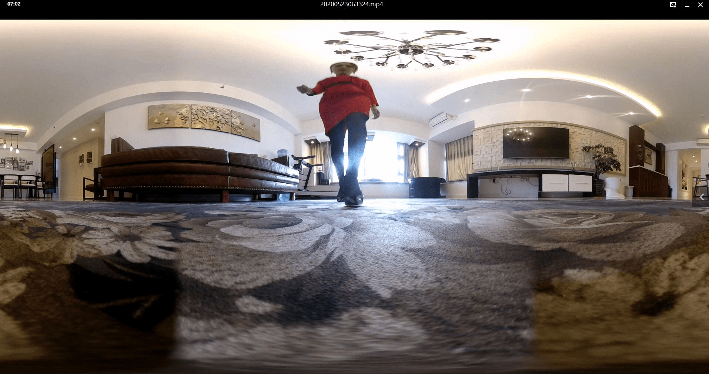
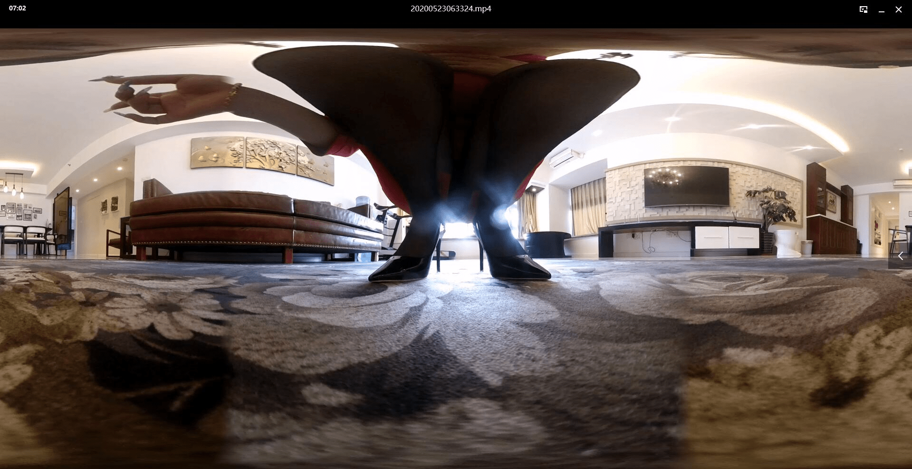
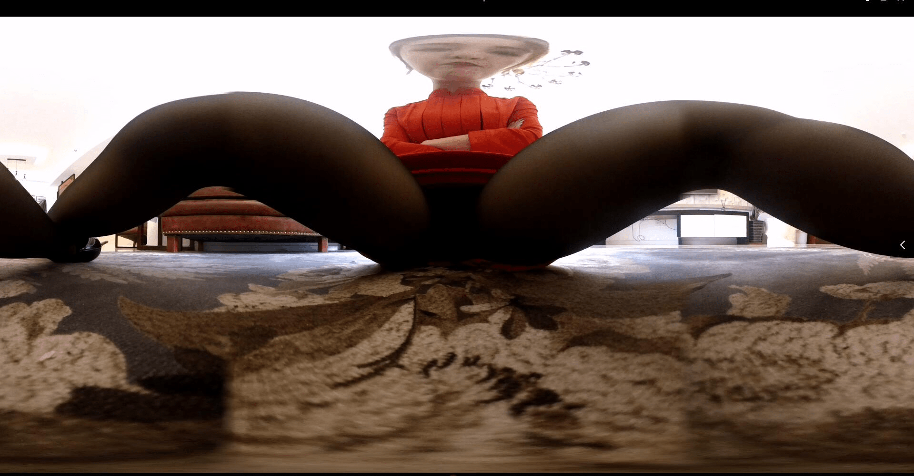

# 一个个人自费找空姐拍的VR

作者：龙影

TID：28959

<title>1</title> <link href="../Styles/Style.css" type="text/css" rel="stylesheet">

# 1

<ignore_js_op>

**QQ截图20200623070301.jpg** *(186.86 KB, 下載次數: 1)*

[下載附件](forum.php?mod=attachment&aid=ODM1NDJ8ZDZkZWZkNTJ8MTY3NDA2NjQxNnwxODIzMHwyODk1OQ%3D%3D&nothumb=yes)

2020-6-23 07:29 上傳

<ignore_js_op>

**QQ截图20200623070312.jpg** *(182.36 KB, 下載次數: 1)*

[下載附件](forum.php?mod=attachment&aid=ODM1NDF8YzExMmQ3OGF8MTY3NDA2NjQxNnwxODIzMHwyODk1OQ%3D%3D&nothumb=yes)

2020-6-23 07:29 上傳

<ignore_js_op>

**QQ截图20200623070336.jpg** *(138.39 KB, 下載次數: 0)*

[下載附件](forum.php?mod=attachment&aid=ODM1NDB8Y2YyMGMxZDZ8MTY3NDA2NjQxNnwxODIzMHwyODk1OQ%3D%3D&nothumb=yes)

2020-6-23 07:29 上傳

这是最近自费找的一个空姐拍的VR，感觉只要钱到位，她们也会去了解你的爱好并配合。就是有点小贵，花了8000。
<title>2</title> <link href="../Styles/Style.css" type="text/css" rel="stylesheet">

# 2

8000是加上制作视频的费用还是给空姐的？如果是后者那也太贵了吧。。。 <title>3</title> <link href="../Styles/Style.css" type="text/css" rel="stylesheet">

# 3

是有钱的大佬啊真好啊. <title>4</title> <link href="../Styles/Style.css" type="text/css" rel="stylesheet">

# 4

以为是航拍。。。。。。 <title>5</title> <link href="../Styles/Style.css" type="text/css" rel="stylesheet">

# 5

是呗…… 只要钱到位。什么都好说 <title>6</title> <link href="../Styles/Style.css" type="text/css" rel="stylesheet">

# 6

是大佬…………还是钱方便，

唉，找自己家妹子穿个丝袜都难 <title>7</title> <link href="../Styles/Style.css" type="text/css" rel="stylesheet">

# 7

8000人民币，相当于12万日元，可以找JK拍好几部了 <title>8</title> <link href="../Styles/Style.css" type="text/css" rel="stylesheet">

# 8

仿佛闻到了土豪的气味 <title>9</title> <link href="../Styles/Style.css" type="text/css" rel="stylesheet">

# 9

> [chuilaba1122 發表於 2020-6-23 07:38](https://giantessnight.cf/gnforum2012/forum.php?mod=redirect&goto=findpost&pid=440122&ptid=28959)
> 8000是加上制作视频的费用还是给空姐的？如果是后者那也太贵了吧。。。

这个视频不用制作，就把我的相机放那就完了，然后回来直接拷到电脑上就行。就是全给空姐的
<title>10</title> <link href="../Styles/Style.css" type="text/css" rel="stylesheet">

# 10

我要有钱该多好。jpg <title>11</title> <link href="../Styles/Style.css" type="text/css" rel="stylesheet">

# 11

> [大理三道茶 發表於 2020-6-24 06:26](https://giantessnight.cf/gnforum2012/forum.php?mod=redirect&goto=findpost&pid=440194&ptid=28959)
> 这个视频不用制作，就把我的相机放那就完了，然后回来直接拷到电脑上就行。就是全给空姐的
> ...

这个相机多少钱。。感觉近景跟远景对焦都很清晰，感觉一般的相机拍不出来，比网上拍摄的VR好不少，突然发现那些网站的摄影其实很业余。。无论从视觉还是晃动的镜头，感觉就是应付赶稿子那样、
<title>12</title> <link href="../Styles/Style.css" type="text/css" rel="stylesheet">

# 12

對大佬的財力表示佩服 <title>13</title> <link href="../Styles/Style.css" type="text/css" rel="stylesheet">

# 13

> [龙影 發表於 2020-6-24 11:39](https://giantessnight.cf/gnforum2012/forum.php?mod=redirect&goto=findpost&pid=440210&ptid=28959)
> 这个相机多少钱。。感觉近景跟远景对焦都很清晰，感觉一般的相机拍不出来，比网上拍摄的VR好不少，突然发 ...

相机就是小米的全景相机，以前才卖1600，现在应该更便宜了。我看了半天就觉得这个相机性价比最高，效果也不错，比例大小也合适。
网上好多人拍其实就主要为了挣钱，不是真爱的，拍得都不行。糊弄两下钱收了就完了。</ignore_js_op></ignore_js_op></ignore_js_op>