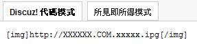

# 一个关于签名档问题

作者：c936281403

TID：8935

<title>1</title> <link href="../Styles/Style.css" type="text/css" rel="stylesheet">

# 1

就是怎么在签名档里贴图啊，急求啊。
好吧，我承认我很白痴 <title>2</title> <link href="../Styles/Style.css" type="text/css" rel="stylesheet">

# 2

好吧，这是最基础的HTML编程啦。任何论坛里都有该教材，偶不相信LZ不逛其他论坛不会用度娘。。。。 <title>3</title> <link href="../Styles/Style.css" type="text/css" rel="stylesheet">

# 3

其实就算LZ逛其他论坛 也上度娘  也是可以完全不用签名的.............. <title>4</title> <link href="../Styles/Style.css" type="text/css" rel="stylesheet">

# 4

简单的就是IMG代码拉- -
发贴或回贴有“插入图片”功能，把你要做签名的图片地址放进去(不能放电脑本地的图）
然后把连代码一起的那一串复制到你签名里就行了。
还不会的话，看下图。
<ignore_js_op>

**1.jpg** *(5.37 KB, 下載次數: 0)*

[下載附件](forum.php?mod=attachment&aid=MjIzNjZ8MjgwZDgxYTd8MTY3NDA2ODgzMXwxODIzMHw4OTM1&nothumb=yes)

2010-12-19 13:18 上傳

[ *本帖最後由 sunnygoon 於 2010-12-19 13:18 編輯* ] <title>5</title> <link href="../Styles/Style.css" type="text/css" rel="stylesheet">

# 5

- -    是啊 签名什么的完全都是浮云 <title>6</title> <link href="../Styles/Style.css" type="text/css" rel="stylesheet">

# 6

找个签名档网站吧  <title>7</title> <link href="../Styles/Style.css" type="text/css" rel="stylesheet">

# 7

谢了，原来是图片网址，我还以为是本地上传 <title>8</title> <link href="../Styles/Style.css" type="text/css" rel="stylesheet">

# 8

要加[img][/img]</ignore_js_op>